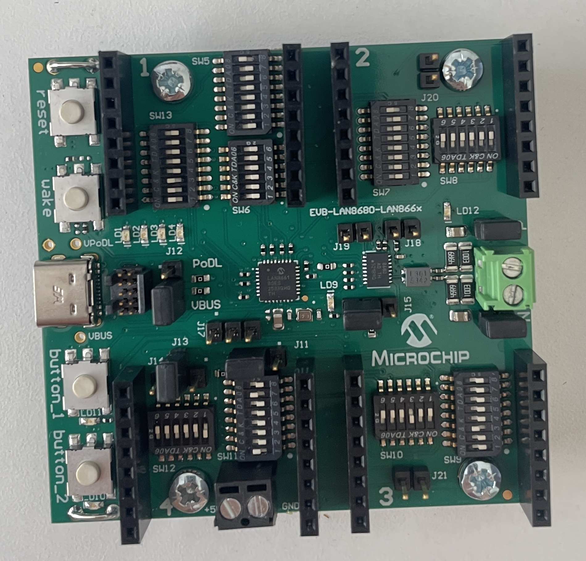
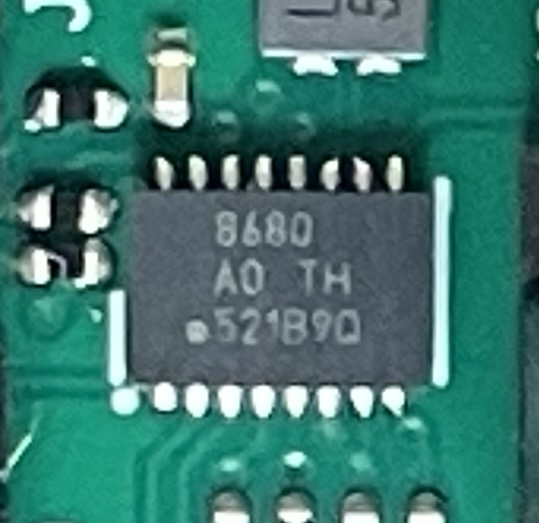
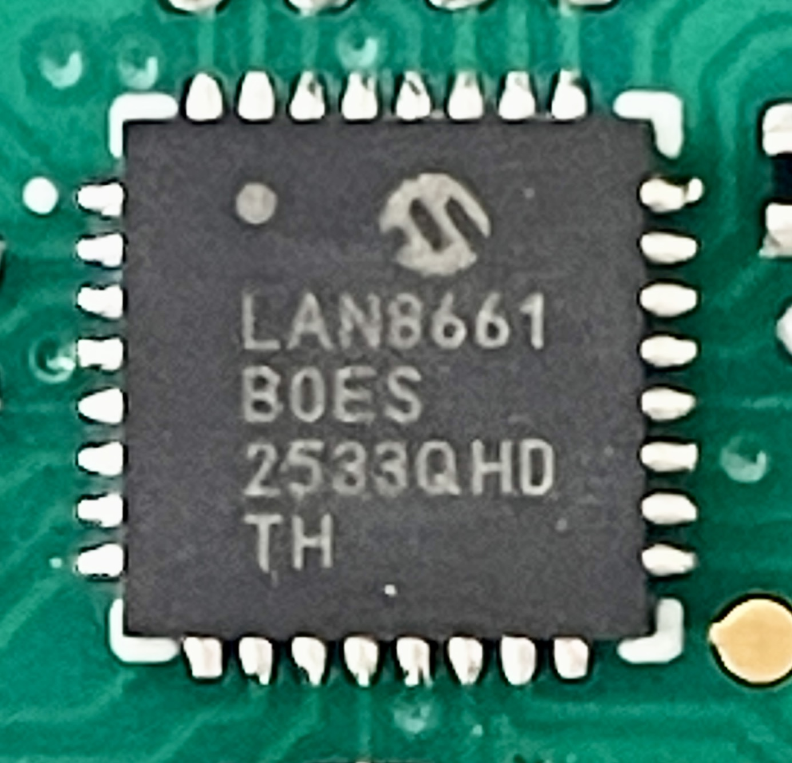
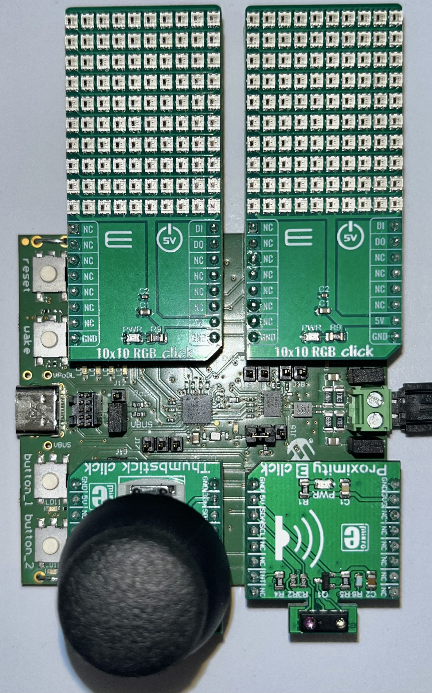
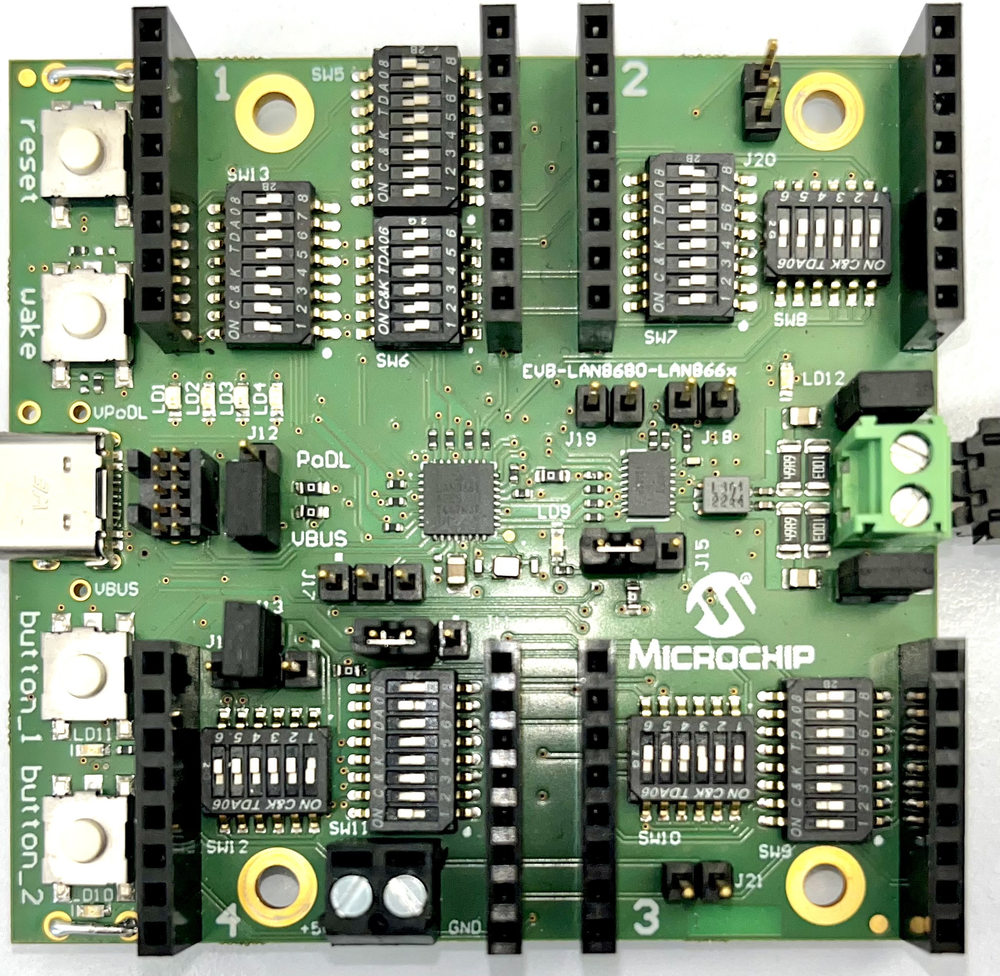
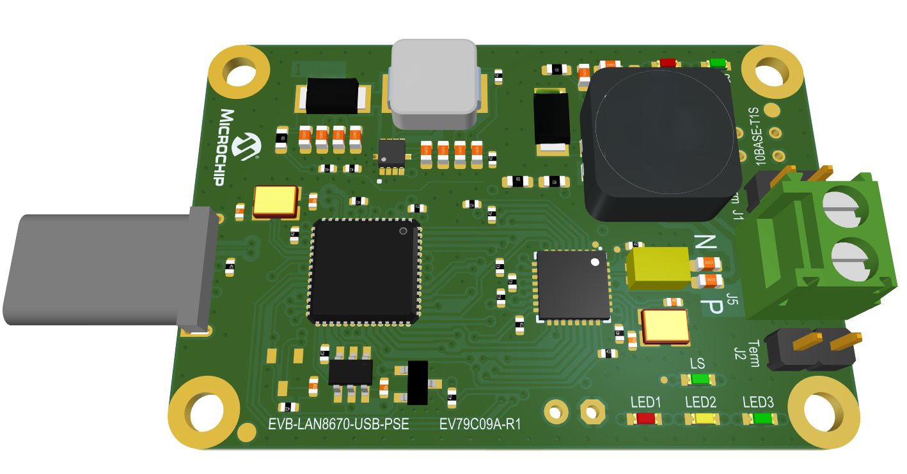

# LAN866x Tools – board guide & full tool reference

Companion document to the [README](README.md). It covers two things in depth:

1. **The hardware** – the two boards involved, what plugs where, and how every
   jumper / DIP switch must be set (with photos and an ASCII map).
2. **Every tool** – purpose, exact command line, options and example output.

> 🟦 All tools are **pure C** built on `libsomeip` (RCP over SOME/IP). See the
> [README](README.md) for build instructions and the porting notes.

## Table of contents

1. [The setup at a glance](#1-the-setup-at-a-glance)
2. [Endpoint board – EVB-LAN8680-LAN866x](#2-endpoint-board--evb-lan8680-lan866x)
   - 2.1 [Board identity & silicon](#21-board-identity--silicon)
   - 2.2 [Board map (top view)](#22-board-map-top-view)
   - 2.3 [Connector & jumper reference](#23-connector--jumper-reference)
   - 2.4 [Click slots – what plugs where](#24-click-slots--what-plugs-where)
   - 2.5 [Jumper & DIP settings (ASCII map)](#25-jumper--dip-settings-ascii-map)
   - 2.6 [Power options](#26-power-options)
   - 2.7 [On-board LEDs & buttons](#27-on-board-leds--buttons)
3. [T1S-USB adapter – EVB-LAN8670-USB-PSE](#3-t1s-usb-adapter--evb-lan8670-usb-pse)
4. [Tool reference](#4-tool-reference)
   - 4.1 [Common options & behaviour](#41-common-options--behaviour)
   - 4.2 [`lan866x-discovery`](#42-lan866x-discovery)
   - 4.2.1 [`lan866x-servicetest`](#421-lan866x-servicetest)
   - 4.3 [`lan866x-diag`](#43-lan866x-diag)
   - 4.4 [`lan866x-i2cscan`](#44-lan866x-i2cscan)
   - 4.4.1 [`lan866x-i2cid` / `lan866x-proxmon` / `lan866x-lan8680`](#441-lan866x-i2cid)
   - 4.5 [`lan866x-gpio`](#45-lan866x-gpio)
   - 4.5.1 [`lan866x-ledscan` / `-ledblink` / `-ledtoggle` / `-ledpwm` / `-proxled`](#451-lan866x-ledscan--lan866x-ledblink)
   - 4.6 [`lan866x-spi`](#46-lan866x-spi)
   - 4.6.1 [`lan866x-spiid` / `lan866x-thumbmon`](#461-lan866x-spiid)
   - 4.7 [`lan866x-adc`](#47-lan866x-adc)
   - 4.8 [`lan866x-pwm`](#48-lan866x-pwm)
   - 4.9 [`lan866x-boot`](#49-lan866x-boot)
   - 4.10 [`lan866x-flashimg`](#410-lan866x-flashimg)
   - 4.11 [`lan866x-flashpkg`](#411-lan866x-flashpkg)
   - 4.12 [`lan866x-clickdemo`](#412-lan866x-clickdemo)
   - 4.13 [`lan866x-video`](#413-lan866x-video)
   - 4.14 [`lan866x-dncpmon`](#414-lan866x-dncpmon)
   - 4.15 [`lan866x-dncpdisc`](#415-lan866x-dncpdisc)
5. [Tool ↔ RCP method matrix](#5-tool--rcp-method-matrix)
6. [Maintenance scripts](#6-maintenance-scripts)
   - 6.1 [`check_rcp_vs_proto.py` – drift checker](#61-check_rcp_vs_protopy--drift-checker)
   - 6.2 [`rtp4175_to_video.py` – capture → playable video](#62-rtp4175_to_videopy--capture--playable-video)

---

## 1. The setup at a glance

The toolset runs on a **Windows PC** and controls **LAN866x endpoints** over a
**10BASE-T1S** single-pair bus. Two boards are involved:

```
   ┌─────────┐   USB    ┌───────────────────────┐   T1S single pair   ┌────────────────────────┐
   │   PC    │─────────►│  EVB-LAN8670-USB-PSE   │═════════════════════│  EVB-LAN8680-LAN866x   │
   │ (tools) │  (NIC)   │  USB→T1S adapter (PSE) │   (2-wire + PoDL)   │  LAN866x endpoint(s)   │
   └─────────┘          └───────────────────────┘                     └────────────────────────┘
        │                    appears as Ethernet NIC                        runs the firmware that
        └─ SOME/IP-SD (224.0.0.1:30490) ─► discovers endpoints              answers RCP (service 0xFF10)
```

| Board | Role | Order code | Detailed in |
|---|---|---|---|
| **EVB-LAN8670-USB-PSE** | USB→T1S **adapter** on the PC; also feeds PoDL power onto the bus | EV79C09A-R1 | [§3](#3-t1s-usb-adapter--evb-lan8670-usb-pse) |
| **EVB-LAN8680-LAN866x** | the **endpoint** under control (the “Apps Board”) | EV12T76A | [§2](#2-endpoint-board--evb-lan8680-lan866x) |

The PC's USB-T1S NIC needs a static IP in the endpoint subnet (`192.168.0.100/24`);
endpoints are `192.168.0.<NodeID>`. See README §2.4.

---

## 2. Endpoint board – EVB-LAN8680-LAN866x

This is the board the tools talk to. It is a 10BASE-T1S endpoint evaluation board
with a LAN8680 T1S front-end, a LAN866x application MCU, and **4 mikroBUS Click
slots** so peripherals (sensors, LED panels) can be driven over the RCP service.



### 2.1 Board identity & silicon

| Field | Value |
|---|---|
| Board name | **EVB-LAN8680-LAN866x Apps Board** |
| Order / part number | **EV12T76A** |
| Schematic # | **02-01132**, Rev 3 |
| PCB # | **04-12198** |

| Ref | Device | Role |
|---|---|---|
| **U3** | **LAN8680** (A0) | 10BASE-T1S **front-end**: MDI (TRXN/TRXP), **PoDL**, wake, housekeeping I²C; links to the MCU over a 3-wire TX/RX/ED interface |
| **U23** | **LAN8661** (B0 ES, Lighting) | LAN866x **application MCU** – 4× SERCOM, ADC, 16 digital pins (PA00–PA15); drives the Click peripherals |

> The board is populated with a **LAN8661 (Lighting)**; the LAN866x family is pin-
> compatible (LAN8660 = Control, LAN8661 = Lighting, LAN8662 = Audio). The shipped
> firmware renders an RTP video stream onto two WS2812 RGB panels and exposes the
> SOME/IP RCP service (`0xFF10`) the tools use.

<p align="center">
  
  
</p>

### 2.2 Board map (top view)

Orientation: **USB connector on the left** (as in the photo above).

```
        ┌──────────────────────── EVB-LAN8680-LAN866x ───────────────────────┐
 reset ○│  ┌─────────┐                                     ┌─────────┐        │
 wake  ○│  │ CLICK 1 │  SW5 SW13                  SW7  SW8 │ CLICK 2 │        │
        │  │ top-left│  SW6                            J20 │ top-right│       │
        │  └─────────┘                                     └─────────┘        │
 USB-C ▭│   VPoDL   J12                  ┌──────┐  J19 J18                    │
        │   PoDL    J17   ┌──────┐       │  U3  │      LD9    ┌──┐ CN1        │
 VBUS  ○│   VBUS    J11   │ U23  │       │8680  │      LD12   │▣▣│ T1S bus    │
        │                 │8661  │       └──────┘  J15        └──┘ (terminal) │
 btn_1 ○│  ┌─────────┐    └──────┘            ●Microchip      ┌─────────┐     │
 btn_2 ○│  │ CLICK 4 │  SW11 SW12                         SW9 │ CLICK 3 │     │
        │  │ btm-left│         ┌──┐ +5/GND J21          SW10  │ btm-right│    │
        │  └─────────┘        CN(5V)                          └─────────┘     │
        └─────────────────────────────────────────────────────────────────────┘
```

Click slots are numbered on the silk: **1** = top-left, **2** = top-right,
**3** = bottom-right, **4** = bottom-left.

### 2.3 Connector & jumper reference

| Ref | Function |
|---|---|
| **CN1** | T1S single-pair bus (2-pin terminal block) – connect to the adapter's bus |
| **CN3 / USB-C** | USB-C (5 V / VBUS) power |
| **J16** | SWD debug header (2×5, 1.27 mm) on the MCU |
| **J3/J4, J5/J6, J7/J8, J9/J10** | 4× mikroBUS Click slots (each = two 1×8 headers) |
| **J11–J15** | power-routing jumpers (see §2.5) |
| **J17** | ADC source: Click-1 analog ↔ on-board NTC temp sensor |
| **J18** | LAN8680 power: **closed = 12 V PoDL**, **open = 5 V USB** |
| **SW1–SW3** | tactile buttons (LAN8680 GPIO / wake) |
| **SW4** | reset button |
| **SW5–SW13** | DIP switches that route the MCU's SER0–3 signals to the Click slots |

Each Click slot has a fixed signal channel and its own pair of DIP switches:

| Click | mikroBUS conn. | channel | 8-way switch (SPI/UART/PWM) | 6-way switch (I²C) |
|---|---|---|---|---|
| **Click 1** (top-left) | J5 / J6 | `-0` (SER0) | **SW5** | **SW6** |
| **Click 2** (top-right) | J3 / J4 | `-1` (SER1) | **SW7** | **SW8** |
| **Click 3** (btm-right) | J9 / J10 | `-2` (SER2) | **SW9** | **SW10** |
| **Click 4** (btm-left) | J7 / J8 | `-3` (SER3) | **SW11** | **SW12** |

SERCOM → pin map (the values the tools use as defaults):

| SERCOM | P0 (MISO/SDA/TX) | P1 (SCK/SCL/RX) | P2 (CS) | P3 (MOSI) |
|---|---|---|---|---|
| SER0 | PA00 | PA01 | PA02 | PA03 |
| SER1 | PA04 | PA05 | PA06 | PA07 |
| SER2 | PA08 | PA09 | PA10 | PA11 |
| SER3 | PA12 | PA13 | PA14 | PA15 |

### 2.4 Click slots – what plugs where

The shipped demo (and `lan866x-clickdemo`) uses these four boards:



```
   ┌───────────────────┐     ┌───────────────────┐
   │   CLICK 1          │     │   CLICK 2          │
   │   10×10 RGB        │     │   10×10 RGB        │     ← LED matrices face the
   │   (WS2812)         │     │   (WS2812)         │       OUTER (top) board edge
   └───────────────────┘     └───────────────────┘
   ┌───────────────────┐     ┌───────────────────┐
   │   CLICK 4          │     │   CLICK 3          │
   │   Thumbstick (SPI) │     │   Proximity 3 (I²C)│     ← joystick / sensor face
   │   MCP3204          │     │   VCNL4200 @ 0x51  │       the OUTER (bottom) edge
   └───────────────────┘     └───────────────────┘
```

| Slot | Position | Click board | Bus | Pins (LAN866x) |
|---|---|---|---|---|
| **Click 1** | top-left | 10×10 RGB (WS2812) | — * | WS2812 data, SER0 |
| **Click 2** | top-right | 10×10 RGB (WS2812) | — * | WS2812 data, SER1 |
| **Click 3** | btm-right | Proximity 3 (VCNL4200) | I²C | SDA=PA08, SCL=PA09 (SER2) |
| **Click 4** | btm-left | Thumbstick (MCP3204) | SPI | MISO=PA12 SCK=PA13 CS=PA14 MOSI=PA15 (SER3) |

\* The RGB panels are **not** addressed over I²C/SPI – the Lighting firmware renders
them from an **RTP/RFC4175 video stream** (UDP 5001). `lan866x-clickdemo` sends that
stream.

**Orientation (mikroBUS rule):** each Click fits only one way – match the **bevelled
corner** of the Click to the bevelled mark on the socket so the two 1×8 rows line up
(pin 1 = AN side). Push all 2×8 pins fully home, don't cant the board.

> ⚠️ **Don't swap Thumbstick and Proximity:** Thumbstick **must** be in Slot 4 (SPI)
> and Proximity **must** be in Slot 3 (I²C) – that's how the DIP switches below route
> them. The two RGB panels are interchangeable (left/right just decides which one the
> Thumbstick vs. the Proximity drives).

### 2.5 Jumper & DIP settings (ASCII map)

Physical reference photo:



This is the **shipped / demo configuration** (matches `Setup\dip-switch-evb-r3.txt`,
board Rev 3). Legend: `▣` = bridged/closed/ON, `·` = open/OFF.

**Power-routing jumpers (3-pin headers)**

```
   J11   [1]·[2▣3]   2-3 → 3V3 supplied by the DC-DC (1 A)
   J12   [1]·[2▣3]   2-3 → VSEN
   J15   [1▣2]·[3]   1-2 → VUC
   J13 ▣────────▣ J14    J13-1 ↔ J14-2 → 5 V Click header fed from USB  ◄ needed for the RGB panels
   J18   [▣ closed]       12 V PoDL  (leave OPEN for 5 V USB supply)
```

**Click signal-routing DIP switches** – close only the listed positions:

```
                         1  2  3  4  5  6  7  8
   SW5  Click1 / RGB     ·  ·  ·  ·  ·  ·  ·  ▣      → position 8 ON
   SW7  Click2 / RGB     ·  ·  ·  ·  ·  ·  ·  ▣      → position 8 ON

                         1  2  3  4  5  6   (6-way I²C banks)
   SW9  Click3 / Prox    ·  ·  ▣  ·  ·  ·          → position 3 ON
   SW10 Click3 / Prox    ·  ·  ▣  ·  ·  ·          → position 3 ON

                         1  2  3  4  5  6  7  8
   SW11 Click4 / Thumb   ▣  ·  ·  ·  ·  ·  ▣  ·      → positions 1 and 7 ON
   SW12 Click4 / Thumb   ▣  ·  ·  ·  ·  ·              → position 1 ON

                         1  2  3  4  5  6  7  8
   SW13 on-board LEDs    ▣  ▣  ▣  ·  ·  ·  ·  ·      → positions 1,2,3 ON (enable 3 LEDs)
```

Summary table:

| Item | Setting | Purpose |
|---|---|---|
| J11 | 2-3 | 3V3 from DC-DC (1 A) |
| J12 | 2-3 | VSEN |
| J15 | 1-2 | VUC |
| J13-1 ↔ J14-2 | bridged | 5 V Click header from USB **(RGB panels need this)** |
| J18 | closed | 12 V PoDL (open = 5 V USB) |
| SW5-8 | ON | Click 1 = RGB |
| SW7-8 | ON | Click 2 = RGB |
| SW9-3, SW10-3 | ON | Click 3 = Proximity (I²C) |
| SW11-1, SW11-7, SW12-1 | ON | Click 4 = Thumbstick (SPI) |
| SW13-1/2/3 | ON | enable the 3 on-board LEDs |

> The WS2812 matrices draw real current. Without the 5 V Click path
> (J13-1↔J14-2, USB well powered) the displays stay dark.

### 2.6 Power options

- **Bus / PoDL:** 12 V over the T1S pair (J18 closed). The adapter (EVB-LAN8670-USB-PSE)
  can supply this – see §3.
- **USB-C:** local 5 V (J18 open). Two MCP16312 bucks generate 3V3 / Vsup.

### 2.7 On-board LEDs & buttons

The board has user LEDs and push-buttons. **Which side of the board they hang on
decides whether the RCP SOME/IP service can touch them** — only the MCU pins are
reachable via the GPIO methods.

**On-board LEDs — driven by the LAN8661 MCU → controllable over RCP.**
Three LEDs (LD1–LD3) sit on the MCU's SERCOM CS lines, gated by DIP switch
**SW13**. Verified live with `lan866x-ledscan` (→ [`release/led_map.json`](release/led_map.json)):

| LED | MCU pin | SERCOM function | SW13 position |
|---|---|---|---|
| **LD1** | **PA02** | SER0 CS | SW13-1 |
| **LD2** | **PA06** | SER1 CS | SW13-2 |
| **LD3** | **PA10** | SER2 CS | SW13-3 |
| (LD4) | PA14 | SER3 CS | SW13-4 — **OFF** by default (LED dark) |

Drive them with `lan866x-gpio` (one pin) or `lan866x-ledblink` (running-light demo):
```bat
lan866x-gpio.exe --ip 192.168.0.54 --pin 2 --set 1     REM LD1 on
lan866x-ledblink.exe --ip 192.168.0.54                  REM LD1→LD2→LD3 running light
```
> `PA03`/`PA07` (the MOSI lines of SER0/SER1) cannot be opened as GPIO — the
> firmware uses them to drive the WS2812 RGB panels on Click 1/2. Full write-up:
> **[docs/LEDDEMO.md](docs/LEDDEMO.md)**.

**Push-buttons — on the LAN8680 front-end → NOT reachable over RCP GPIO.**
The two user buttons (silk `BUTTON_1`/`BUTTON_2`) and the reset/wake buttons are
wired to the **LAN8680** front-end, not to the MCU:

| Silk | RefDes | Net | LAN8680 pin | own status LED | RCP-readable? |
|---|---|---|---|---|---|
| **BUTTON_1** | SW1 | `GPIO0` | DIO0 (pin 9) | LD11 | ❌ no (not an MCU pin) |
| **BUTTON_2** | SW2 | `GPIO1` | DIO1 (pin 16) | LD10 | ❌ no |
| (reset) | SW3 | `RST` | RESET_N (pin 1) | — | n/a |
| (wake) | SW4 | `WAKEIN` | WAKEIN (pin 15) | — | n/a |

`GPIO0`/`GPIO1` reach only the LAN8680 and the Click-header INT pins; **no LAN8661
PA pin** is connected, so `lan866x-gpio --get` cannot read them. Each user button
does drive its **own status LED in hardware** (BUTTON_1→LD11, BUTTON_2→LD10), so
you can verify it physically without any software. The button **state** lives in the
LAN8680's own registers, reachable over its **housekeeping I²C** (slave addr 0x40) —
the front-end's DIO0/DIO1 bits in its SBC registers. That bus *is* accessible now:
see [`lan866x-lan8680`](#441-lan866x-i2cid) and [docs/LAN8680.md](docs/LAN8680.md).

---

## 3. T1S-USB adapter – EVB-LAN8670-USB-PSE

The adapter on the PC side. It uses a **LAN9500A** (USB 2.0 → 10/100 Ethernet) bridged
to a **LAN8670** 10BASE-T1S PHY, so the PC sees a normal Ethernet NIC whose wire is the
T1S single pair. The **-PSE** variant additionally injects PoDL power onto the bus.



*Left: USB connector (J4) to the PC. Right: the green 2-pin screw terminal (J6) is the
T1S bus (TRX_P / TRX_N); the large inductor next to it belongs to the PoDL power stage.
Bottom edge: status LEDs (PWR / FLT / LS / data). Board marking: `EVB-LAN8670-USB-PSE
EV79C09A-R1`.*

| Field | Value |
|---|---|
| Order code | **EV79C09A-R1** |
| Bus power (PSE) | **12 V, up to 600 mA** over the T1S pair |
| USB connector | J4 (to the PC) |
| Network connector | J6 screw terminal – **Terminal 1 = TRX_P, Terminal 2 = TRX_N** |
| Termination | jumpers **J1 + J2** – **both closed** enables 100 Ω edge termination |
| LEDs | PWR, FLT (over-current), LS (link), LED2 (data, blinks) |

**Setup:**
1. Plug into the PC USB; install the Windows driver (`EVB-LAN8670-USB_Drv_Setup.exe`).
2. Give the new NIC a static IP `192.168.0.100/24`.
3. Wire J6 to the endpoint's CN1 (single pair). At the **two physical ends** of the
   segment close termination (J1+J2 here; on the endpoint via its termination option).
4. If powering the endpoint over the bus, the adapter sources 12 V PoDL – make sure all
   connected nodes are Power-over-Data-Line tolerant.

> ⚠️ The -PSE board is a **power source** – mis-wiring can damage non-PoDL devices.
> Full pinout/jumpers: `EVB\EVB-LAN8670-USB-PSE\EVB-LAN8670-USB-PSE-Users-Guide-60001919.pdf`.

---

## 4. Tool reference

All tools build to `lan866x-<name>(.exe)` and live in `out/` (or `release/`) after a
build. The six core RCP tools plus boot/flash/diag/clickdemo speak SOME/IP; the two
DNCP tools are standalone (Winsock only).

> 📄 **Source:** each tool is a single `.c` file at the repo root named after it —
> e.g. `lan866x-discovery` → [discovery.c](discovery.c), `lan866x-spiid` →
> [spiid.c](spiid.c). The [README tool table](README.md#1-overview) links every tool
> to its source; the worked **examples** are indexed (with source + per-demo docs) in
> **[docs/DEMOS.md](docs/DEMOS.md)**. Shared core: [src/rcp.c](src/rcp.c) /
> [src/rcp.h](src/rcp.h).

### 4.1 Common options & behaviour

Most SOME/IP tools share the same target-selection options:

| Option | Meaning |
|---|---|
| `--ip <addr>` | target this endpoint IP directly |
| `--ep <index>` | target the N-th discovered endpoint (default `0` = first found) |
| `-h` / `--help` | print the tool's own usage |

If neither `--ip` nor `--ep` is given, the tool runs **SOME/IP discovery** and uses the
first endpoint it finds (README §5). Pins are given as the PA index (0–15).

Discovery is **not** a fixed wait: the tool polls and proceeds **as soon as the selected
endpoint answers** (usually tens of ms); the printed search window (`max N s`) is only the
upper bound used when the target never replies.

> **Host pacing note:** the PC drops RCP responses if requests are sent faster than it
> can service them (the wire answers in ~2 ms, but a multi-homed NIC / scheduling can
> miss back-to-back replies). Tools that do several round-trips space them out and
> retry; see `lan866x-diag` for the measured effect.

### 4.2 `lan866x-discovery`

> 📄 Source: [discovery.c](discovery.c)

**List every reachable endpoint with its full status.** This is the first tool to run –
it confirms the link, the driver and the firmware are all alive.

```bat
out\lan866x-discovery.exe
```

Per endpoint it prints `GetStatus (0x1002)` + `GetNetworkStatus (0x1600)`: uptime,
running application, chip identifier and role, all six version fields, security mode,
MAC, IPv4, link state, OASPI status, arbitration (PLCA) and PLCA node id.

```
Devices available = 2

========================================================
Endpoint #0  -  192.168.0.101:6800  (instance 0x0001, available=1)
========================================================
  Uptime:             2h 38m 18s
  Chip Identifier:    LAN8662B   -> Audio Endpoint
  Main Version:       LAN8662-main_V1.3.0-54
  ...
  Endpoint Status:    Link-Up
  Arbitration:        PLCA no fallback
  PLCA Node Id:       1
```

> Nothing found? driver installed · NIC IP `192.168.0.x` · bus terminated · endpoints
> powered · firewall allowed.

#### 4.2.1 `lan866x-servicetest`

> 📄 Source: [servicetest.c](servicetest.c)

**Probe which RCP methods/services the endpoint's firmware actually implements.**
Different firmware builds expose different method sets (e.g. the Lighting build has
no `OpenAdc`; a Control build does). For each known method ID it sends an **empty
payload** and reads the SOME/IP return code:

- `RT_UNKNOWN_METHOD` (**0x03**) → the method is **not implemented**;
- **any other** code (usually `RT_MALFORMED_MESSAGE` 0x09, because the params were
  empty) → the **handler exists**.

```bat
out\lan866x-servicetest.exe --ip 192.168.0.50
out\lan866x-servicetest.exe --unsafe          REM also probe Reboot/Update methods
```

| Option | Meaning |
|---|---|
| `--unsafe` | also probe the Reboot / firmware-update methods (still empty-payload only) |
| `--ip` / `--ep` | target endpoint |

**Safe by design:** the firmware looks up the method ID first and rejects the
empty/malformed payload *before* executing anything, so the probe has no side
effects. The genuinely destructive methods (Reboot `0x1000`, StartUpdate `0x1004`,
WriteImage `0x1005`, FinishUpdate `0x1006`) are **skipped unless `--unsafe`**. It
probes the System, GPIO, I²C, SPI, UART, ADC and PWM method groups and prints a
per-method verdict plus a present/absent summary.

### 4.3 `lan866x-diag`

> 📄 Source: [diag.c](diag.c)

**Read and interpret T1S link quality** for one endpoint – read-only.

```bat
out\lan866x-diag.exe --ip 192.168.0.54 [--probe N] [--gap MS] [--raw]
```

| Option | Default | Meaning |
|---|---|---|
| `--probe N` | 200 | number of RCP round-trip probes for loss/latency |
| `--gap MS` | 15 | pause between probes (use `0` to stress the host rx path) |
| `--raw` | off | also dump the raw PHY diagnosis channel bytes |

It pulls `GetStatus`, `GetNetworkStatus`, `ReadDiagnosisData` (SQI / fault / short – if
the firmware build exposes it) and then runs an **active probe**: each probe is one RCP
round-trip; only a probe that fails *every* retry counts as a real link loss (a
first-try miss that succeeds on retry is a host-side drop). It prints a min/avg/max RTT
and a verdict (HEALTHY / DEGRADED / LINK DOWN), and warns if PLCA is off.

> The verdict separates the **T1S wire** (~2 ms RTT, low loss when paced) from the
> **host throughput limit** (loss climbs steeply with no pacing). TDR/topology is not
> used – it needs ≥2 coordinated nodes.

### 4.4 `lan866x-i2cscan`

> 📄 Source: [i2cscan.c](i2cscan.c)

**Scan an endpoint's I²C bus**, like `i2cdetect`.

```bat
out\lan866x-i2cscan.exe                       REM first endpoint, SDA=PA08 SCL=PA09, 400 kHz
out\lan866x-i2cscan.exe --ip 192.168.0.54
out\lan866x-i2cscan.exe --ep 1 --sda 8 --scl 9 --speed 1
```

| Option | Default | Meaning |
|---|---|---|
| `--sda <n>` / `--scl <n>` | 8 / 9 | I²C pins (PA index) |
| `--speed <0\|1>` | 1 (400 kHz) | bus speed (0 = 100 kHz) |

Probes 0x08–0x77 with a 1-byte read and prints an `i2cdetect` grid (short ~150 ms
per-probe timeout, since absent addresses never reply). Pins are released
(`ReleaseDigitalPins`) before `OpenI2C`.

```
     0  1  2  3  4  5  6  7  8  9  a  b  c  d  e  f
50: -- 51 -- -- -- -- -- -- -- -- -- -- -- -- -- --

1 device(s) found on the I2C bus.
```

> If I²C isn't configured on that endpoint, `OpenI2C` returns `RT_NOT_REACHABLE`
> (“OpenI2C failed”). On the demo board this finds the Proximity 3 (VCNL4200 @ 0x51).

#### 4.4.1 `lan866x-i2cid`

**Read a device ID over I²C, non-blocking** — the worked I²C example. Reads the
VCNL4200's ID register (`0x0E`) and checks it equals `0x1058`, using the **async RCP
API** so the loop never parks on the round-trip. Full write-up:
**[docs/I2CDEMO.md](docs/I2CDEMO.md)**.

```bat
out\lan866x-i2cid.exe --ip 192.168.0.54                REM VCNL4200 ID @0x51 reg 0x0E
out\lan866x-i2cid.exe --addr 0x51 --reg 0x0E --sda 8 --scl 9 --speed 1
```

| Option | Default | Meaning |
|---|---|---|
| `--addr <a>` | 0x51 | I²C device address (hex ok) |
| `--reg <r>` | 0x0E | ID register (hex ok) |
| `--sda <n>` / `--scl <n>` | 8 / 9 | I²C pins (PA index) |
| `--speed <0\|1>` | 1 (400 kHz) | bus speed |

Uses `WriteAndReadI2C` (`0x1208`): writes the register address, reads 2 bytes
(VCNL4200 = LSB first). Prints how many times the loop spun while the read was in
flight — the visible proof it didn't block.

**`lan866x-proxmon`** — live proximity bar: enables the VCNL4200 PS engine and reads
`PS_DATA` continuously (async), rendering at a steady cadence. The "read a sensor in
a superloop" pattern. See [docs/I2CDEMO.md §8](docs/I2CDEMO.md#8-going-further-live-monitor--sensoractuator).

```bat
out\lan866x-proxmon.exe --ip 192.168.0.54 --max 400 --hz 15
```

**`lan866x-lan8680`** — read the **LAN8680 front-end (System Basis Chip)** over its
housekeeping I²C (**SERCOM2 = PA08/PA09** per the schematic; 7-bit addr **0x20** or
**0x40** — datasheet text vs figure disagree, so both are tried; 16-bit regs, MSB
first). Auto-probes the SERCOM buses, confirms the chip via `PHY_ID2` (MODEL=100000),
and decodes supply/temp warnings with `--status`. **READ-ONLY** (the LAN8680 is the board's power/watchdog/
reset controller). Full write-up: [docs/LAN8680.md](docs/LAN8680.md).

```bat
out\lan866x-lan8680.exe --ip 192.168.0.54 --status
out\lan866x-lan8680.exe --sda 4 --scl 5 --reg 0x44
```

### 4.5 `lan866x-gpio`

> 📄 Source: [gpio.c](gpio.c)

**Set or read a single GPIO pin.**

```bat
out\lan866x-gpio.exe --pin 2 --set 1     REM PA02 output, drive high
out\lan866x-gpio.exe --pin 2 --get       REM PA02 input, read
out\lan866x-gpio.exe --ip 192.168.0.54 --pin 6 --set 0
```

| Option | Meaning |
|---|---|
| `--pin <n>` | GPIO pin (PA index 0–15) |
| `--set <0\|1>` | configure as output and drive the level |
| `--get` | configure as input and read the level |

#### 4.5.1 `lan866x-ledscan` / `lan866x-ledblink`

Two GPIO helpers built around the board's **on-board LEDs** (PA02/PA06/PA10 =
LD1–LD3, see [§2.7](#27-on-board-leds--buttons)). Full write-up:
**[docs/LEDDEMO.md](docs/LEDDEMO.md)**.

**`lan866x-ledscan`** — interactively find *which GPIO drives which LED*. It blinks
each candidate pin and asks you `[y]es / [n]o / [r]epeat / [q]uit`, then writes the
answers to a JSON file (`led_map.json`) that can be read back by other tools.

```bat
out\lan866x-ledscan.exe --ip 192.168.0.54            REM probe the candidate set
out\lan866x-ledscan.exe --all                         REM probe PA00..PA15
out\lan866x-ledscan.exe --pins 2,6,10 --blinks 8 --out my_leds.json
```

| Option | Default | Meaning |
|---|---|---|
| `--pins <list>` | candidate set (2,3,6,7,10,11,14,15) | pins to probe |
| `--all` | — | probe PA00..PA15 |
| `--blinks <n>` / `--on <ms>` / `--off <ms>` | 6 / 250 / 250 | blink pattern per pin |
| `--out <file>` | `led_map.json` | JSON result file |

**`lan866x-ledblink`** — the **"hello world" running light**: cycles LD1→LD2→LD3,
half a second each, forever (Ctrl+C turns them off and exits cleanly).

```bat
out\lan866x-ledblink.exe --ip 192.168.0.54            REM PA02,PA06,PA10 @ 500 ms/step
out\lan866x-ledblink.exe --pins 2,6,10 --beat 250
out\lan866x-ledblink.exe --all-on                     REM all LEDs on, then exit
```

| Option | Default | Meaning |
|---|---|---|
| `--pins <list>` | `2,6,10` (LD1,LD2,LD3) | LED pins to cycle |
| `--beat <ms>` | 500 | time each LED stays lit |
| `--all-on` | — | turn all listed LEDs on once and exit (no loop) |

**`lan866x-ledtoggle`** — the **non-blocking** counterpart: toggles **one** LED at a
half-second beat using the **async RCP API** (`rcp_async_request`/`rcp_async_poll`),
so the main loop never parks on the network. It's the superloop-friendly pattern an
MCU port wants. See [docs/LEDDEMO.md §6.2](docs/LEDDEMO.md#62-non-blocking-variant--lan866x-ledtoggle).

```bat
out\lan866x-ledtoggle.exe --ip 192.168.0.54           REM toggle PA02 (LD1) @ 500 ms
out\lan866x-ledtoggle.exe --pin 6 --beat 250
```

| Option | Default | Meaning |
|---|---|---|
| `--pin <0..15>` | 2 (LD1) | LED pin to toggle |
| `--beat <ms>` | 500 | toggle interval |

**`lan866x-ledpwm`** — "breathing" LED via **PWM** (non-blocking `WritePwm`). Adds
the PWM method family to the examples. ⚠️ PWM is **not confirmed** on the Lighting
firmware — `OpenPwm` may fail; confirm with `lan866x-pwm` first. See
[docs/PWMDEMO.md](docs/PWMDEMO.md).

```bat
out\lan866x-ledpwm.exe --ip 192.168.0.54 --pin 2 --freq 1000 --period 2000
```

**`lan866x-proxled`** — the **sensor→actuator** mini-app: proximity (I²C) drives the
on-board LEDs (GPIO) as a 0–3 level meter, no video. The complete input→decide→output
loop a real device runs. See [docs/COMBODEMO.md](docs/COMBODEMO.md).

```bat
out\lan866x-proxled.exe --ip 192.168.0.54 --max 400
```

### 4.6 `lan866x-spi`

> 📄 Source: [spi.c](spi.c)

**Full-duplex SPI transfer.**

```bat
out\lan866x-spi.exe --tx 9F0000                       REM send 3 bytes, read MISO simultaneously
out\lan866x-spi.exe --tx AA55 --mode 0 --speed 1000000
out\lan866x-spi.exe --miso 12 --sck 13 --cs 14 --mosi 15 --tx 0102
```

| Option | Default | Meaning |
|---|---|---|
| `--tx <hex>` | — | bytes to send (hex string); RX is captured during the same transfer |
| `--mode <0..3>` | — | SPI mode |
| `--speed <Hz>` | — | clock |
| `--miso/--sck/--cs/--mosi <n>` | 12/13/14/15 | pins (PA index) |

Output is `TX: …` / `RX: …`. Pins are released before `OpenSpi`.

#### 4.6.1 `lan866x-spiid`

**Identify the Thumbstick (MCP3204) over SPI, non-blocking** — the worked SPI
example. Reads both joystick axes with the **async RCP API**. Full write-up:
**[docs/SPIDEMO.md](docs/SPIDEMO.md)**.

```bat
out\lan866x-spiid.exe --ip 192.168.0.54                REM read ch1=X, ch0=Y
out\lan866x-spiid.exe --mode 1 --speed 1923000
```

| Option | Default | Meaning |
|---|---|---|
| `--miso/--sck/--cs/--mosi <n>` | 12/13/14/15 | SPI pins (PA index) |
| `--mode <0..3>` | 1 | SPI mode |
| `--speed <Hz>` | 1923000 | clock |

> ⚠️ The MCP3204 ADC has **no silicon ID register** (unlike the VCNL4200). So
> "identifying" it means proving it returns a valid 12-bit conversion: a centred
> joystick reads ~2048 per axis at rest. Uses `WriteAndReadSpi` (`0x1508`); see
> [docs/SPIDEMO.md](docs/SPIDEMO.md) for the MCP3204 command bytes and the compound
> (`0x1509`) alternative.

**`lan866x-thumbmon`** — live thumbstick read: reads the MCP3204 X/Y axes continuously
(async, one transfer in flight, alternating axes) with a live position read-out. See
[docs/SPIDEMO.md §8](docs/SPIDEMO.md#8-going-further-live-monitor).

```bat
out\lan866x-thumbmon.exe --ip 192.168.0.54 --hz 20
```

### 4.7 `lan866x-adc`

> 📄 Source: [adc.c](adc.c)

**Read the on-chip 12-bit ADC** (analog input or internal temperature).

```bat
out\lan866x-adc.exe                          REM single analog read, 3V3 reference
out\lan866x-adc.exe --temp                   REM internal temperature sensor
out\lan866x-adc.exe --vref 1                 REM 1V1 reference
out\lan866x-adc.exe --count 10 --interval 200
```

| Option | Meaning |
|---|---|
| `--temp` | read the internal temperature channel (vs. analog input) |
| `--vref <0\|1>` | reference: 0 = 3V3, 1 = 1V1 |
| `--count <n>` / `--interval <ms>` | repeat N reads every interval |

Prints raw (0–4095) and scaled voltage, e.g. `raw=2048  =  1.650 V`.

> Not every firmware build implements ADC – the demo Lighting build returns
> `E_UNKNOWN_METHOD` for `OpenAdc`. Flash a Control build for full ADC support.

### 4.8 `lan866x-pwm`

> 📄 Source: [pwm.c](pwm.c)

**Drive a PWM output** on a digital pin.

```bat
out\lan866x-pwm.exe --pin 6 --freq 1000 --duty 50              REM 1 kHz, 50 % on PA06
out\lan866x-pwm.exe --pin 6 --period-ns 20000000 --duty 7.5    REM servo, 1.5 ms pulse
out\lan866x-pwm.exe --pin 6 --duty 0                           REM stop (0 %)
out\lan866x-pwm.exe --pin 7 --freq 500 --duty 25 --hold 5
```

| Option | Meaning |
|---|---|
| `--pin <n>` | output pin (PA index) |
| `--freq <Hz>` *or* `--period-ns <ns>` | period |
| `--duty <percent>` | duty cycle (tool converts to the wire's `0 = 0 %` … `2^31 = 100 %`) |
| `--hold <s>` | stop the output after N seconds (default: leave it running) |

By default the signal keeps running on the endpoint after the tool exits (the handle
lives on the device). The pin is released before `OpenPwm`.

### 4.9 `lan866x-boot`

> 📄 Source: [boot.c](boot.c)

**Reboot an endpoint between its main app and the bootloader** and show the status in
each mode. **Non-destructive** – it only issues `Reboot (0x1000)`, never writes flash.

```bat
out\lan866x-boot.exe                       REM cycle: app -> bootloader -> app (default)
out\lan866x-boot.exe --to bootloader       REM reboot into the bootloader and stay
out\lan866x-boot.exe --to main             REM reboot into the main app
out\lan866x-boot.exe --ip 192.168.0.54 --wait 20
```

| Option | Default | Meaning |
|---|---|---|
| `--to bootloader\|main\|cycle` | cycle | target image |
| `--wait <s>` | 20 | how long to wait for the node to reappear |

It detects an actual reset via the uptime counter and re-discovers the node. In
bootloader mode `GetStatus` reports the generic family id (`LAN866x`) rather than the
specific part. This is “stage 1” of the flasher and validates the reboot + re-discovery
path.

> **Reappears at any IP:** after the reboot, `boot` (and `flashpkg`) re-acquire the
> node by **SOME/IP-SD** — selecting whichever endpoint answers, regardless of its
> address. This matters because the **bootloader's IP can differ from the main app's**
> (the bootloader keeps the previous package's `updater/config`): e.g. a Control main
> on `.50` whose bootloader comes up on `.54`. Waiting for the *same* IP would miss it.

### 4.10 `lan866x-flashimg`

> 📄 Source: [flashimg.c](flashimg.c)

**Write ONE pre-built (signed/encrypted) image** via the bootloader. **Writes flash.**

```bat
out\lan866x-flashimg.exe --ip 192.168.0.54 --image main/config.bin ^
    --data config.bin --iv config.iv.bin --sig config.signature.bin
```

| Option | Meaning |
|---|---|
| `--image <name>` | logical image name (default `main/config.bin`) |
| `--data <file>` | the image `.bin` |
| `--iv <file>` | the 16-byte AES-CBC IV (`.iv.bin`) |
| `--sig <file>` | the RSA signature (`.signature.bin`) |
| `--chunk <n>` / `--retries <n>` / `--wait <s>` | transport tuning |

Flow: reboot → bootloader; `StartUpdate(name,IV)` → `WriteImage` chunks (acked by
`WriteId`, so a resend is idempotent) → `FinishUpdate(name,signature)` → reboot → main;
verify via `GetStatus`. The three blobs come straight from an MCHPKG; the host only
transports them, the bootloader verifies the signature. This is “stage 2” – mainly for
bringing up/debugging the flash path. A failed write is recoverable (re-flash from the
bootloader).

### 4.11 `lan866x-flashpkg`

> 📄 Source: [flashpkg.c](flashpkg.c)

**Update an endpoint straight from an MCHPKG package** – the end-user flash tool.
**Writes flash** (recoverable from the bootloader).

```bat
out\lan866x-flashpkg.exe LAN8661-ws2812_V1.3.2_RELEASE_display1.mchpkg --ip 192.168.0.54
out\lan866x-flashpkg.exe pkg.mchpkg --config-only
out\lan866x-flashpkg.exe pkg.mchpkg --app-only --chunk 1200 --retries 15
```

| Option | Meaning |
|---|---|
| `<package.mchpkg>` | the package (positional) |
| `--config-only` / `--app-only` | flash only the config / only the app |
| `--chunk <n>` / `--retries <n>` / `--wait <s>` | transport tuning (defaults 1200 / 15 / 25) |

It opens the package (bundled `third-party/minizip` ZIP reader), extracts
`main/app.{bin,iv,signature}` and `main/config.{bin,iv,signature}`, reads the target
version from `package.pdsc`, reboots to the bootloader, flashes **app then config**,
reboots to main, and verifies **by outcome** (the running version must match) – printing
a clear `UPDATE OK / FAILED`. It deliberately ignores the benign `FinishUpdate`
`E_NOT_REACHABLE` quirk (the device can answer that even on success).

> Bootloader / keys / factory (`updater/*`) upgrades are out of scope – this does the
> normal firmware+config update only. Flash a **matching app+config pair**; a config-only
> write newer than the app makes the device fall back to the bootloader (recoverable).

### 4.12 `lan866x-clickdemo`

> 📄 Source: [clickdemo.c](clickdemo.c) · deep-dive [docs/CLICKDEMO.md](docs/CLICKDEMO.md)

**Interactive MikroE Click demo** for a LAN866x **Lighting** endpoint: two RGB panels
driven from a Thumbstick and a Proximity sensor. Requires the Lighting firmware
(`LAN8661-ws2812 … display1`, ≥ V1.3.2) and the Click setup of [§2.4](#24-click-slots--what-plugs-where)/[§2.5](#25-jumper--dip-settings-ascii-map).

> 📖 **Deep‑dive with measured timing diagrams:** [docs/CLICKDEMO.md](docs/CLICKDEMO.md)
> — the software, the render‑loop timing model, and real captures analysed with
> `tools/plot_timing.py`.

```bat
out\lan866x-clickdemo.exe --ip 192.168.0.54
out\lan866x-clickdemo.exe --fps 50 --bright 128 --bar 64 --prox-max 400
```

| Option | Default | Meaning |
|---|---|---|
| `--fps N` | 50 | frame rate |
| `--bright 0..255` | 128 | max brightness of the Thumbstick spot (WS2812 are very bright) |
| `--prox-max <n>` | 400 | proximity raw value that puts the bar at the top |
| `--bar 0..255` | 64 | blue brightness of the proximity bar |
| `--log <file>` | `clickdemo-events.csv` | per-event CSV log for timing analysis; `--nolog` disables it |

> 📖 The render‑loop timing (why it stays smooth, and how to analyse a capture) is
> documented in depth in [docs/CLICKDEMO.md](docs/CLICKDEMO.md); the `--log` file pairs
> with a Wireshark capture via [`tools/plot_timing.py`](tools/plot_timing.py).

What it does each loop:
- reads the **Thumbstick** (MCP3204 over **SPI**, slot 4) and the **Proximity 3**
  (VCNL4200 over **I²C @ 0x51**, slot 3) – sequentially, so the host doesn't drop one of
  two back-to-back replies;
- renders a **20×10 RGB frame**: left 10 columns = display 1 (orange “flashlight” spot
  steered by the Thumbstick), right 10 columns = display 2 (blue proximity bar);
- sends the frame as one **RTP/RFC4175** packet to **UDP 5001** (the firmware paints both
  WS2812 panels from it – mirrors the official `gameloop-example`).

The console shows live `Thumbstick x/y` and `Proximity raw`; `..` means that sensor
isn't answering (board not seated / DIP wrong). **Ctrl-C** clears both displays and
releases the peripherals.

### 4.13 `lan866x-video`

> 📄 Source: [video.c](video.c)

**Loop‑play a video file on the two RGB panels.** Same display path as the clickdemo
(one 20×10 RTP/RFC4175 frame → UDP 5001, left half = display 1, right half = display 2),
but the pixels come from a video file instead of the sensors. Requires the **Lighting**
firmware and **ffmpeg** on `PATH` (or `--ffmpeg <path>`).

```bat
out\lan866x-video.exe media\cube.mp4 --ip 192.168.0.54
out\lan866x-video.exe docs\img\clickdemo.mp4 --ip 192.168.0.54
out\lan866x-video.exe clip.gif --fps 20 --bright 96
```

> A ready‑made demo clip ships in [`media/cube.mp4`](media/cube.mp4) — a rotating cube
> that zooms in and out, rendered for the 20×10 display and seamless‑looping. Regenerate
> or tweak it with [`tools/make_cube_video.py`](tools/make_cube_video.py)
> (`python tools/make_cube_video.py --out media/cube.mp4`).

| Option | Default | Meaning |
|---|---|---|
| `<file>` | — | the video/image file (positional, required); any format ffmpeg reads |
| `--fps N` | 15 | frame rate (1..60) |
| `--bright 0..255` | 128 | global brightness (WS2812 are very bright) |
| `--ffmpeg <path>` | `ffmpeg` | ffmpeg executable if not on `PATH` |

ffmpeg decodes + scales the file to 20×10 raw RGB and loops it; the tool sends each
frame as one RTP packet. It uses **SOME/IP discovery** to find the endpoint (so `--ip`/
`--ep` work as usual) but issues **no RCP methods** — it is a pure RTP video source.
**Ctrl-C** clears both displays.

### 4.14 `lan866x-dncpmon`

> 📄 Source: [dncpmon.c](dncpmon.c)

**Passive DNCP monitor** – standalone (Winsock only, *not* SOME/IP).

```bat
out\lan866x-dncpmon.exe                   REM listen forever (Ctrl-C to stop)
out\lan866x-dncpmon.exe --timeout 30      REM stop after 30 s without packets
```

Decodes **DNCP** (Dynamic Node Configuration Protocol) Announce/Registry packets on
**UDP 65526/65527**: MAC, device id, IPv4/IPv6, state (Unconfigured/Configured) and PLCA
ids. **Purely passive** – it only shows DNCP traffic already present on the bus.

### 4.15 `lan866x-dncpdisc`

> 📄 Source: [dncpdisc.c](dncpdisc.c)

**Active DNCP discovery** – standalone, **read-only** (per AN1891).

```bat
out\lan866x-dncpdisc.exe                              REM 3 rounds, channel 11
out\lan866x-dncpdisc.exe --channel 11 --rounds 5 --timeout 4
```

| Option | Default | Meaning |
|---|---|---|
| `--channel <n>` | 11 | EnumChannel |
| `--rounds <n>` | 3 | broadcast rounds |
| `--timeout <s>` | — | per-round listen window |

Acts as a **temporary DNCP server**: broadcasts an **empty Registry** to
`224.0.0.1:65527`; nodes that don't find themselves in it answer with an **Announce** to
`224.0.0.1:65526`. Per node it decodes all fields: MAC, vendor device id, IPv4+IPv6,
state, persistency, BurstFramesPerTO, protocol version and all PLCA node ids.

> **Read-only** – assigns no PLCA ids/IPs and persists nothing. **Use only when no other
> DNCP server is active** on the bus.

---

## 5. Tool ↔ RCP method matrix

Which RCP methods each SOME/IP tool exercises (service `0xFF10`; full ID list in
[README §8](README.md#8-rcp-method-ids), and the per-function `rcp_*` API — request/reply
structs + encoding — in [docs/RCP_API.md](docs/RCP_API.md)). The DNCP tools use no RCP –
they speak DNCP on UDP 65526/65527.

| Tool | Primary RCP methods |
|---|---|
| `discovery` | GetStatus `0x1002`, GetNetworkStatus `0x1600` |
| `servicetest` | sends every known method ID with empty params (async); reads the return code (0x03=absent) |
| `diag` | GetStatus, GetNetworkStatus, ReadDiagnosisData `0x1003`, GetHealthStatus `0x100A`; `--clear-counters` → ClearNetworkCounters `0x1605`; `--td` → StartTDMeasurement `0x1602`; + active probe |
| `i2cscan` | ReleaseDigitalPins `0x1105`, OpenI2C `0x1200`, ReadI2C `0x1220` |
| `i2cid` | OpenI2C `0x1200`, WriteAndReadI2C `0x1208` **async**, CloseI2C `0x1202` |
| `proxmon` | OpenI2C `0x1200`, WriteI2C `0x1204`, WriteAndReadI2C `0x1208` **async** |
| `lan8680` | OpenI2C `0x1200`, WriteAndReadI2C `0x1208` (read-only), CloseI2C `0x1202` |
| `proxled` | OpenI2C/WriteAndReadI2C `0x1208` **async** (in) + OpenGpio/SetGpio (out) |
| `gpio` | OpenGpio `0x1300`, SetGpio `0x1330`, GetGpio `0x1332` |
| `gpioevents` | OpenGpio `0x1300`, EnableGpioCaptureEvent `0x1356`, DisableGpioEvent `0x1360` + **event** OnGpioEvents `0x8000` (subscription demo) |
| `ledscan` / `ledblink` | ReleaseDigitalPins `0x1105`, OpenGpio `0x1300`, SetGpio `0x1330` |
| `ledtoggle` | OpenGpio `0x1300`, SetGpio `0x1330` **async** (`rcp_async_request`/`rcp_async_poll`) |
| `ledpwm` | OpenPwm `0x1800`, WritePwm `0x1804` **async**, ClosePwm `0x1802` |
| `spi` | OpenSpi `0x1500`, WriteAndReadSpi `0x1508`, CloseSpi `0x1502` |
| `spiid` | OpenSpi `0x1500`, WriteAndReadSpi `0x1508` **async**, CloseSpi `0x1502` |
| `thumbmon` | OpenSpi `0x1500`, WriteAndReadSpi `0x1508` **async**, CloseSpi `0x1502` |
| `adc` | OpenAdc `0x1700`, ReadAdc `0x1720` |
| `pwm` | OpenPwm `0x1800`, WritePwm `0x1804` |
| `uart` | OpenUart `0x1400`, WriteUart `0x1404`, ReadUart `0x1420`; `--listen` → **event** OnUartReceive `0x8010` |
| `boot` | Reboot `0x1000`, GetStatus |
| `flashimg` / `flashpkg` | Reboot, StartUpdate / WriteImage / FinishUpdate, GetStatus |
| `clickdemo` | OpenSpi/WriteAndReadSpi `0x1509`, OpenI2C/WriteI2C/WriteAndReadI2C `0x1208` (+ RTP/UDP 5001) |
| `video` | — (SOME/IP discovery only; pure RTP/RFC4175 video on UDP 5001) |
| `dncpmon` / `dncpdisc` | — (DNCP, UDP 65526/65527) |

---

## 6. Maintenance scripts

Host-side developer scripts under [`tools/`](tools/) — not part of the built
`lan866x-*` toolset, run by hand during maintenance.

### 6.1 `check_rcp_vs_proto.py` – drift checker

Verifies that the hand-written RCP layer still matches the authoritative SOME/IP
service definition `lan866x.proto`. It **only reports** — it never generates code
(see [docs/comparision.md](docs/comparision.md) for why a checker, not a generator).
It compares:

- **method IDs** sent from [`src/rcp.c`](src/rcp.c) (`rcp_xfer` / `rcp_async_request`)
  against the proto's `method_id`s, and
- the **`*Var_t` / `*Reply_t` structs** in [`include/lan866x_common.h`](include/lan866x_common.h)
  against the proto `message` field types.

Findings are tiered: a **type** mismatch on a shared field is dangerous (silently
breaks WTLV encoding → `E_MALFORMED_MESSAGE`, see INTEGRATION_NOTES gotcha #1) and
**fails the gate**; field-**set** differences are reported as informational version
skew (the committed `lan866x_common.h` tracks firmware V1.3.2/V1.4.0, the proto is
SDK v1.10.0). Method IDs that deliberately diverge for the target firmware (the
`Close*` methods and the ADC renumber — see
[docs/INTEGRATION_NOTES.md](docs/INTEGRATION_NOTES.md)) are baselined in
`KNOWN_EXTRA_IDS` inside the script, so the gate is green until something *new* drifts.

The proto is NDA and lives outside the repo (under `EVB/`), so its path must be
given. Pass it on **one line** (Windows `cmd`/PowerShell have no `\` line
continuation):

```bat
REM cmd.exe / PowerShell - explicit path
python tools\check_rcp_vs_proto.py --proto "EVB\SOMEIP\lan866x-someip-client-v1.10.0a\generator\lan866x.proto"
```

Or set the path once via the environment variable and just run the script
(`-v` also lists proto methods the toolset doesn't use):

```bat
REM cmd.exe
set "LAN866X_PROTO=%CD%\EVB\SOMEIP\lan866x-someip-client-v1.10.0a\generator\lan866x.proto"
python tools\check_rcp_vs_proto.py
```
```powershell
# PowerShell
$env:LAN866X_PROTO = "$PWD\EVB\SOMEIP\lan866x-someip-client-v1.10.0a\generator\lan866x.proto"
python tools\check_rcp_vs_proto.py
```
```sh
# bash (Git Bash / Linux) - here the \ continuation does work
export LAN866X_PROTO="$PWD/EVB/SOMEIP/lan866x-someip-client-v1.10.0a/generator/lan866x.proto"
python tools/check_rcp_vs_proto.py
```

Exit code **0** = clean (CI / pre-commit friendly), **1** = new gated drift. Typical
clean run:

```
[C1] method IDs: no unknown IDs (all are in the proto or on the known-extras baseline) - OK
[C1-known] 4 documented firmware-vs-proto divergence(s):
   . 0x1202 in rcp_close_i2c() - CloseI2C (firmware V1.3.2/V1.4.0; absent from v1.10 proto)
   ...
[C2] struct types: every shared field agrees with the proto - OK
clean (4 known divergence(s), 9 skew note(s))
```

### 6.2 `rtp4175_to_video.py` – capture → playable video

The **inverse of [`lan866x-video`](#413-lan866x-video)**: turns a Wireshark capture
of the display stream back into a normal video file. Wireshark itself can't export
RTP *video* (its player is audio-only), but the stream is **uncompressed** RGB so it
reconstructs losslessly.

It reads the capture with **tshark**, pulls the `udp.dstport==5001` payloads, strips
the per-packet headers — 12 B RTP + 2 B extended-seq + 10×6 B RFC4175 SRD = 74 B —
and pipes the remaining **600 B of RGB24** (20×10, see [video.c](video.c)) straight
into **ffmpeg**, which up-scales (nearest-neighbour) and encodes. Needs `tshark` and
`ffmpeg` (both ship with this repo's toolchain; the script also finds tshark in the
default `C:\Program Files\Wireshark` install dir if it isn't on `PATH`).

```bat
REM mirror 1 on the bridge, capture the stream, then:
python tools\rtp4175_to_video.py capture.pcapng -o out.mp4 --fps 15
python tools\rtp4175_to_video.py capture.pcapng -o out.gif --scale 400x200
python tools\rtp4175_to_video.py capture.pcapng --scale none           REM native 20x10
```

| Option | Default | Meaning |
|---|---|---|
| `<capture>` | — | the `.pcap`/`.pcapng` (positional, required) |
| `-o <file>` | `video_out.mp4` | output; extension picks the container (mp4, gif, …) |
| `--fps N` | 15 | output frame rate (the RTP timestamp is a 10 µs counter, **not** a frame clock — set this to match how the source was played) |
| `--scale WxH` | `400x200` | nearest-neighbour upscale; `none` keeps the native 20×10 |
| `--port N` | 5001 | RTP destination port to extract |

> Source is physically **20×10** (the display size); both panels appear side by side
> (left half = display 1, right half = display 2) exactly as sent.
