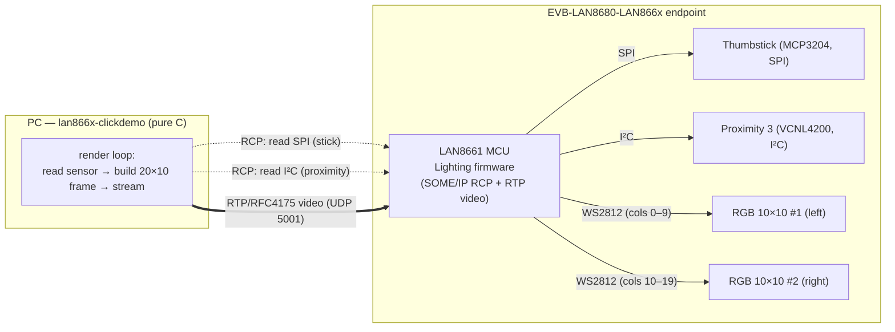
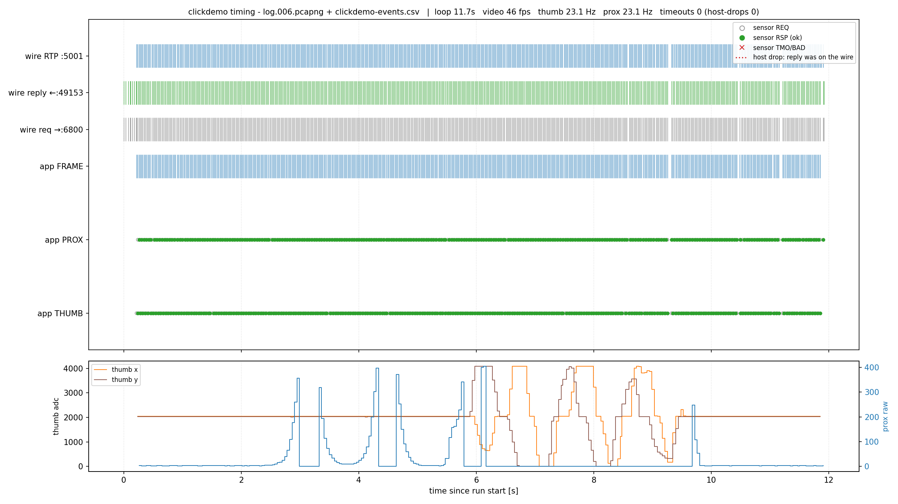
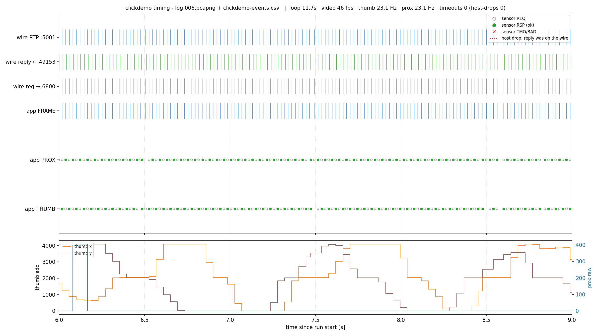
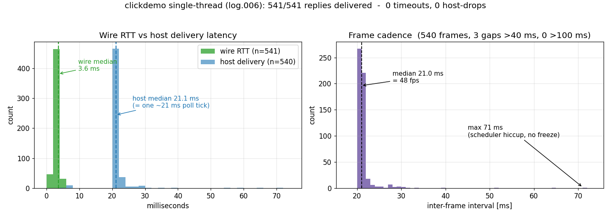

# clickdemo — interactive Click demo & timing deep‑dive

`lan866x-clickdemo` drives **two 10×10 WS2812 RGB Click panels** on a LAN866x
**Lighting** endpoint from **two sensors** — a Thumbstick (SPI) and a Proximity 3
(I²C) — entirely over the **RCP SOME/IP service** plus an **RTP video stream**, in
**pure C**. This document describes the demo, the software, and — in detail — the
**timing** of the render loop, illustrated with diagrams measured on real hardware.

> Companion docs: [howto_demonstrate.md](../howto_demonstrate.md) (how to run it
> live), [TOOLS.md](../TOOLS.md#412-lan866x-clickdemo) (board setup, options),
> [INTEGRATION_NOTES.md](INTEGRATION_NOTES.md) (the RCP/stack facts it relies on),
> [RCP_API.md](RCP_API.md) (the `rcp_*` calls it uses — `OpenSpi`, `WriteAndReadSpi2`, I²C).

---

## 1. What the demo shows


| Panel | Driven by | Bus | What you see |
|---|---|---|---|
| **Left** (Click 1) | Thumbstick (MCP3204) | **SPI**, slot 4 | an **orange "flashlight" spot**: centred at rest, moves to the edges as you push the stick |
| **Right** (Click 2) | Proximity 3 (VCNL4200) | **I²C @ 0x51**, slot 3 | a **blue bar** whose height tracks distance: hand closer → bar rises |

The point of the demo is to prove, end‑to‑end, that a host can **read peripherals**
(SPI + I²C) and **drive displays** (RTP video) on a LAN866x endpoint over 10BASE‑T1S,
with the exact same C code that would run on an MCU port. Board wiring, Click
placement and DIP switches are in [TOOLS.md §2.4/§2.5](../TOOLS.md#24-click-slots--what-plugs-where).

---

## 2. Architecture & data flow



- **Sensor reads** are RCP round‑trips: compound SPI `0x1509` for the 2‑axis
  Thumbstick (one round‑trip, both channels), and `WriteAndReadI2C 0x1208` for the
  Proximity register.
- **The displays are *not* per‑pixel addressable.** The firmware renders them from
  one **20×10 RTP/RFC4175 frame** on **UDP 5001** — left 10 columns → display 1,
  right 10 → display 2 (see [INTEGRATION_NOTES → Displays/RTP](INTEGRATION_NOTES.md#displays--rtp-clickdemo-video)).

---

## 3. The software

Single file [`clickdemo.c`](../clickdemo.c), linked against `rcpcore` (RCP over
`libsomeip`) on the **single‑thread platform layer** ([`plat.h`](../src/plat.h) /
[PORTING.md](../PORTING.md)). The render/sensor loop is platform‑neutral; the few
Windows specifics sit behind an `#ifdef _WIN32` glue. The relevant pieces:

| Part | Function(s) | Role |
|---|---|---|
| Setup | `spi_setup`, `i2c_setup`, `vcnl4200_init` | one‑time, *blocking* open/init of the two peripherals (paced with small `plat_sleep_ms`s) |
| Async reads | `fire_thumb`, `fire_prox` + callbacks `on_thumb`, `on_prox` | non‑blocking RCP requests; the reply is delivered **synchronously** by `rcp_async_poll()` and updates plain shared state |
| Render | `thumb_spot`, `prox_bar` | turn the latest sensor values into the 20×10 RGB framebuffer |
| Stream | `rtp_send` / `rtp_send_region` | pack the framebuffer into one RFC4175 datagram → UDP 5001 (via `plat_udp_*`) |
| Event log | `elog` + `--log` | one CSV row per event for analysis (see §6) |

**Asynchronous RCP** is the key. `rcp_async_request()` sends and returns
immediately; `rcp_async_poll()` drives completions/timeouts. Received datagrams are
dispatched **synchronously** from the poll, so the callback runs on the **same (only)
execution strand** as the loop — no rx thread, the critical sections are no‑ops, and
there is no reentrancy hazard
([INTEGRATION_NOTES](INTEGRATION_NOTES.md#callbacks-run-synchronously-on-the-single-execution-strand)).
The callback just stores results in plain variables; no `volatile`/atomic/lock is
needed, and it must not call back into `rcp_*`.

---

## 4. The timing model

### 4.1 The render loop (one tick)

```
   ┌─ every tick (target ~1000/fps ms) ──────────────────────────────┐
   │ 1. render both halves from the LATEST sensor values             │
   │ 2. rtp_send()            ← ONE 20×10 frame, steady cadence       │
   │ 3. fire ONE sensor read  ← alternating thumb / prox (1:1)        │
   │ 4. rcp_async_poll()      ← deliver replies / time‑outs           │
   │ 5. throttled status line (~10 Hz)                                │
   │ 6. plat_sleep_ms(1000/fps)                                       │
   └──────────────────────────────────────────────────────────────────┘
```

Three deliberate decisions shape the timing (the diagrams in §5 show the effect):

**(a) Video is decoupled from the sensor reads.** The frame is rendered from the
*last known* values and sent **first**, every tick — it is **never gated behind a
blocking read**. So an occasional Windows scheduler stall in the loop delays at most
one frame instead of freezing the video pipeline; the next tick simply carries on.

**(b) One read per tick, alternating thumb/prox (1:1).** Two RCP requests fired
back‑to‑back make their two replies arrive ~ms apart, and the Windows socket path can
then **drop one of them** ([gotcha #4](INTEGRATION_NOTES.md#host-throughput-vs-t1s-link-quality-important)).
Firing exactly one read per tick paces requests ~20 ms apart and keeps replies
**solo** — this is what holds the measured drop rate at **0 %** (§5). 1:1 gives each
sensor ~half the frame rate (~23 Hz), so both bars update evenly.

**(c) Async deadline = 70 ms — comfortable headroom.** The wire answers in ~3–4 ms
and, with one paced read per tick, every reply is collected by the next
`rcp_async_poll()`. 70 ms covers the worst loop stall (~71 ms scheduler hiccup) so a
reply in flight across a stall is still delivered, not falsely timed out. In practice
it is **never hit** (0 timeouts, §5).

### 4.2 The dominant timing fact: wire ~4 ms, host delivers at the poll cadence

The 10BASE‑T1S link and the firmware are **excellent** — wire RTT ~3.6 ms, **every
request answered** (§5). The app sees each reply not at 3.6 ms but at the **next poll
tick** (~21 ms), because the loop fires one read and then collects replies once per
frame — so the host‑observed latency is the *poll cadence*, not the wire.

The one host‑side hazard is [gotcha #4](INTEGRATION_NOTES.md#host-throughput-vs-t1s-link-quality-important):
the Windows socket path can drop a reply that is already on the NIC when **two
requests race back‑to‑back**. The one‑read‑per‑tick pacing keeps requests from racing,
which is why a full run shows **0 host‑side drops** (§5.3). It remains a real host
behaviour under *unpaced* back‑to‑back traffic — the pacing is what avoids it. (Extra
active NICs aggravate it, since the SD multicast is joined on every interface.)

---

## 5. Measured timing (real hardware)

Captured with Wireshark on the T1S NIC **and** the demo's own event log, then plotted
on one shared UTC timeline by [`tools/plot_timing.py`](../tools/plot_timing.py). Lanes
top→bottom: wire RTP `:5001`, wire reply `←:49153`, wire request `→:6800`, app
`FRAME`, app `PROX`, app `THUMB`. Markers: REQ ○, RSP ● (green), TMO ✕ (red). The
bottom panel plots the sensor values.

*(Measured on the single‑thread build — capture `log.006.pcapng` + its
`clickdemo-events.csv`, an 11.7 s run, hand waved in front of the proximity sensor
~3–6 s and the thumbstick worked ~6–9 s.)*

### 5.1 Overview of a full run



The whole run streams: the RTP / reply / request lanes are **dense and steady**
(~46 fps video, ~23 Hz per sensor), the PROX and THUMB lanes are a solid line of
**green RSPs with no red ✕ anywhere** — **0 timeouts, 0 host‑drops** (title line). The
bottom panel shows the proximity value (blue) spiking as a hand approaches (~3–6 s) and
the thumbstick X/Y (orange/brown) swept around 6–9 s. (Discovery + peripheral setup
happen before the event log opens, so the CSV covers the streaming phase only.)

### 5.2 A clean window — balanced reads, every reply delivered



Zoomed to 6–9 s. Thumbstick and proximity **alternate evenly** — REQ (○) then RSP (●
green) — at ~23 Hz each; **every** wire request gets a reply within a couple of ms and
the app delivers it (no red); the thumb X/Y step curves update smoothly. This is what
"flüssig" looks like — the typical window.

### 5.3 Wire RTT vs host latency, and cadence



The headline plot. **Left:** the wire RTT (green) is a tight spike at **~3.6 ms** —
the real 10BASE‑T1S round‑trip — while the app delivers each reply at **~21 ms**
(blue), i.e. one poll tick later. The gap between the two is **not loss**; it is the
once‑per‑frame poll cadence (the app fires one read and collects replies on the next
tick). **Right:** the frame interval sits at **21 ms (≈48 fps)** with a thin tail to a
single **71 ms** scheduler hiccup — **0 gaps over 100 ms**, so the decoupled video
never freezes. All 541 sensor replies were delivered; **no red ✕ exists to plot**,
because there were no timeouts.

### 5.4 Measured results (run log.006)

| Metric | Value |
|---|---|
| Reply delivery | **100 %** — 541/541 sensor replies delivered |
| Timeouts / host‑side drops | **0** (sid↔wire correlation: every reply consumed) |
| Wire RTT | 3.6 ms median, 5.1 ms max |
| Host delivery latency | ~21 ms (one poll tick) |
| Video cadence | ~46 fps, 0 stalls > 100 ms |
| Per‑sensor rate | ~23 Hz each (1:1) |

---

## 6. Reproduce / analyse the timing yourself

1. **Event log** — the demo writes `clickdemo-events.csv` by default
   (`--log <file>` to change, `--nolog` to disable). Each row:
   `epoch,rel_ms,event,sid,v1,v2,rc,lat_ms`. The `epoch` is UTC (== tshark
   `frame.time_epoch`) and `sid` is the SOME/IP session id (== `someip.sessionid`),
   so every app event matches its packet on the wire.
2. **Capture** — run Wireshark on the T1S NIC while the demo runs; save a `.pcapng`.
3. **Plot** —
   ```
   python tools/plot_timing.py --pcap logs/log.NNN.pcapng --csv release/clickdemo-events.csv
   python tools/plot_timing.py --from 9 --to 12 --out logs/zoom.png   # zoom to a window
   ```
   It prints the timeout/host‑drop count — normally **0** (as in `log.006`). A timeout
   whose `sid` is present as a reply on the wire would be a host drop, one absent from
   the wire a (rare) real link loss.

---

## 7. Tuning knobs & takeaways

- **Options:** `--fps N` (frame cadence), `--bright`, `--bar`, `--prox-max`,
  `--log/--nolog`. See [TOOLS.md §4.12](../TOOLS.md#412-lan866x-clickdemo).
- **Read balance:** the 1:1 thumb/prox split lives in the loop (`tick & 1u`). Bias it
  (e.g. 3:2) only if one sensor needs more samples than the other.
- **Async deadline:** `rcp_set_async_timeout_ms(70)` — comfortable headroom (never hit
  in `log.006`). Raise it for a host with larger scheduler stalls; lower it (never
  below ~10× the ~4 ms RTT) for faster recovery.
- **Environment:** disabling NICs not on the T1S subnet cuts gotcha #4 under unpaced
  traffic.
- **Takeaway:** with the wire at ~4 ms RTT and the firmware answering everything, the
  art of a smooth host demo is **timing discipline** — decouple the display from the
  round‑trips, and pace requests so replies arrive solo. Replies are polled
  synchronously (single‑thread), so there is no rx thread to fall behind and no lock to
  contend; the discipline that remains is pacing and decoupling.
