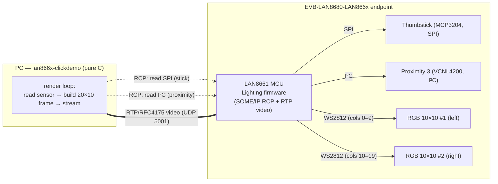
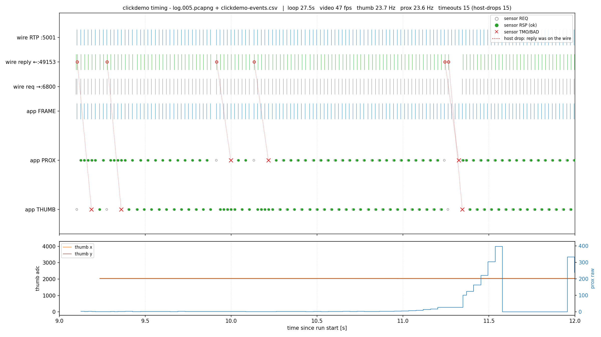

# clickdemo — interactive Click demo & timing deep‑dive

`lan866x-clickdemo` drives **two 10×10 WS2812 RGB Click panels** on a LAN866x
**Lighting** endpoint from **two sensors** — a Thumbstick (SPI) and a Proximity 3
(I²C) — entirely over the **RCP SOME/IP service** plus an **RTP video stream**, in
**pure C**. This document describes the demo, the software, and — in detail — the
**timing** of the render loop, illustrated with diagrams measured on real hardware.

> Companion docs: [howto_demonstrate.md](../howto_demonstrate.md) (how to run it
> live), [TOOLS.md](../TOOLS.md#412-lan866x-clickdemo) (board setup, options),
> [INTEGRATION_NOTES.md](INTEGRATION_NOTES.md) (the RCP/stack facts it relies on).

---

## 1. What the demo shows


| Panel | Driven by | Bus | What you see |
|---|---|---|---|
| **Left** (Click 1) | Thumbstick (MCP3204) | **SPI**, slot 4 | an **orange "flashlight" spot**: centred at rest, moves to the edges as you push the stick |
| **Right** (Click 2) | Proximity 3 (VCNL4200) | **I²C @ 0x51**, slot 3 | a **blue bar** whose height tracks distance: hand closer → bar rises |

The point of the demo is to prove, end‑to‑end, that a host can **read peripherals**
(SPI + I²C) and **drive displays** (RTP video) on a LAN866x endpoint over 10BASE‑T1S,
with the exact same C code that would run on an MCU port. Board wiring, Click
placement and DIP switches are in [TOOLS.md §2.4/§2.5](../TOOLS.md#24-click-slots--what-plugs-where).

---

## 2. Architecture & data flow



- **Sensor reads** are RCP round‑trips: compound SPI `0x1509` for the 2‑axis
  Thumbstick (one round‑trip, both channels), and `WriteAndReadI2C 0x1208` for the
  Proximity register.
- **The displays are *not* per‑pixel addressable.** The firmware renders them from
  one **20×10 RTP/RFC4175 frame** on **UDP 5001** — left 10 columns → display 1,
  right 10 → display 2 (see [INTEGRATION_NOTES → Displays/RTP](INTEGRATION_NOTES.md#displays--rtp-clickdemo-video)).

---

## 3. The software

Single file [`clickdemo.c`](../clickdemo.c), linked against `rcpcore` (RCP over
`libsomeip`) + Winsock for the RTP socket. The relevant pieces:

| Part | Function(s) | Role |
|---|---|---|
| Setup | `spi_setup`, `i2c_setup`, `vcnl4200_init` | one‑time, *blocking* open/init of the two peripherals (paced with small `Sleep`s) |
| Async reads | `fire_thumb`, `fire_prox` + callbacks `on_thumb`, `on_prox` | non‑blocking RCP requests; the reply lands later on the rx thread and updates shared `volatile` state |
| Render | `thumb_spot`, `prox_bar` | turn the latest sensor values into the 20×10 RGB framebuffer |
| Stream | `rtp_send` / `rtp_send_region` | pack the framebuffer into one RFC4175 datagram → UDP 5001 |
| Event log | `elog` + `--log` | one CSV row per event for analysis (see §6) |

**Asynchronous RCP** is the key. `rcp_async_request()` sends and returns
immediately; `rcp_async_poll()` drives completions/timeouts. The callback runs
**under the transmit lock** (a non‑reentrant semaphore — see
[gotcha #3](INTEGRATION_NOTES.md#gotcha--callbacks-run-under-a-non-reentrant-lock)),
so it only stores results in `volatile` variables and never calls back into `rcp_*`.

---

## 4. The timing model

### 4.1 The render loop (one tick)

```
   ┌─ every tick (target ~1000/fps ms) ──────────────────────────────┐
   │ 1. render both halves from the LATEST sensor values             │
   │ 2. rtp_send()            ← ONE 20×10 frame, steady cadence       │
   │ 3. fire ONE sensor read  ← alternating thumb / prox (1:1)        │
   │ 4. rcp_async_poll()      ← deliver replies / time‑outs           │
   │ 5. throttled status line (~10 Hz)                                │
   │ 6. Sleep(1000/fps)                                               │
   └──────────────────────────────────────────────────────────────────┘
```

Three deliberate decisions shape the timing — each one is a fix for a measured
problem (the diagrams in §5 show the effect):

**(a) Video is decoupled from the sensor reads.** The frame is rendered from the
*last known* values and sent **first**, every tick. It is **never gated behind a
blocking read**. An earlier version blocked on each read plus a `Sleep(12)` between
them; when a Windows scheduler stall stretched that `Sleep` to ~150 ms, the whole
pipeline — including the video — froze. Now a loop stall delays at most one frame.

**(b) One read per tick, alternating thumb/prox (1:1).** Two RCP requests fired
back‑to‑back make their two replies arrive ~ms apart, and the Windows host then
**drops one of them** (see (d)). Firing exactly one per tick keeps replies **solo**.
1:1 gives each sensor ~half the frame rate (~23 Hz). An earlier 3:1 thumb bias
starved the proximity to ~12 Hz — a visibly stuttering bar.

**(c) Async deadline = 70 ms.** The wire answers in ~3–4 ms, but the host's
rx‑dispatch thread occasionally falls **~40–50 ms behind in bursts**. A too‑short
deadline (we tried 40 ms) discards a reply that is *already on the wire* and re‑reads
for nothing; 70 ms clears that jitter while a genuine loss still recovers ~2× faster
than the original 120 ms.

### 4.2 The dominant timing fact: host‑side reply drops (gotcha #4)

The 10BASE‑T1S link and the firmware are **excellent** — RTT ~3–4 ms, every request
answered. **All** observed hitches are **host‑side**: the reply datagram is captured
on the NIC but **the Windows socket path doesn't hand it to the app in time**, so the
async layer times out. This is [gotcha #4](INTEGRATION_NOTES.md#host-throughput-vs-t1s-link-quality-important).
It is made worse by extra active NICs (the SD multicast is joined on every interface)
— disabling unrelated NICs/Wi‑Fi reduces it.

---

## 5. Measured timing (real hardware)

Captured with Wireshark on the T1S NIC **and** the demo's own event log, then plotted
on one shared UTC timeline by [`tools/plot_timing.py`](../tools/plot_timing.py). Lanes
top→bottom: wire RTP `:5001`, wire reply `←:49153`, wire request `→:6800`, app
`FRAME`, app `PROX`, app `THUMB`. Markers: REQ ○, RSP ● (green), TMO ✕ (red). The
bottom panel plots the sensor values.

### 5.1 Overview of a full run


The first ~9 s is **discovery + peripheral setup** (sparse, paced round‑trips, no
frames). From then on the loop streams: the RTP / reply / request lanes are **dense
and steady (~47 fps video, ~23 Hz per sensor)**, and the bottom panel shows the
proximity value (blue) responding to a hand waved in front of the sensor while the
thumbstick (orange) is moved around 20–33 s. Title line carries the run summary.

### 5.2 A clean window — balanced reads, smooth values


Zoomed to ~4 s of normal operation. Thumbstick and proximity RSPs (green) **alternate
evenly** at ~23 Hz each; every wire request gets a reply within a couple of ms; the
`prox raw` step curve updates smoothly. This is what "flüssig" looks like.

### 5.3 A drop window — the host‑drop mechanism, made explicit



The headline plot. Each **red ✕** on an app lane is a sensor **timeout**, connected by
a red dotted line to a **red circle on the wire‑reply lane** — i.e. *the reply WAS on
the wire (~4 ms after the request) but the app never received it*. That is gotcha #4
caught red‑handed: pure **host‑side** loss, not a link problem. After the fixes these
are rare (~1 % of reads) and each costs ~70 ms (one re‑read), instead of the ~170 ms
freeze the original code suffered.

### 5.4 Before → after (what the fixes bought)

| Symptom | Before | After |
|---|---|---|
| Video cadence | ~24 fps, froze ~150 ms on a loop stall | **~47 fps**, no stalls (decoupled) |
| Proximity sample rate | ~12 Hz (3:1 bias) → stuttering bar | **~23 Hz** (1:1) |
| Reply‑drop rate | ~4 % (prox) | **~1 %** |
| Stall per dropped reply | ~170 ms (120 ms timeout) | **~70 ms** |
| Cause of every timeout | — | **100 % host‑side**, proven by sid↔wire correlation |

---

## 6. Reproduce / analyse the timing yourself

1. **Event log** — the demo writes `clickdemo-events.csv` by default
   (`--log <file>` to change, `--nolog` to disable). Each row:
   `epoch,rel_ms,event,sid,v1,v2,rc,lat_ms`. The `epoch` is UTC (== tshark
   `frame.time_epoch`) and `sid` is the SOME/IP session id (== `someip.sessionid`),
   so every app event matches its packet on the wire.
2. **Capture** — run Wireshark on the T1S NIC while the demo runs; save a `.pcapng`.
3. **Plot** —
   ```
   python tools/plot_timing.py --pcap logs/log.NNN.pcapng --csv release/clickdemo-events.csv
   python tools/plot_timing.py --from 9 --to 12 --out logs/zoom.png   # zoom to a window
   ```
   It prints the host‑drop timestamps so you can zoom straight to them. A timeout
   whose `sid` is present as a reply on the wire is a host drop; one that is **absent**
   from the wire would be a (rare) real link loss.

---

## 7. Tuning knobs & takeaways

- **Options:** `--fps N` (frame cadence), `--bright`, `--bar`, `--prox-max`,
  `--log/--nolog`. See [TOOLS.md §4.12](../TOOLS.md#412-lan866x-clickdemo).
- **Read balance:** the 1:1 thumb/prox split lives in the loop (`tick & 1u`). Bias it
  (e.g. 3:2) only if one sensor needs more samples than the other.
- **Async deadline:** `rcp_set_async_timeout_ms(70)` — raise it if your host's
  rx‑dispatch jitter is larger; lower it (never below ~10× the ~4 ms RTT) for faster
  recovery on a clean host.
- **Environment:** disabling NICs not on the T1S subnet measurably cuts gotcha #4.
- **Takeaway:** with the wire at ~4 ms RTT and the firmware answering everything, the
  art of a smooth host demo is **timing discipline** — decouple the display from the
  round‑trips, pace requests so replies arrive solo, and size the timeout to the
  host's jitter, not the wire's latency.
