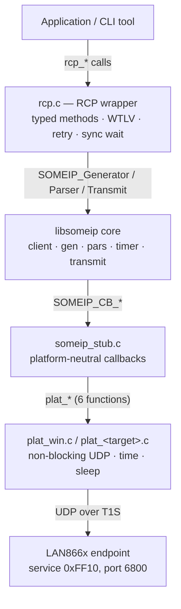
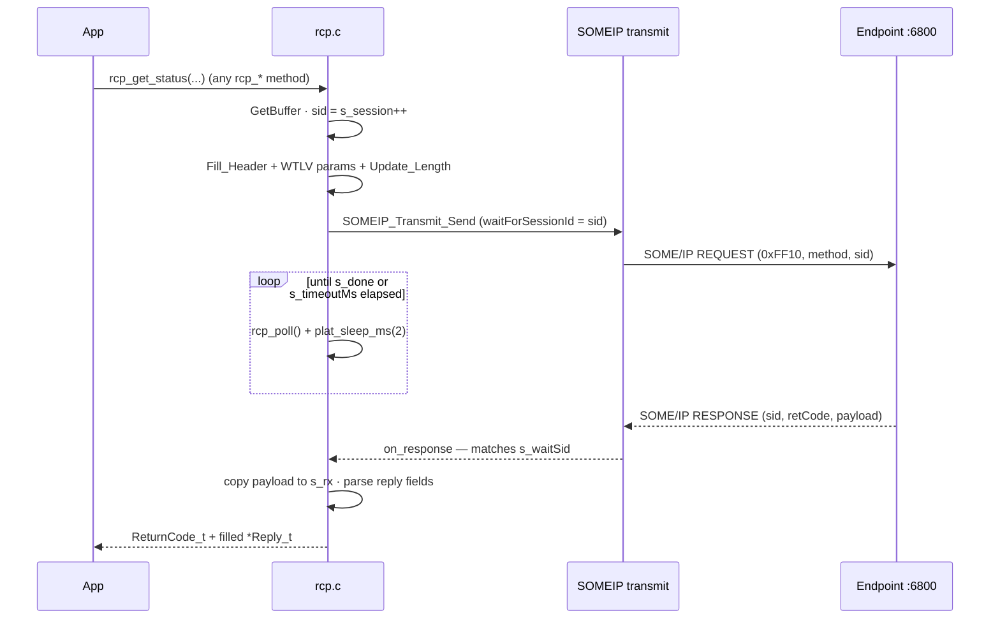
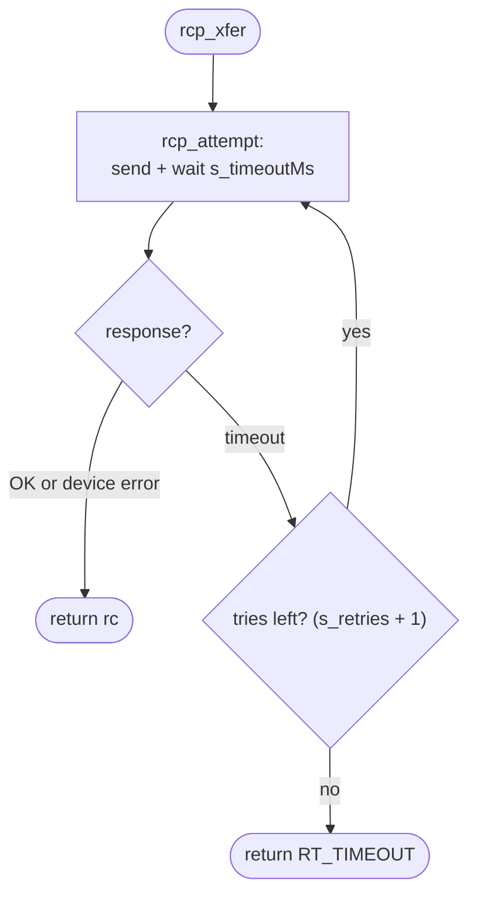
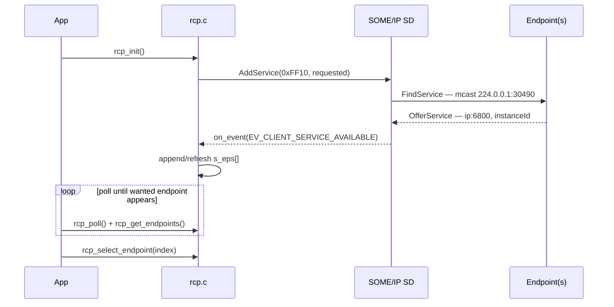
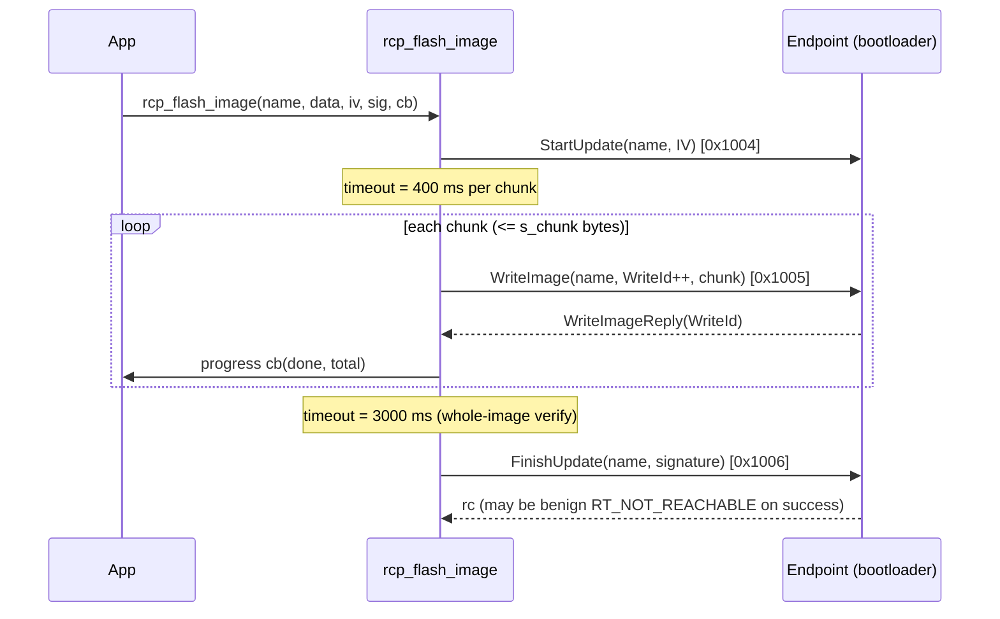
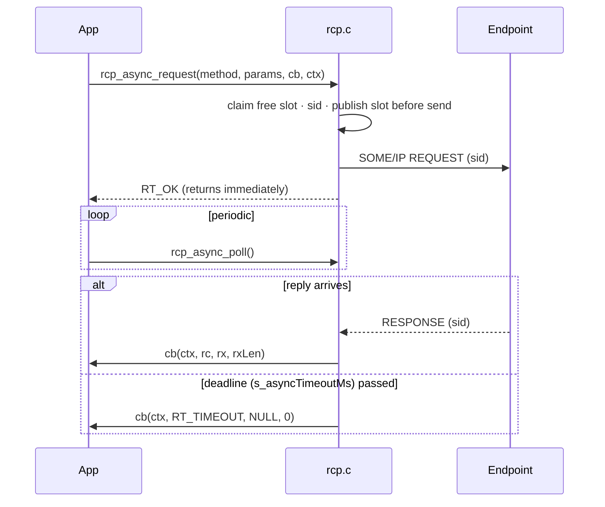

# RCP API reference (`src/rcp.c` / `src/rcp.h`)

A precise, exhaustive description of the `rcp_*` API — the wrapper that turns the
LAN866x **Remote Control Protocol (RCP)** into typed C calls over the pure‑C
SOME/IP stack. This is the **only** layer an application (and a new port) talks
to: it hides the SOME/IP header, the WTLV parameter encoding, the retry loop and
the single‑thread RX dispatch.

> Scope: this documents the host‑side client wrapper as implemented in this repo,
> so it can be **re‑implemented from scratch** (other language, other transport)
> without reading the SOME/IP core. Wire facts and method IDs are taken straight
> from the source. Authoritative method‑ID source remains the SOME/IP dissector
> CSV / Endpoint User's Guide; the table here matches `rcp.c` as shipped.

Contents:
1. [Model & invariants](#1-model--invariants)
2. [Return codes (`ReturnCode_t`)](#2-return-codes-returncode_t)
3. [How one request works on the wire](#3-how-one-request-works-on-the-wire)
4. [Lifecycle & configuration](#4-lifecycle--configuration)
5. [Discovery & endpoint selection](#5-discovery--endpoint-selection)
6. [Synchronous methods](#6-synchronous-methods)
7. [Asynchronous (non‑blocking) API](#7-asynchronous-non-blocking-api)
8. [WTLV parameter encoding](#8-wtlv-parameter-encoding)
9. [Re‑implementation checklist](#9-re-implementation-checklist)

---

## 1. Model & invariants

| Property | Value / rule |
|---|---|
| Service ID | `0xFF10` (`RCP_SERVICE_ID`) |
| Instance ID | `0x1` |
| Interface version | `0x1` (replies with any other version are dropped) |
| Client ID | `0xaffe` (fixed in every request header) |
| SD (Service Discovery) | UDP **30490**, multicast **224.0.0.1** |
| Method endpoint (request dst) | UDP **6800** (per‑endpoint, learned from the SD offer) |
| Reply source port (endpoint) | UDP **49153** |
| Threading | **single strand** — one execution thread, superloop |
| Endianness | SOME/IP is **big‑endian** on the wire |

**Layering** — the application only ever touches `rcp.h`; everything below is the
vendor SOME/IP core plus the one platform file you write for a port:



**Single‑thread invariant (critical).** There is no RX thread. Received UDP is
parsed **synchronously** inside `someip_service()`, which runs from `rcp_poll()`
and `rcp_async_poll()`. Therefore:

- The shared request/reply state (`s_rx`, `s_done`, `s_waitSid`, the async slot
  table) needs **no** `volatile`, atomics or locks.
- Response/async callbacks fire **inline** from the poll call, on the caller's
  strand. Keep them short and **never call `rcp_*` from inside a callback** — it
  would reuse the transmit buffers mid‑iteration.

**Module‑global state** (one client per process): selected endpoint, the endpoint
table, the per‑attempt timeout/retries/chunk knobs, a single RX buffer `s_rx` and
a single request scratch buffer `s_scratch`, each `SOMEIP_TRANSMIT_MAX_PAYLOAD_LEN`
bytes. Synchronous calls are therefore **not reentrant** — one request in flight
at a time. (The async API has its own `RCP_ASYNC_MAX` slot table and is the way to
overlap requests.)

---

## 2. Return codes (`ReturnCode_t`)

Every method returns `ReturnCode_t`. `RT_OK == 0`; note the wire return codes and
the internal codes share the enum. Decoders use `RT_MALFORMED_MESSAGE` when the
reply parses wrong.

| Code | Value | Meaning |
|---|---|---|
| `RT_OK` | `0x00` | success |
| `RT_NOT_OK` | `0x01` | unspecified error |
| `RT_UNKNOWN_SERVICE` | `0x02` | service ID unknown |
| `RT_UNKNOWN_METHOD` | `0x03` | method ID unknown (e.g. `spi2` on a pre‑V1.3.2 config) |
| `RT_NOT_READY` | `0x04` | service+method known, app not running |
| `RT_NOT_REACHABLE` | `0x05` | peripheral not configured on that node / target unreachable |
| `RT_TIMEOUT` | `0x06` | no response within the deadline (after all retries) |
| `RT_WRONG_PROTOCOL_VERSION` | `0x07` | SOME/IP version unsupported |
| `RT_WRONG_INTERFACE_VERSION` | `0x08` | interface version mismatch |
| `RT_MALFORMED_MESSAGE` | `0x09` | (de)serialization error — e.g. each field overwriting the last; see §8 |
| `RT_WRONG_MESSAGE_TYPE` | `0x0A` | unexpected message type |
| `RT_E2E_*` | `0x0B`–`0x0F` | end‑to‑end protection errors (unused here) |
| `RT_INTERNAL_ERROR` | `0x1000` | no endpoint selected / no transmit buffer / no async slot |
| `RT_SEND_ERROR` | `0x1001` | transmit layer could not send |
| `RT_PARAMETER_NOT_VALID` | `0x1002` | a parameter failed to encode / image name too long |
| `RT_DEVICE_NOT_AVAILABLE` | `0x1003` | device not present right now |

> Gotcha: `FinishUpdate` (and thus `rcp_flash_image`) may return a **benign**
> `RT_NOT_REACHABLE` even on success — judge a flash by the outcome (reboot +
> running version), not strictly by the rc.

---

## 3. How one request works on the wire

The synchronous path (`rcp_attempt` → `rcp_xfer`) is the reference flow; the async
path mirrors it without the wait.



1. **Pick a transmit buffer** from the SOME/IP transmit pool. Fail → `RT_INTERNAL_ERROR`.
2. **Allocate a session id** (`s_session++`, wrapping but never 0). This is the
   correlation key between request and reply.
3. **Fill the SOME/IP header** into the buffer:
   `msgType=REQUEST`, `retCode=E_OK`, `serviceId=0xFF10`, `methodId=<method>`,
   `clientId=0xaffe`, `sessionId=<sid>`, `interfaceVersion=0x1`.
4. **Append the parameter payload** (already WTLV‑encoded, see §8) after the header.
5. **Patch the SOME/IP length field** to cover header tail + payload.
6. **Send**, recording `waitForSessionId = sid` and the callback on the buffer.
7. **Wait** (sync only): loop `rcp_poll()` + `plat_sleep_ms(2)` until the reply
   arrives or `s_timeoutMs` elapses, measured by a real‑time `SOMEIP_CB_GetTimeMS()`
   deadline (never by counting sleeps — Windows `Sleep` granularity is ~15.6 ms).
8. **Match the reply.** `on_data_received` parses the header; only a
   `RESPONSE`/`ERROR` for service `0xFF10` and interface version `1` is routed to
   the transmit layer, which calls `on_response` for the buffer whose
   `waitForSessionId` matches. The reply payload is copied into `s_rx[0..s_rxLen]`.
9. **On timeout**, the buffer is abandoned cleanly: its callback is detached and
   its slot freed so a late reply can't complete a *later* request's wait.

**Retry.** `rcp_xfer` wraps `rcp_attempt` in `s_retries + 1` attempts; it retries
**only** on `RT_TIMEOUT` (a real response — OK or a device error — stops the loop).
This mirrors the C++ client's `REQUEST_RETRIES`. Because the host drops replies
under back‑to‑back load (~60 % at 0 ms gap), pacing + retry is what makes control
traffic reliable; the T1S wire itself is ~0 % loss.



---

## 4. Lifecycle & configuration

```c
bool rcp_init(const uint8_t localIfIP[4]);
void rcp_poll(void);
bool rcp_is_ready(void);
void rcp_set_timeout_ms(uint32_t ms);   /* per-attempt response timeout, default 1500 */
void rcp_set_retries(uint8_t n);        /* extra attempts on RT_TIMEOUT, default 3 */
void rcp_set_chunk(uint16_t n);         /* WriteImage chunk bytes, default/clamp <= 1200 */
```

| Function | Description |
|---|---|
| `rcp_init` | Initialise the SOME/IP transmit layer (binds the method socket) and call `SOMEIP_Client_AddService(0xFF10, requested=true)` so the stack sends `FindService` and receives periodic `OfferService`. `localIfIP` is accepted for API symmetry but **ignored** — the platform stub picks the interface by subnet match. Returns `false` if the transmit layer or service registration fails. Call **once**, after the network interface has a valid IP. |
| `rcp_poll` | Pump the stack once: `someip_service()` (synchronous RX + SD) then `SOMEIP_Transmit_CheckTimers()`. Call periodically while waiting (the sync methods call it internally; call it yourself in your superloop when idle so discovery and retransmits progress). |
| `rcp_is_ready` | `true` once **at least one** endpoint has offered the service (`s_epCount > 0`). Used to distinguish "nothing answered" from "the wanted one didn't". |
| `rcp_set_timeout_ms` | Per‑**attempt** deadline (not total). Lower it for fast probing where a non‑answer is expected (I²C address scan); 0 is clamped to 1. `rcp_flash_image` sets it internally (400 ms for chunks, 3000 ms for `FinishUpdate`). |
| `rcp_set_retries` | Extra attempts after a timeout. Set **0** for probing where a missing reply is the normal result (so an absent I²C address returns quickly). |
| `rcp_set_chunk` | `WriteImage` payload size; values outside `1..1200` clamp to 1200. Smaller chunks survive a marginal link better (WriteId‑idempotent retries cover drops). |

**Startup order for a port:** PHY up → IP valid → `rcp_init()` → poll until
`rcp_is_ready()` / the wanted endpoint appears → select → call methods.

---

## 5. Discovery & endpoint selection

```c
#define RCP_MAX_ENDPOINTS 16u
typedef struct {
    uint8_t  ip[4];        /* endpoint IP from the SD OfferService */
    uint16_t port;         /* method port (6800) */
    uint16_t serviceId;    /* 0xFF10 */
    uint16_t instanceId;   /* received instance id */
    bool     available;    /* currently offering? */
} rcp_endpoint_t;

uint8_t rcp_get_endpoints(rcp_endpoint_t *out, uint8_t maxOut);
bool    rcp_select_endpoint(uint8_t index);
```



- Endpoints are discovered by the SD **event callback** `on_event`: on
  `EV_CLIENT_SERVICE_AVAILABLE` a new `{ip,instanceId}` is appended (or an existing
  one re‑marked available); on `EV_CLIENT_SERVICE_STOPPED` matching entries are
  marked unavailable. The IP/port come from the endpoint's offer, **not** from the host.
- `rcp_get_endpoints` copies up to `maxOut` entries into `out` and returns the count.
- `rcp_select_endpoint` sets the target for all subsequent method calls; returns
  `false` if `index >= count`. Default selection is index 0.
- Helper pattern (see `src/tool_common.h`): poll and call `rcp_get_endpoints`
  repeatedly, returning as soon as the wanted IP/index appears, rather than waiting
  a fixed window.

---

## 6. Synchronous methods

All methods below block (poll internally) until a reply, a device error, or
timeout‑after‑retries. Each row lists the **method ID** and the request/reply
struct from `include/lan866x_common.h`. Unless noted, a method takes a single
`const *Var_t` input and/or writes a `*Reply_t` output, returns `ReturnCode_t`.

### 6.1 System / diagnostics

| Function | ID | In | Out | Notes |
|---|---|---|---|---|
| `rcp_get_status` | `0x1002` | — | `GetStatusReply_t` | Names + 6 version blobs + uptime, reset cause, COMO/service version, keys version. The wrapper pre‑sets every `*Length` to the buffer capacity before parsing. |
| `rcp_get_network_status` | `0x1600` | — | `GetNetworkStatusReply_t` | IPv4/IPv6/MAC, link state, OASPI status, arbitration (PLCA) mode + node id. |
| `rcp_read_diagnosis_data` | `0x1003` | — | `ReadDiagnosisDataReply_t` | Four raw 16‑byte PHY/T1S channel blobs (SQI, fault/short detection). |

`GetStatusReply_t` key fields: `ActiveApplication[64]`, `ChipIdentifier[64]`
(e.g. `LAN8661A`), `{Root,Boot,Main}ApplicationVersion[64]`,
`{Boot,Main}ConfigurationVersion[64]`, `KeysVersion[64]`, `StartupInformation`
(reset‑cause bitfield, see header), `UpTime` (ns), `ComoVersion`, `ServiceVersion`
(`0xMMmm00`). `GetNetworkStatusReply_t`: `EndpointStatus` 1=up/2=down,
`ArbitrationMode` 0=CSMA‑CD/1=PLCA/2=PLCA‑no‑fallback, `PLCANodeId`.

### 6.2 Bootloader / firmware update

| Function | ID | In | Out | Notes |
|---|---|---|---|---|
| `rcp_reboot` | `0x1000` | `const char *name` | — | Reboots into the named image. Name is sent **BOM‑prefixed** (UTF‑8 BOM `EF BB BF` + name + NUL). Helpers: `RCP_IMAGE_BOOTLOADER`, `RCP_IMAGE_MAIN`. The node leaves and re‑joins the bus (re‑discovery follows). |
| `rcp_start_update` | `0x1004` | `StartUpdateVar_t` | — | `ImageName` + `InitVector`. |
| `rcp_write_image` | `0x1005` | `WriteImageVar_t` | `WriteImageReply_t` | One chunk: `ImageName`, `WriteId`, `WriteData[<=1200]`. Reply echoes `WriteId` (loss detection). |
| `rcp_finish_update` | `0x1006` | `FinishUpdateVar_t` | — | `ImageName` + `Signature[<=512]`; verifies the whole image. May return benign `RT_NOT_REACHABLE` on success. |

**High‑level helper:**

```c
typedef void (*rcp_progress_cb)(uint32_t done, uint32_t total);
ReturnCode_t rcp_flash_image(const char *imageName,
                             const uint8_t *data, uint32_t dataLen,
                             const uint8_t *iv,   uint16_t ivLen,
                             const uint8_t *sig,  uint16_t sigLen,
                             rcp_progress_cb cb);
```

Drives the full `StartUpdate → WriteImage…(WriteId++) → FinishUpdate` sequence,
chunking `data` by `s_chunk`, BOM‑prefixing the name internally, and adjusting the
timeout per phase (400 ms chunks, 3000 ms finish). `iv`/`sig` must fit the struct
fields (32 / 512). The blobs are the pre‑built, signed parts from an MCHPKG; the
host only transports them — the bootloader verifies the signature.



### 6.3 Digital pins

| Function | ID | In | Notes |
|---|---|---|---|
| `rcp_release_digital_pins` | `0x1105` | `ReleaseDigitalPinsVar_t` | `PinIdList[<=16]` — unlock pins and reset to default. |

### 6.4 GPIO

| Function | ID | In | Out | Notes |
|---|---|---|---|---|
| `rcp_open_gpio` | `0x1300` | `OpenGpioVar_t` | `OpenGpioReply_t` | `PinIdGpio`, `Direction` (0=in, 1=out‑low, 2=out‑high, 3=open‑drain) → `HandleGpio`. |
| `rcp_set_gpio` | `0x1330` | `SetGpioVar_t` | — | `GpioValues[<=48]` = packed `{u16 handle, u8 value}` tuples. |
| `rcp_get_gpio` | `0x1332` | — | `GetGpioReply_t` | Returns the same tuple blob. |

### 6.5 I²C

| Function | ID | In | Out | Notes |
|---|---|---|---|---|
| `rcp_open_i2c` | `0x1200` | `OpenI2CVar_t` | `OpenI2CReply_t` | `PinIdSda/Scl`, `ClockSpeed` (0=100k,1=400k,2=1M) → `HandleI2C`. |
| `rcp_write_i2c` | `0x1204` | `WriteI2CVar_t` | — | `Handle`, `DeviceAddress` (7‑bit, R/W stripped), `WriteId`, `WriteData[<=1400]`. |
| `rcp_read_i2c` | `0x1220` | `ReadI2CVar_t` | `ReadI2CReply_t` | **Pure read** — use this for presence/bus scans. Reply: `ReadId`, `ReadData`. |
| `rcp_write_and_read_i2c` | `0x1208` | `WriteAndReadI2CVar_t` | `ReadI2CReply_t` | Combined write‑then‑read. |
| `rcp_close_i2c` | `0x1202` | `CloseI2CVar_t` | — | `HandleI2C`. |

> **Scan gotcha:** for presence detection use `rcp_read_i2c` (`0x1220`). The
> firmware does **not** report an address NACK as an error for `WriteAndReadI2C`
> (`0x1208`) with a 0‑byte write, so absent addresses look present (phantoms).

### 6.6 SPI

| Function | ID | In | Out | Notes |
|---|---|---|---|---|
| `rcp_open_spi` | `0x1500` | `OpenSpiVar_t` | `OpenSpiReply_t` | `PinIdMiso/Sck/Cs/Mosi` (`0xFF`=unused), `Mode` 0‑3, `ClockSpeed` Hz → `HandleSpi`. |
| `rcp_write_and_read_spi` | `0x1508` | `WriteAndReadSpiVar_t` | `WriteAndReadSpiReply_t` | One full‑duplex transfer: `Handle`, `ReadDataLength`, `WriteId`, `WriteData[<=1400]` → `ReadId`, `ReadData`. |
| `rcp_write_and_read_spi2` | `0x1509` | *(flat args)* | *(flat args)* | **Compound:** two SPI elements in one round‑trip (config ≥ V1.3.2). Halves latency for paired reads. Returns `RT_UNKNOWN_METHOD` on an old config. |
| `rcp_close_spi` | `0x1502` | `CloseSpiVar_t` | — | `HandleSpi`. |

`rcp_write_and_read_spi2` has a flat signature (no struct):

```c
ReturnCode_t rcp_write_and_read_spi2(uint16_t handle, uint32_t writeId,
    const uint8_t *cmd0, uint16_t cmd0Len, uint8_t *rd0, uint16_t *rd0Len,
    const uint8_t *cmd1, uint16_t cmd1Len, uint8_t *rd1, uint16_t *rd1Len);
```
`rd0Len`/`rd1Len` are in/out (capacity in, bytes read out).

### 6.7 ADC

| Function | ID | In | Out | Notes |
|---|---|---|---|---|
| `rcp_open_adc` | `0x1700` | `OpenAdcVar_t` | `OpenAdcReply_t` | `PinId` (always 0) → `HandleAdc`. |
| `rcp_read_adc` | `0x1720` | `ReadAdcVar_t` | `ReadAdcReply_t` | `Handle`, `ChannelSelecct` (0=analog in,1=internal temp), `VoltageReference` (0=3v3,1=1v1) → `Instance`, `ReadData`. (Field name `ChannelSelecct` is spelled as in the vendor header.) |
| `rcp_close_adc` | `0x1702` | `CloseAdcVar_t` | — | `HandleAdc`. |

### 6.8 PWM

| Function | ID | In | Out | Notes |
|---|---|---|---|---|
| `rcp_open_pwm` | `0x1800` | `OpenPwmVar_t` | `OpenPwmReply_t` | `PinId`, `IntervalTime` (ns, rounded to 20 ns), `DutyCycle` (`0..2^31` = 0..100 %) → `HandlePwm`. |
| `rcp_close_pwm` | `0x1802` | `ClosePwmVar_t` | — | `HandlePwm`. |

> The duty‑cycle wire encoding is `0 = 0% .. 2^31 = 100%`. The CLI tool takes a
> percent and converts. Opening PWM leaves the signal running on the device after
> the tool exits (the handle lives on the endpoint).

---

## 7. Asynchronous (non‑blocking) API

For overlapping requests (e.g. keep a fixed‑rate video loop running while sensor
reads are in flight). The sync and async paths **never share state**.



```c
#define RCP_ASYNC_MAX 16
typedef void (*rcp_async_cb)(void *ctx, ReturnCode_t rc, const uint8_t *rx, uint16_t rxLen);

ReturnCode_t rcp_async_request(uint16_t methodId, const uint8_t *params, uint16_t paramLen,
                               rcp_async_cb cb, void *ctx);
void     rcp_async_poll(void);
void     rcp_set_async_timeout_ms(uint32_t ms);   /* per-request deadline, default 150 */
uint16_t rcp_async_last_sid(void);                /* SOME/IP sessionid of last queued request */
```

- `rcp_async_request` builds the header + appends the **pre‑encoded** `params`
  (you encode them yourself — see the helpers below), grabs a free slot
  (`RT_INTERNAL_ERROR` if all `RCP_ASYNC_MAX` are busy), sends, and returns
  immediately. The slot is published **before** send so a fast reply matches.
- `rcp_async_poll` must be called periodically: it pumps RX (`someip_service`),
  checks transmit timers, fires the user callback for any reply, and times out
  slots past `s_asyncTimeoutMs` (callback gets `RT_TIMEOUT`, `rx=NULL`).
- The callback runs **inline** on the polling strand — keep it short, no `rcp_*`
  re‑entry, no locking needed.
- `rcp_async_last_sid` returns the session id of the last queued request to
  correlate with a capture (`someip.sessionid`).

**Param builders / reply decoders** (the WTLV stays inside `rcp`):

```c
/* SPI compound (method 0x1509): handle, writeId, two (cmd,readLen) elements. */
uint16_t rcp_enc_spi2(uint8_t *buf, uint16_t cap, uint16_t handle, uint32_t writeId,
                      const uint8_t *c0, uint16_t c0len, const uint8_t *c1, uint16_t c1len,
                      uint16_t r0len, uint16_t r1len);
bool     rcp_dec_spi2(const uint8_t *rx, uint16_t rxLen,
                      uint8_t *rd0, uint16_t *l0, uint8_t *rd1, uint16_t *l1);

/* I2C read (method 0x1220): handle, addr, writeId, write blob, readLen. */
uint16_t rcp_enc_i2c_read(uint8_t *buf, uint16_t cap, uint16_t handle, uint16_t addr,
                          uint32_t writeId, const uint8_t *wr, uint16_t wrlen, uint16_t rdlen);
bool     rcp_dec_i2c_read(const uint8_t *rx, uint16_t rxLen, uint8_t *rd, uint16_t *rdLen);

/* SetGpio (method 0x1330): one 3-byte tuple [handleHi, handleLo, value] as BLOB
 * tag 0. Same wire format as the blocking rcp_set_gpio(). Used by lan866x-ledtoggle. */
uint16_t rcp_enc_gpio_set(uint8_t *buf, uint16_t cap, uint16_t handle, uint8_t value);

/* WriteAndReadSpi (method 0x1508): one full-duplex transfer. Used by lan866x-spiid. */
uint16_t rcp_enc_spi1(uint8_t *buf, uint16_t cap, uint16_t handle, uint32_t writeId,
                      const uint8_t *tx, uint16_t txLen, uint16_t rdLen);
bool     rcp_dec_spi1(const uint8_t *rx, uint16_t rxLen, uint8_t *rd, uint16_t *rdLen);
```
Encoders return the byte length (0 on encode error); decoders return `false` on a
malformed reply. `rd*Len` are in/out. Typical use: `rcp_enc_*` into a stack buffer,
pass it to `rcp_async_request`, decode `rx` in your callback with `rcp_dec_*`.

---

## 8. WTLV parameter encoding

RCP parameters are serialized with the SOME/IP **WTLV** (wire‑type/tag/length/value)
generator. The wrapper builds each request by calling the `SOMEIP_Generator_Fill_*`
primitives in **ascending tag order** (0,1,2,…), and decodes replies with the
matching `SOMEIP_Parser_Read_*` in the same order.

Primitives used by `rcp.c`: `Fill_UINT8/UINT16/UINT32`, `Fill_BLOB` (for byte
arrays / strings), `Fill_Header`, `Update_Length`; parsers
`Read_UINT8/16/32/64`, `Read_BLOB`, `Read_Header`.

> **The single most important encoding rule** (`CLAUDE.md` gotcha #1):
> `SOMEIP_Generator_Fill_*` writes **absolutely at `pBuf[0]`** and only advances
> `*consumed`. You must pass `&buf[consumed]` and `(MAX - consumed)` for **every**
> field. The `rcp.c` encoders do exactly this — note the `&s_scratch[pl]` /
> `(MAXP - pl)` pattern with `pl` accumulating. Get it wrong and each field
> overwrites the previous one → the device replies `E_MALFORMED_MESSAGE` (0x09).

Worked example — the I²C‑read encoder (tags 0..4):

```c
SOMEIP_Generator_Fill_UINT16(0, handle,  &buf[pl], cap - pl, &pl);  /* tag 0 */
SOMEIP_Generator_Fill_UINT16(1, addr,    &buf[pl], cap - pl, &pl);  /* tag 1 */
SOMEIP_Generator_Fill_UINT16(2, rdlen,   &buf[pl], cap - pl, &pl);  /* tag 2 */
SOMEIP_Generator_Fill_UINT32(3, writeId, &buf[pl], cap - pl, &pl);  /* tag 3 */
SOMEIP_Generator_Fill_BLOB  (4, wr, wrlen,&buf[pl], cap - pl, &pl); /* tag 4 */
```

Reply decoding reads back in tag order, with each `*Length` pre‑set to the
destination capacity (the parser writes back the actual length):

```c
out->ReadDataLength = sizeof(out->ReadData);
SOMEIP_Parser_Read_UINT32(&b[p], n - p, &tag, &out->ReadId, &p);
SOMEIP_Parser_Read_BLOB  (&b[p], n - p, &tag, out->ReadData, &out->ReadDataLength, &p);
```

Per‑method tag order is defined by each `rcp_*` function body in `src/rcp.c` —
that source is the authoritative field‑order reference for a re‑implementation.

---

## 9. Re‑implementation checklist

To build an equivalent client (any language/transport):

1. **Transport.** Non‑blocking UDP. Bind a method socket; join multicast
   `224.0.0.1` for SD on port 30490; send requests to the endpoint's `ip:6800`;
   expect replies from its `:49153`.
2. **Discovery.** Send SD `FindService(0xFF10, instance 1, IfVer 1)`; collect
   `OfferService` offers → `{ip, port, instanceId}` table; track availability.
3. **Request framing.** SOME/IP header big‑endian: `serviceId=0xFF10`,
   `methodId`, `clientId=0xaffe`, per‑request `sessionId` (≠0, wrapping),
   `interfaceVersion=1`, `msgType=REQUEST`. Append WTLV params in tag order
   (§8), then set the length field.
4. **Reply routing.** Accept only `serviceId=0xFF10`, `interfaceVersion=1`,
   `msgType∈{RESPONSE,ERROR}`; correlate by `sessionId`; surface `retCode` as
   the `ReturnCode_t`.
5. **Reliability.** Per‑attempt timeout (default 1500 ms) + retry **only** on
   timeout (default 3 extra). **Pace** requests — the host loses replies under
   back‑to‑back load; the wire does not.
6. **Single strand.** Dispatch RX synchronously from a poll; don't re‑enter the
   request path from a completion callback.
7. **Method table.** Use the IDs and field orders from §6 / `src/rcp.c`.

See also: [INTEGRATION_NOTES.md](INTEGRATION_NOTES.md) (protocol/stack know‑how,
corrected method IDs), [PORTING.md](../PORTING.md) (the `plat.h` layer + which files
to compile), [README.md §5](../README.md#5-how-does-discovery-work) (discovery),
[README.md §8](../README.md#8-rcp-method-ids) (the method-ID table),
[TOOLS.md](../TOOLS.md) (per-tool reference) and [CLAUDE.md](../CLAUDE.md)
(the non‑obvious gotchas).
