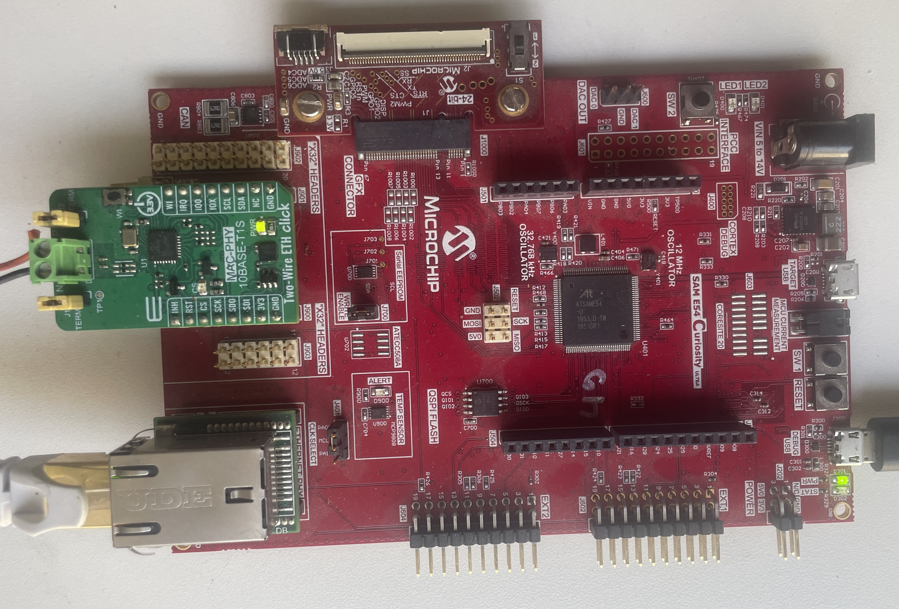

# t1s_100baset_bridge

A **10BASE-T1S ↔ 100BASE-T Layer-2 bridge** firmware for the ATSAME54P20A, with
an embedded **LAN866x SOME/IP (RCP) client**. It lets a PC on ordinary Fast
Ethernet reach — and command — a Microchip **LAN866x 10BASE-T1S endpoint** that
lives on the two-wire T1S bus, and it can run the same control/diagnostic flows
on-board, straight from a serial console.

> This is a vendored copy under `lan866x-tools/`. PTP grandmaster/follower
> support has been removed here and lives on in the newer
> [`net_10base_t1s`](https://github.com/zabooh/net_10base_t1s) project.

---

## Contents

- [1. What this firmware is for](#1-what-this-firmware-is-for)
  - [What you can demonstrate](#what-you-can-demonstrate)
- [2. Hardware setup](#2-hardware-setup)
  - [Bridge board: bill of materials](#bridge-board-bill-of-materials)
  - [How `eth0` (LAN865x) is wired](#how-eth0-lan865x-is-wired-from-the-firmware-config)
  - [Endpoint side (separate hardware)](#endpoint-side-separate-hardware)
  - [Network and addressing (default)](#network-and-addressing-default)
  - [Console and cabling](#console-and-cabling)
- [3. Firmware architecture](#3-firmware-architecture)
  - [Block view](#block-view)
  - [The bridge data path](#the-bridge-data-path)
  - [The embedded LAN866x SOME/IP client (the toolset port)](#the-embedded-lan866x-someip-client-the-toolset-port)
  - [Application state machine (`app.c`)](#application-state-machine-appc)
  - [Port mirror and SPAN (Wireshark)](#port-mirror-and-span-wireshark)
  - [CLI command groups](#cli-command-groups)
- [4. Building it yourself](#4-building-it-yourself)
  - [4.1 Tool prerequisites (per machine)](#41-tool-prerequisites-per-machine)
  - [4.2 One-time setup after cloning](#42-one-time-setup-after-cloning)
  - [4.3 Build and flash](#43-build-and-flash)
  - [4.4 First bring-up checklist](#44-first-bring-up-checklist)
- [5. Changing IP and PLCA configuration](#5-changing-ip-and-plca-configuration)
  - [5.1 Persistent: edit the build config and rebuild](#51-persistent-edit-the-build-config-and-rebuild)
  - [5.2 Runtime via the CLI (not persistent)](#52-runtime-via-the-cli-not-persistent)
- [6. Port mirror: capturing the T1S bus in Wireshark](#6-port-mirror-capturing-the-t1s-bus-in-wireshark)
  - [6.1 Why a mirror is needed](#61-why-a-mirror-is-needed)
  - [6.2 What gets mirrored (both directions, MAC-filtered)](#62-what-gets-mirrored-both-directions-mac-filtered)
  - [6.3 Using it](#63-using-it)
  - [6.4 Limitations](#64-limitations)
- [7. The lan866x SOME/IP commands](#7-the-lan866x-someip-commands)
  - [7.1 discovery](#71-discovery)
  - [7.2 diag](#72-diag)
  - [7.3 ledblink](#73-ledblink)
  - [7.4 gpiomax](#74-gpiomax)
  - [7.5 clickdemo](#75-clickdemo)
  - [7.6 gpio group](#76-gpio-group-gpio--gpioevents--ledtoggle--ledpwm)
  - [7.7 i2c group](#77-i2c-group-i2cscan--i2cid--proxmon--lan8680--proxled)
  - [7.8 spi group](#78-spi-group-spi--spiid--thumbmon--adc--pwm)
  - [7.9 sys group](#79-sys-group-servicetest--boot--uart--video)
  - [7.10 dncp group](#710-dncp-group-dncpmon--dncpdisc)

---

## 1. What this firmware is for

The board sits between two worlds:

```
   PC / lab network                Bridge (this firmware)            T1S bus
   100BASE-T (RJ45)          ATSAME54P20A + LAN865x + LAN8740     10BASE-T1S (2-wire)
   ┌──────────────┐  100M    ┌───────────────────────────┐  T1S   ┌──────────────┐
   │  Wireshark   │◄────────►│ eth1 (GMAC)   eth0 (LAN865x)│◄──────►│  LAN866x     │
   │  ping        │ .181/.180│   └── MAC bridge (L2) ──┘   │ PLCA   │  endpoint    │
   │ lan866x-*.exe│          │   + SOME/IP RCP client      │ node 0 │  192.168.0.54│
   └──────────────┘          └───────────────────────────┘        └──────────────┘
```

It does three distinct jobs:

**a) Transparent L2 bridge.** The two interfaces — `eth0` (the T1S MAC-PHY) and
`eth1` (100BASE-T) — are joined by the Harmony **MAC bridge**, so any PC-side
traffic (ARP, ICMP/ping, mDNS, and the host tools' SOME/IP) flows through to the
endpoint on the T1S bus and back, with MAC learning (FDB). From the PC you can
simply `ping 192.168.0.54` or run `lan866x-discovery.exe` and reach the endpoint
*through* the bridge as if it were on the local Ethernet.

**b) On-board LAN866x controller.** The full `lan866x-tools` SOME/IP client
(`rcp.c` + the SOME/IP stack) is compiled into the firmware and exposed as a
`lan866x` console command group. So the same operations the PC tools perform —
endpoint discovery, link diagnostics, the LED demo, the sensors→displays Click
demo — can be driven from the board's serial CLI without any PC software. This is
also the reference **MCU port** of the toolset (see `PORTING.md`): the only
platform-specific file is `plat_h3tcpip.c`.

**c) T1S bus analyzer / SPAN port.** The firmware can mirror T1S traffic onto
`eth1` so you can capture the two-wire bus in **Wireshark** on the PC — including
the endpoint's SOME/IP offers/replies *and* the bridge's own requests
(`mirror` command). It also has raw frame dump/logging (`ipdump`, `logstat`), a
raw-Ethernet loopback test (`noip_send`), LAN865x register peek/poke
(`lan_read`/`lan_write`), PLCA node-ID control, and per-interface counters.

### What you can demonstrate

- A PC reaching a 10BASE-T1S endpoint over a standard RJ45 link, end to end.
- Live T1S/PLCA traffic in Wireshark (mirrored onto Fast Ethernet).
- The LAN866x RCP service: device identity, firmware versions, link quality,
  PLCA status, achievable RCP goodput.
- Sensor-to-actuator over T1S: a thumbstick + proximity sensor driving two RGB
  matrix displays on a lighting endpoint, rendered via an RTP video stream.
- The toolset running unchanged on an MCU (same `rcp.c`, same protocol).

---

## 2. Hardware setup

The bridge node is built from a Microchip SAM E54 Curiosity board with one
MikroElektronika Click add-on. The **LAN866x endpoint** on the T1S side is a
*separate* device (the thing you control); it is not part of the bridge board.



### Bridge board: bill of materials

| Function | Board | Microchip order number |
|---|---|---|
| **MCU host** (Cortex-M4F, runs this firmware) + **onboard 100BASE-T PHY** for `eth1` (GMAC ↔ RJ45) | SAM E54 Curiosity (Ultra) board (ATSAME54P20A, onboard LAN8740A Ethernet) | **DM320210** — *verify against your board* |
| **10BASE-T1S MAC-PHY** for `eth0` (SPI ↔ two-wire bus) | MikroElektronika **Two-Wire ETH Click** (LAN8651) | `MIKROE-xxxx` — *verify on mikroe.com* |

> **`eth1` (100BASE-T) is the host board's onboard Ethernet** — a **LAN8740A** PHY
> on RMII (PHY address 0), driven by the GMAC. No separate PHY daughter board is
> used; the RJ45 on the board edge is the 100BASE-T port. This matches the
> firmware config (`DRV_LAN8740_PHY_*` in `configuration.h`).
>
> **`eth0` (10BASE-T1S)** uses the **LAN8651** MAC-PHY on the Two-Wire ETH Click,
> driven by `DRV_LAN865X` over SERCOM SPI. The SPI pin assignment in the firmware
> is fixed (CS=PC15, INT=PC14, see below) and the Click's wiring must land on
> those pins. The exact board order codes (Curiosity variant, MikroE Click) should
> be confirmed against the hardware you have — they could not be looked up offline.

### How `eth0` (LAN865x) is wired (from the firmware config)

| Signal | SAM E54 pin | Notes |
|---|---|---|
| SPI instance | SERCOM **SPI driver instance 0** | `DRV_LAN865X_SPI_DRIVER_INSTANCE_IDX0 = 0` |
| SPI clock | **15 MHz** | `DRV_LAN865X_SPI_FREQ_IDX0 = 15000000` |
| Chip select (CS) | **PC15** | `DRV_LAN865X_SPI_CS_IDX0 = SYS_PORT_PIN_PC15` |
| Interrupt (INT) | **PC14** | `DRV_LAN865X_INTERRUPT_PIN_IDX0 = SYS_PORT_PIN_PC14` |

### Endpoint side (separate hardware)

- A **LAN866x 10BASE-T1S endpoint** (LAN8660 Control / LAN8661 Lighting /
  LAN8662 Audio), default address **192.168.0.54**, connected to the bridge's
  `eth0` over the two-wire T1S bus.
- For the **Click demo**, the endpoint is a **Lighting endpoint** with two
  10×10 RGB matrix displays, a **Thumbstick Click** (SPI, MCP3204) and a
  **Proximity 3 Click** (I²C, VCNL4200).
- The endpoint hardware, datasheets and firmware packages are **NDA material**
  and are not part of this repo (see `CLAUDE.md`).

### Network and addressing (default)

| Interface | Role | IP | Mask | PLCA |
|---|---|---|---|---|
| `eth0` | T1S (LAN865x) | **192.168.0.180** | /24 | node id **0** (coordinator), node count **8** |
| `eth1` | 100BASE-T (GMAC) | **192.168.0.181** | /24 | — |
| endpoint | LAN866x | 192.168.0.54 | /24 | follower |

Both bridge interfaces share one `192.168.0.0/24` subnet (gateway
`192.168.0.1`) — the MAC bridge makes that a single L2 segment. Put the PC's
RJ45 adapter on the same subnet (e.g. `192.168.0.200`).

> **PLCA coordinator.** The bridge is the PLCA coordinator (node id 0). If the
> T1S side shows no RX, this is the first thing to check — `plca_node`
> reads it back; `plca_node 0` re-asserts it.

### Console and cabling

1. **Debugger + console:** one USB cable from the PC to the SAM E54 Curiosity
   board's **embedded-debugger** USB port. This is both the programmer
   (PKOB/EDBG) and the virtual COM port for the CLI (**115200 8N1**).
2. **100BASE-T:** the board's **onboard RJ45** (LAN8740A PHY) ↔ the PC's Ethernet
   adapter (the one set to `192.168.0.200`).
3. **T1S:** the two-wire bus from the LAN865x Click to the LAN866x endpoint.

---

## 3. Firmware architecture

Built on **MPLAB Harmony 3** for the ATSAME54P20A. Single-threaded cooperative
superloop (`SYS_Tasks()` in `main.c`); no RTOS, no threads, no locks.

### Block view

```
                       ┌──────────────────────────────────────────────┐
   serial CLI ───────► │ SYS_CMD console                              │
   (EDBG COM)          │   ├─ "Test"  group  (app.c)                  │
                       │   └─ "lan866x" group (lan866x_cli.c,         │
                       │                       clickdemo_cli.c)        │
                       ├──────────────────────────────────────────────┤
   LAN866x SOME/IP  ◄─►│ rcp.c  ─►  someip_stub.c  ─►  libsomeip       │  (toolset core,
   (RCP 0xFF10)        │                 │                             │   unchanged)
                       │                 ▼                             │
                       │           plat_h3tcpip.c  (the only port file)│
                       ├─────────────────┼────────────────────────────┤
   T1S bus  ◄──────────┤ eth0: DRV_LAN865X ┐                          │
                       │                   ├─ TCPIP MAC bridge (L2) ─┐ │
   100BASE-T ◄─────────┤ eth1: GMAC+LAN8740┘   + Harmony TCP/IP stack │ │
                       └──────────────────────────────────────────────┘
                                         packet handlers (app.c):
                                         pktEth0Handler / pktEth1Handler
```

### The bridge data path

- `TCPIP_STACK_USE_MAC_BRIDGE` is enabled with **2 ports** (`eth0`, `eth1`), a
  17-entry FDB, and a dedicated packet pool. **The MAC bridge does all L2
  forwarding** between T1S and 100BASE-T — there is no manual forwarding code in
  the application (a former `fwd` command was removed for exactly this reason).
- `pktEth0Handler` / `pktEth1Handler` are **non-consuming observers**: they run
  per RX frame for logging/mirroring, then return `false` so the frame proceeds
  to normal stack + bridge processing.

### The embedded LAN866x SOME/IP client (the toolset port)

- `rcp.c`, `someip_stub.c` and `libepmicrochip/libsomeip/` are the **exact same**
  platform-neutral sources as the PC tools. The MCU value is **not** in `rcp.c`
  but in the platform layer.
- `plat_h3tcpip.c` implements the six `plat.h` functions over Harmony
  `TCPIP_UDP_*`. The hard-won details that make RCP work on this stack:
  - **Ephemeral ports:** Harmony `ServerOpen(...,0,...)` does not auto-assign a
    port, so `*port==0` requests get a concrete port from a dynamic range
    (49200+) and it's reported back, or the reply would be lost.
  - **eth0 pinning:** sockets are pinned to `eth0` (`TCPIP_UDP_SocketNetSet`)
    so requests to the endpoint always source from `.180` and replies return on
    T1S — both interfaces share one /24, so without pinning the reply path is
    ambiguous → `RT_TIMEOUT`.
  - **Multicast flags:** SD multicast (`224.0.0.1:30490`) is accepted *without*
    `UDP_MCAST_FLAG_IGNORE_UNICAST`, otherwise the unicast method replies (same
    socket) would be dropped.
  - **TX buffer = 1024 B:** the default 512 B is too small for the clickdemo RTP
    frame (~674 B), which would silently never send.
  - **`plat_sleep_ms()` pumps the stack:** it calls `TCPIP_STACK_Task()` +
    `SYS_CONSOLE_Tasks()` while waiting, so a *blocking* `rcp_*` call issued from
    a CLI handler still lets the network stack and live console progress run.
    This is safe because the command handler runs sequentially **after**
    `TCPIP_STACK_Task()` in the superloop (never re-entrant).

### Application state machine (`app.c`)

`APP_Initialize` registers the Telnet auth + a 1 s timer and calls
`LAN866X_CLI_Init()`. `APP_Tasks` walks `INIT → WAIT → SERVICE_TASKS → IDLE`:
in `SERVICE_TASKS` it registers the two packet handlers; in `IDLE` it (1) drives
the SOME/IP client every tick (`LAN866X_CLI_Task()` → background Service
Discovery), (2) services the async LAN865x register read/write state machine,
and (3) drains the deferred packet-log ring buffer to the console (≤10
entries/iteration, so logging never stalls the loop). Captured frame bytes go to
a separate circular pool; the ring uses a lock-free single-producer/consumer
pattern (handlers write, `APP_Tasks` reads).

### Port mirror and SPAN (Wireshark)

*(Full walkthrough and limitations in [§6](#6-port-mirror-capturing-the-t1s-bus-in-wireshark).)*

`mirror 1` turns on two clone paths so a PC capture on `eth1` sees the full T1S
picture, each filtered by the bridge's own `eth0` MAC to stay duplicate-free:
- **RX mirror** (`mirror_eth0_rx_to_eth1`, app.c): frames addressed to the bridge
  (dst MAC == `eth0`) — the endpoint's replies — are cloned to `eth1`.
- **TX mirror** (`mirror_eth0_tx_hook`, called from the LAN865x egress
  `DRV_LAN865X_PacketTx`): frames the bridge itself originates (src MAC == `eth0`)
  — its `ping`/ARP/SOME/IP — are cloned to `eth1`, protocol-independent. Because a
  node never receives its own TX, hooking the egress is the only way to see them.

### CLI command groups

Several `SYS_CMD` groups; type the command name directly (no group prefix needed).
Every `lan866x-*` host tool except `lan866x-flashimg`/`lan866x-flashpkg` has an
on-board equivalent. Long-running monitors/demos are **bounded** (`[secs]`) and
abort on **Ctrl-C / `q`**; their loop pumps the stack + console so bridging keeps
running. Run `discovery` first so a target endpoint is selected.

**`lan866x` group** — mirrors the host tools against the endpoint over T1S:

| Command | Mirrors | Description |
|---|---|---|
| `discovery` | `lan866x-discovery.exe` | list endpoints + full status (run this first) |
| `diag [probes]` | `lan866x-diag.exe` | T1S link diagnostics + RCP-goodput estimate |
| `ledblink [laps] [ms]` | `lan866x-ledblink.exe` | LED running light (PA02/06/10) |
| `gpiomax [secs] [pin] [depth]` | `lan866x-gpiomax.exe` | max-speed GPIO toggle benchmark (toggle rate) |
| `clickdemo [s] [fps]` | `lan866x-clickdemo.exe` | Thumbstick+Proximity → RGB displays (Ctrl-C/`q` to stop) |

**`Test` group** — bridge / diagnostics / bring-up:

| Command | Description |
|---|---|
| `mirror [0\|1]` | SPAN: copy T1S (eth0) traffic — RX **and** the bridge's own TX — to eth1 for Wireshark |
| `ipdump [0..3]` | dump RX frames (0=off, 1=eth0, 2=eth1, 3=both) |
| `stats` | per-interface TX/RX software counters |
| `meminfo` | free memory: C-runtime heap (total + largest free block) **and** TCP/IP heap (free/maxblock/highwater, like `heapinfo`) |
| `plca_node [id]` | get/set PLCA node id (0 = coordinator); no arg = show current |
| `lan_read <addr>` / `lan_write <addr> <val>` | LAN865x register access (hex) |
| `noip_send <n> [gap_ms]` / `noip_stat` | raw-Ethernet (EtherType 0x88B5) loopback test + counters |
| `dump <addr> <count>` | memory dump (hex) |
| `logstat` / `logclear` | deferred packet-log statistics / clear |
| `timestamp` | firmware build timestamp |

The remaining host tools are mirrored in the **`gpio`**, **`i2c`**, **`spi`**,
**`sys`** and **`dncp`** command groups — documented per command in
[§7.6–§7.10](#76-gpio-group-gpio--gpioevents--ledtoggle--ledpwm).

Harmony stack commands (`netinfo`, `bridge`, `ping`, etc.) are also available.

---

## 4. Building it yourself

### 4.1 Tool prerequisites (per machine)

| Requirement | Notes |
|---|---|
| **MPLAB XC32** | v4.60 (baked into `toolchain.cmake`) or v5.x, under `C:\Program Files\Microchip\xc32\` |
| **CMake ≥ 4.1 + Ninja** | both on `PATH` (the supported build uses CMake presets + Ninja) |
| **MPLAB X / MDB** | required by `flash.py` (uses `mdb.bat`); any installed version is auto-discovered |
| **Device pack** | SAME54_DFP in `%USERPROFILE%\.mchp_packs` (installed via MPLAB X / MCC) |
| **Python 3.9+** | `pyserial` for the tool scripts (installed by setup) |
| **Terminal** | the board's EDBG virtual COM port, 115200 8N1 |

> **Two build paths.** `build.bat` (CMake/Ninja) is the primary, scripted path.
> The **MPLAB X IDE** also builds the project: `nbproject/configurations.xml` is
> wired with the SOME/IP client sources (`rcp.c`, `someip_stub.c`, the
> `libsomeip/src/someip-*.c`, `plat_h3tcpip.c`, `lan866x_cli.c`, `clickdemo_cli.c`)
> and their include directories, so *Open Project → Build* links cleanly (verified).
> If you re-run **MCC code generation**, re-check that `configurations.xml` still
> lists those files (MCC can overwrite it).

### 4.2 One-time setup after cloning

Because every machine has different compiler versions, COM ports and tool
versions, a one-shot setup adapts the project locally. Connect the board via its
USB debugger port first, then:

```bat
git clone https://github.com/zabooh/lan866x-tools.git
cd lan866x-tools\firmware\t1s_100baset_bridge
setup.bat
```

`setup.bat` runs four independent steps (a failure in one is reported but does
not abort the rest):

| Step | Script | What it adapts |
|---|---|---|
| 1 | `requirements.txt` (pip) | install `pyserial` |
| 2 | **`setup_compiler.py`** | detect the installed **XC32 version** → writes `setup_compiler.config` and patches `toolchain.cmake` |
| 3 | **`setup_flasher.py`** | detect the **board's EDBG programmer + COM port** → writes `setup_flasher.config` |
| 4 | `setup_debug.py` | SAME54_DFP tool-pack fix (only needed for VS Code debugging) |

The two `.config` files are per-machine and **git-ignored**, so each clone
generates its own. You can re-run any step on its own (e.g. `python
setup_compiler.py` after installing a new XC32). The **MPLAB X version** needs no
setup step — `mdb_flash.py` auto-discovers the newest installed `mdb.bat`.

### 4.3 Build and flash

```bat
build.bat            :: incremental build  (build.bat rebuild = clean build, build.bat help)
python flash.py      :: program the board via MDB and release it from reset
```

`build.bat`:
1. reads the XC32 selection from `setup_compiler.config`,
2. configures with the CMake preset and builds with Ninja,
3. copies the resulting HEX into a tracked **`release/T1S_100BaseT_Bridge.hex`**,
4. prints a flash/RAM/heap/IRQ **build summary** (`build_summary.py`).

For a per-component **RAM/ROM breakdown of the SOME/IP client** (the stack, RCP,
the platform port and each endpoint demo/tool CLI group), run after a build:

```bat
python someip_size.py        :: ROM=.text+.data, RAM=.data+.bss, grouped by component
```

Because the HEX is committed under `release/`, a **fresh clone can flash without
building**:

```bat
python flash.py      :: flashes release/T1S_100BaseT_Bridge.hex
```

`flash.py` reads the programmer/COM assignment from `setup_flasher.config`,
locates `mdb.bat` from the newest installed MPLAB X, programs over SWD, then
issues `reset` + `run` so the MCU starts immediately (avoids leaving it held in
reset).

### 4.4 First bring-up checklist

1. `setup.bat` → `build.bat` → `python flash.py`.
2. Open the EDBG COM port at 115200 8N1; you should see the build banner.
3. `stats` — confirm `eth0`/`eth1` exist and counters move.
4. `plca_node` — should report node id **0**.
5. From the PC (on `192.168.0.200`): `ping 192.168.0.54` → 0% loss (bridge works).
6. `discovery` on the CLI **or** `lan866x-discovery.exe` on the PC → the endpoint
   appears. Then `diag`, `ledblink`, `clickdemo` as desired.

> **Peripheral wedge:** after hard-killed runs, the endpoint's `OpenSpi`/`OpenI2C`
> can start failing and a soft reboot won't clear it — power-cycle the endpoint.
> Pace control traffic; the Windows host can drop back-to-back RCP replies (the
> T1S link itself is excellent). See `../../docs/INTEGRATION_NOTES.md`.

---

## 5. Changing IP and PLCA configuration

The IP addresses (`eth0` = 192.168.0.180, `eth1` = 192.168.0.181) and the PLCA
parameters (node id 0, node count 8) can be changed two ways. **Editing the build
config is the only persistent method** — a runtime CLI change is convenient for
experiments but is forgotten on the next reset.

### 5.1 Persistent: edit the build config and rebuild

All defaults live in **`firmware/src/config/default/configuration.h`** (an
MCC-generated file). Edit the macros, then `build.bat` + `python flash.py`.

| Setting | Macro (`configuration.h`) | Default |
|---|---|---|
| eth0 (T1S) IP | `TCPIP_NETWORK_DEFAULT_IP_ADDRESS_IDX0` | `"192.168.0.180"` |
| eth0 subnet mask | `TCPIP_NETWORK_DEFAULT_IP_MASK_IDX0` | `"255.255.255.0"` |
| eth0 gateway | `TCPIP_NETWORK_DEFAULT_GATEWAY_IDX0` | `"192.168.0.1"` |
| eth0 MAC | `TCPIP_NETWORK_DEFAULT_MAC_ADDR_IDX0` | `"00:04:25:01:02:01"` |
| eth1 (100BASE-T) IP | `TCPIP_NETWORK_DEFAULT_IP_ADDRESS_IDX1` | `"192.168.0.181"` |
| eth1 subnet mask | `TCPIP_NETWORK_DEFAULT_IP_MASK_IDX1` | `"255.255.255.0"` |
| eth1 gateway | `TCPIP_NETWORK_DEFAULT_GATEWAY_IDX1` | `"192.168.0.1"` |
| eth1 MAC | `TCPIP_NETWORK_DEFAULT_MAC_ADDR_IDX1` | `"00:04:25:01:02:04"` |
| PLCA node id | `DRV_LAN865X_PLCA_NODE_ID_IDX0` | `0` (coordinator) |
| PLCA node count | `DRV_LAN865X_PLCA_NODE_COUNT_IDX0` | `8` |

The PLCA node-id macro is the single source of truth: `initialization.c` seeds
the LAN865x driver from it (`.nodeId = DRV_LAN865X_PLCA_NODE_ID_IDX0`) and `app.c`
uses it as the CLI default, so changing the macro is enough.

```bat
:: after editing configuration.h
build.bat
python flash.py
```

> **Keep `eth0` as PLCA node id 0** unless you deliberately move the coordinator
> role elsewhere — the bridge must coordinate the T1S bus. Keep both interfaces
> on the same subnet as the endpoint and the PC, since the MAC bridge makes them
> one L2 segment.
>
> **MCC note:** `configuration.h` is generated by MCC. A plain text edit +
> rebuild is fully supported. Only if you *re-run MCC code generation* will it be
> overwritten — in that case make the change in the MCC project (TCP/IP network
> config / LAN865x PLCA) instead.

### 5.2 Runtime via the CLI (not persistent)

The Harmony TCP/IP stack commands and the `Test` group let you change addressing
and PLCA on the fly. Run `netinfo` first to see the exact interface names
(`eth0`/`eth1`).

```text
netinfo                                   # show both interfaces, IPs, MACs, status
setip  eth0 192.168.0.190 255.255.255.0   # set eth0 IPv4 address + mask
setgw  eth0 192.168.0.1                    # set eth0 gateway
setip  eth1 192.168.0.191 255.255.255.0   # set eth1 IPv4 address + mask
plca_node 0                                # set PLCA node id (writes PLCA_CTRL1)
plca_node                                  # (no arg) read back the current node id
```

- `setip <interface> <ipv4> <mask>` and `setgw <interface> <ipv4>` are Harmony
  stack commands.
- `plca_node [id]` is in the `Test` group; with an argument it writes the
  LAN865x `PLCA_CTRL1` register (NODE_CNT:NODE_ID) live.

> ⚠️ **Runtime changes are volatile.** Anything set with `setip`/`setgw`/
> `plca_node` is lost on the next reset or power-cycle — the board boots back to
> the `configuration.h` defaults. **For a permanent change, edit the build config
> (§5.1) and reflash.** Use the CLI only to try a value before baking it in.

---

## 6. Port mirror: capturing the T1S bus in Wireshark

The `mirror` command turns the bridge into a SPAN/monitor port: it copies T1S
(`eth0`) traffic onto `eth1` so a PC running Wireshark on its Fast-Ethernet
adapter can see the two-wire bus. This is the primary way to debug SOME/IP / RCP
exchanges with the endpoint.

### 6.1 Why a mirror is needed

Two things are otherwise invisible to a PC capture on `eth1`:

1. **The endpoint's replies/offers** arrive on `eth0` and — because they are
   addressed to the bridge itself — are delivered *locally* by the MAC bridge, not
   forwarded onto `eth1`. So a plain `eth1` capture never shows them.
2. **The firmware's own requests** (a `ping`, ARP, SOME/IP FindService, RCP method
   calls) are sent *out* of `eth0` by the bridge. A node never receives its own
   transmissions, so no RX packet handler ever sees them either.

The mirror reconstructs **both** directions onto `eth1`, protocol-independent, so
a firmware-originated `ping` to the endpoint — or any RCP exchange — is visible in
full (request *and* reply).

### 6.2 What gets mirrored (both directions, MAC-filtered)

Both directions are cloned to `eth1`, but each is **filtered by the bridge's own
`eth0` MAC** so the capture is **duplicate-free** — frames the MAC bridge merely
*forwards* between the PC and the bus (which the PC already sees natively on
`eth1`) are not mirrored.

| Path | Hook (`app.c`) | Filter | What it captures |
|---|---|---|---|
| **RX mirror** | `mirror_eth0_rx_to_eth1()`, from `pktEth0Handler` | dst MAC **==** `eth0` MAC | frames addressed to the bridge itself — the endpoint's unicast replies to the firmware |
| **TX mirror** | `mirror_eth0_tx_hook()`, from `DRV_LAN865X_PacketTx` (the single `eth0` egress) | src MAC **==** `eth0` MAC | frames the bridge itself originates — the firmware's `ping`/ARP/SOME/IP, regardless of protocol |

Why this is duplicate-free, given the bridge does transparent L2 forwarding
(source/destination MACs are preserved):

- A PC→endpoint frame forwarded onto `eth0` keeps the **PC's** src MAC → TX filter
  skips it (the PC already sent it).
- An endpoint→PC frame received on `eth0` carries the **PC's** dst MAC → RX filter
  skips it (the bridge forwards it to `eth1` natively).
- Broadcast/multicast received on `eth0` is forwarded to `eth1` by the bridge, so
  it is **not** mirrored either; only the bridge's *own* outgoing broadcast/
  multicast (src == `eth0` MAC, e.g. its ARP/SD) is added by the TX path.

The original `eth0` frame is never altered — the mirror clones a fresh packet for
`eth1` and leaves the bus frame for normal local/bridge processing.

> **Worked example — `ping` from the firmware to the endpoint (egress on `eth0`):**
> the ICMP echo *request* leaves through `DRV_LAN865X_PacketTx` with src ==
> `eth0` MAC → TX-mirrored. The endpoint's echo *reply* arrives on `eth0` with
> dst == `eth0` MAC → RX-mirrored. So Wireshark on `eth1` shows the **complete**
> exchange, both request and reply. (A PC-originated ping passing *through* the
> bridge is not mirrored — the PC already has both halves on `eth1`.)

### 6.3 Using it

1. On the PC, start **Wireshark** on the Fast-Ethernet adapter connected to the
   bridge's `eth1` (the board's onboard RJ45).
2. On the board CLI: `mirror 1` (turn it on). `mirror` with no argument shows the
   current state; `mirror 0` turns it off.
3. Run anything that talks to the endpoint — `discovery`, `diag`, any `lan866x`
   command, or even a `ping 192.168.0.54` — and watch the T1S traffic (both
   directions) appear in Wireshark.
4. A useful Wireshark display filter: `udp.port == 30490 || udp.port == 6800`
   (Service Discovery + RCP method endpoint), or `someip` if the dissector is on.

```text
mirror 1        # eth0(T1S) -> eth1 mirror: ON   (RX + the bridge's own TX)
discovery       # now visible on eth1 in Wireshark: FindService, offers, GetStatus...
mirror 0        # turn it off when done
```

### 6.4 Limitations

- **Exact L2 frames:** both directions clone the real Ethernet frame verbatim
  (header + payload), so MACs and checksums are exactly what went on the wire.
- **The filter relies on transparent bridging:** it assumes the MAC bridge does
  not rewrite source/destination MACs (it doesn't). The reference is the `eth0`
  interface MAC; frames carrying it are treated as the bridge's own.
- **Single-segment copy:** the mirror clones the packet's first data segment.
  The bridge/stack frames involved are single-segment; a hypothetical
  multi-segment frame would be truncated.
- **Broadcast/multicast received on `eth0` is not mirrored** — the bridge already
  forwards it to `eth1`, where the PC sees it natively (see §6.2).
- Mirroring adds one cloned `eth1` transmit per matching frame. It is meant for
  diagnostics — leave it **off** for normal bridging to avoid the extra load.
- Mirror state is a runtime toggle (like the §5.2 CLI settings) and defaults to
  **off** on every boot.

---

## 7. The `lan866x` SOME/IP commands

These four commands are the on-board equivalents of the PC host tools: they speak
the **RCP service (`0xFF10`) over SOME/IP** to the endpoint across the T1S bus,
using the exact same `rcp.c` client the `.exe` tools use. Type the name directly
(no group prefix); `help lan866x` lists them:

```text
> help lan866x
 *** discovery: list LAN866x endpoints + full status (like lan866x-discovery.exe) ***
 *** diag: T1S link diagnostics (diag [probeCount]) ***
 *** ledblink: LED running light PA02/06/10 (ledblink [laps] [ms]) ***
 *** gpiomax: max-speed GPIO toggle benchmark (gpiomax [secs] [pin] [depth]) ***
 *** clickdemo: Thumbstick+Proximity -> RGB displays (clickdemo [s] [fps]) ***
```

Run **`discovery` first** — it performs Service Discovery and selects an endpoint;
the other commands act on the selected endpoint. These are blocking RCP calls, but
they don't stall the bridge: `plat_sleep_ms()` pumps the TCP/IP stack and console
while waiting (see §3), so bridging and live console output keep running.

### 7.1 discovery

`discovery` — no arguments. Mirrors `lan866x-discovery.exe`. Sends a SOME/IP
FindService, then for each endpoint found prints a full status block via
`GetStatus` + `GetNetworkStatus`:

- identity: chip identifier (→ Control / Lighting / Audio endpoint), uptime,
  active application, main/root/bootloader versions, COMO/service/keys versions,
  startup information (security mode);
- network: MAC, IPv4, endpoint link status, OA-SPI status, arbitration mode
  (CSMA/CD · PLCA · PLCA-no-fallback), and the endpoint's PLCA node id.

It uses a snappy 1000 ms timeout / 1 retry (the T1S link is ~2 ms RTT). If nothing
is found, SD may still be settling — retry, and check the T1S/PLCA wiring.

### 7.2 diag

`diag [probeCount]` — link diagnostics; mirrors `lan866x-diag.exe`. `probeCount`
defaults to **20**, clamped to **1…500**. Prints four sections:

- **DEVICE** — chip identifier and firmware versions.
- **T1S NETWORK** — link status, OA-SPI status, arbitration, PLCA node id, reset
  reason.
- **PHY DIAGNOSIS** — PHY-level link quality fields.
- **LINK PROBE** — `probeCount` RCP round-trips with a live `probing k/N …`
  counter, then `probes / completed / lost / loss%`. A verdict line reports
  **HEALTHY** when loss < 3 %, else **DEGRADED – check link**.
- **BANDWIDTH (RCP goodput)** — round-trips per second and the achieved RCP
  goodput in kbit/s (see also the `diag.exe` bandwidth section).

### 7.3 ledblink

`ledblink [laps] [ms]` — a "hello-world" running light on the endpoint's GPIOs
**PA02 / PA06 / PA10**; mirrors `lan866x-ledblink.exe`. `laps` defaults to **3**
(clamped **1…50**, so it can't tie up the superloop indefinitely); the step time
`ms` defaults to **300**. Each step lights one GPIO and clears the others, walking
the three pins for the requested number of laps.

### 7.4 gpiomax

`gpiomax [secs] [pin] [depth]` — a **maximum-speed GPIO toggle benchmark**; mirrors
`lan866x-gpiomax.exe`. It drives one LED GPIO (default **PA02 / LD1**) as fast as
possible and measures the achieved toggle rate. `secs` (window) defaults to **3**
(clamped **1…10** so it can't block the bridge too long), `pin` defaults to **2**,
and `depth` (SetGpio requests kept in flight) defaults to **16** (clamped
**1…16** = `RCP_ASYNC_MAX`).

Rather than the blocking `rcp_set_gpio()` — which paces itself with a fixed 2 ms
poll and so caps out around 500 toggles/s — it keeps a **pipeline** of async
SetGpio requests in flight (`rcp_async_request` / `rcp_async_poll`) and pumps the
TCP/IP stack between polls so bridging keeps running. It reports:

- **Commanded** — SetGpio requests issued per second (the rate the GPIO is told to
  toggle; the requests reach the endpoint);
- **Confirmed** — replies received per second, and the equivalent square-wave
  frequency (two toggles = one Hz);
- reply timeouts / loss.

On a clean link the two rates match. Example on real hardware (endpoint over T1S,
depth 16): ≈ **1370 toggles/s confirmed (~684 Hz), 0 % loss**. (The PC tool through
the bridge measures similarly, ≈ 1500/s.) On the Windows host the two can diverge
under load — a dropped *reply* doesn't mean a missed toggle — so the on-board
`gpiomax` gives the host-drop-free figure. The LED is left **off** on exit.

### 7.5 clickdemo

`clickdemo [s] [fps]` — the sensor→display demo; mirrors `lan866x-clickdemo.exe`.
By default it **runs until you abort it** with **Ctrl-C** or **`q`** (like the host
tool); an optional `s` caps the run time in seconds (clamped to **3600**). `fps`
defaults to **50** (clamped **1…100**). On a **Lighting** endpoint with two MikroE Click
displays it reads two sensors and renders them as an RTP/RFC4175 video stream
(UDP 5001):

- **Thumbstick Click** (SPI, MCP3204) → an orange spot on the left 10×10 display;
- **Proximity 3 Click** (I²C, VCNL4200) → a blue distance bar on the right display.

`plat_sleep_ms()` pumps the TCP/IP stack **and** the console RX each frame, so the
bridge keeps running throughout and the abort key is seen even on an unbounded
run. Press **Ctrl-C** or **`q`** to stop.

The remaining host tools (every `lan866x-*` except `flashimg`/`flashpkg`, and
`ledscan` which is host-only) are grouped by peripheral below. Each mirrors the
identically-named PC tool over the same RCP API; **bounded** monitors take a
`[secs]` arg and abort on **Ctrl-C / `q`**. Pin defaults follow the EVB wiring
(I²C SDA=PA08/SCL=PA09, SPI MISO=PA12/SCK=PA13/CS=PA14/MOSI=PA15, LEDs PA02/06/10).

### 7.6 `gpio` group (gpio / gpioevents / ledtoggle / ledpwm)

| Command | Description |
|---|---|
| `gpio <pin> <0\|1\|get>` | set or read one GPIO |
| `gpioevents <pin> [edge] [secs]` | live GPIO edge events (edge 0=falling, 1=rising, 2=both) |
| `ledtoggle [pin] [beat_ms] [secs]` | bounded async LED toggle (default PA02, 500 ms, 10 s) |
| `ledpwm [pin] [freqHz] [breathMs] [secs]` | breathing LED via PWM — PWM is pin/build-dependent (fails cleanly if absent) |

### 7.7 `i2c` group (i2cscan / i2cid / proxmon / lan8680 / proxled)

| Command | Description |
|---|---|
| `i2cscan [sda] [scl] [speed]` | scan the I²C bus (speed 0=100k/1=400k/2=1M) |
| `i2cid [addr] [reg] [sda] [scl] [speed]` | read a device ID (default VCNL4200 @0x51 reg 0x0E) |
| `proxmon [secs] [max] [sda] [scl]` | live VCNL4200 proximity **bar** (`[####----] raw=  330`; `max` fills the bar, default 400) |
| `lan8680 [sda] [scl]` | read the LAN8680 SBC, **read-only** (auto-probes the SERCOM buses if no pins given) |
| `proxled [max] [secs]` | proximity drives LD1..LD3 as a level meter (`max` = raw value lighting all 3) |

### 7.8 `spi` group (spi / spiid / thumbmon / adc / pwm)

| Command | Description |
|---|---|
| `spi <txhex> [mode] [speedHz]` | SPI full-duplex transfer; RX length = TX length |
| `spiid` | identify the Thumbstick MCP3204 (reads both axes; ~2048 at rest = fingerprint) |
| `thumbmon [secs]` | monitor the thumbstick X/Y axes |
| `adc [channel 0\|1] [vref 0\|1]` | read the on-chip ADC (0=analog/1=temp; 0=3V3/1=1V1) — build-dependent |
| `pwm <pin> [freqHz] [dutyPct] [holdSecs]` | drive a PWM output; with `holdSecs` it stops after the hold |

### 7.9 `sys` group (servicetest / boot / uart / video)

| Command | Description |
|---|---|
| `servicetest [unsafe]` | probe which RCP methods the endpoint implements (0x03 = absent); `unsafe` also probes Reboot/Update |
| `boot [cycle\|bootloader\|main] [waitS]` | reboot the endpoint between app and bootloader, re-acquire by SD — **link drops briefly, run last** |
| `uart <tx> <rx> [baud] [text]` | open a UART, optional write (`\r \n \t` escapes), then read once |
| `video [secs] [fps] [bright]` | stream a **built-in** animated RTP test pattern to the displays (the host tool's ffmpeg+file path is not portable to the MCU) |

### 7.10 `dncp` group (dncpmon / dncpdisc)

DNCP (Dynamic Node Configuration Protocol) is raw UDP on 65526/65527, **not**
SOME/IP — these use `plat_udp_*` directly.

| Command | Description |
|---|---|
| `dncpmon [secs]` | passive monitor; decodes Announce/Registry packets on the bus |
| `dncpdisc [channel] [rounds] [timeoutS]` | active discovery: broadcasts an empty Registry and lists the nodes' Announces. Read-only (assigns nothing) — **use only when no other DNCP server is active** |

> **Build dependence:** `adc`, `pwm`/`ledpwm` and `uart` depend on the endpoint's
> firmware build and pin routing; they report cleanly when a method isn't
> implemented (e.g. ADC is absent on the minimal Lighting build — `servicetest`
> tells you what's present). `ledscan` (interactive + writes `led_map.json`) stays
> host-only.
