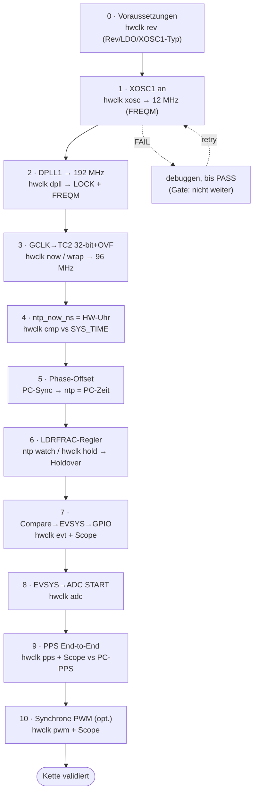

# NTP-Hardware-Zeitbasis — schrittweiser Bring-up mit Test pro Schritt

Inkrementelle Inbetriebnahme der Implementierung aus
[HW_TIMEBASE_B_C_IMPLEMENTATION.md](HW_TIMEBASE_B_C_IMPLEMENTATION.md) (Option B-b + C).
**Jeder Schritt baut auf dem vorigen auf und wird einzeln auf der MCU verifiziert** —
erst wenn der Test eines Schritts PASS ist, geht es zum nächsten. So ist am Ende die
**gesamte Kette** XOSC1 → DPLL1 → GCLK → TC2 → Disziplinierung → EVSYS → Peripherie
nachweislich funktionsfähig.

> **Test-Harness:** eine neue CLI-Gruppe **`hwclk`** (analog zu `ntp`/`env`,
> registriert via `SYS_CMD_ADDGRP`). Jeder Schritt fügt ein Unterkommando hinzu, mit
> dem sich der Schritt **isoliert** prüfen lässt. Weitere Hilfsmittel: **FREQM**
> (Frequenz-Verifikation), **Oszilloskop** an einem GPIO/PWM-Pin, die bestehende
> **`ntp`/`ntp watch`-CLI** und das PC-Tool **`lan866x-ntpsync`** (+ NTP-Tap) für die
> End-to-End-Prüfung. Querreferenz **SYS_TIME** (freilaufender TC0) als Vergleichsuhr.

---

## Inhalt
- [Prinzip: build-up + Gate-Test](#prinzip-build-up--gate-test)
- [Übersicht (Schritt → Test → Kriterium)](#übersicht-schritt--test--kriterium)
- [Schritt 0 — Voraussetzungen prüfen (Gate)](#schritt-0--voraussetzungen-prüfen-gate)
- [Schritt 1 — XOSC1 in Betrieb nehmen](#schritt-1--xosc1-in-betrieb-nehmen)
- [Schritt 2 — DPLL1 hochfahren + Lock](#schritt-2--dpll1-hochfahren--lock)
- [Schritt 3 — GCLK + TC2 32-bit free-running + 64-bit](#schritt-3--gclk--tc2-32-bit-free-running--64-bit)
- [Schritt 4 — `ntp_now_ns()` auf die HW-Uhr (Rate-Vergleich)](#schritt-4--ntp_now_ns-auf-die-hw-uhr-rate-vergleich)
- [Schritt 5 — Phasen-Offset (NTP-Sync)](#schritt-5--phasen-offset-ntp-sync)
- [Schritt 6 — Frequenz-Disziplinierung (LDRFRAC) + Holdover](#schritt-6--frequenz-disziplinierung-ldrfrac--holdover)
- [Schritt 7 — TC2-Compare → EVSYS → GPIO (Einzeltrigger)](#schritt-7--tc2-compare--evsys--gpio-einzeltrigger)
- [Schritt 8 — EVSYS → ADC START](#schritt-8--evsys--adc-start)
- [Schritt 9 — PPS am NTP-Sekundentakt (End-to-End)](#schritt-9--pps-am-ntp-sekundentakt-end-to-end)
- [Schritt 10 — Synchrone PWM (TCC, optional)](#schritt-10--synchrone-pwm-tcc-optional)
- [Definition of Done](#definition-of-done)
- [Ablaufdiagramm](#ablaufdiagramm)

---

## Prinzip: build-up + Gate-Test
- **Eine Änderung pro Schritt**, danach **ein Test**, der nur diesen Schritt prüft.
- **Gate:** ist der Test FAIL → nicht weiter; debuggen, bis PASS. Jeder Schritt liefert
  ein eindeutiges Erfolgskriterium (Zahl/Signal), kein „sieht gut aus".
- **Rückwärts-kompatibel:** SYS_TIME (TC0) und die bestehende Software-NTP bleiben bis
  Schritt 6 aktiv → jederzeit Vergleichsreferenz und sicherer Rückfall.
- **Nicht-invasiv zuerst:** die ersten Schritte (XOSC1, DPLL1) berühren **DPLL0/CPU
  nicht** → kein Risiko fürs laufende System; erst Schritt 3 nutzt einen freien TC.

## Übersicht (Schritt → Test → Kriterium)

| # | Implementiert | Test auf der MCU | PASS-Kriterium |
|---|---|---|---|
| 0 | — (Prüfung) | `hwclk rev` | Silizium-Rev + LDO bekannt; XOSC1-Typ aus Schaltplan |
| 1 | XOSC1 an | `hwclk xosc` (FREQM) | gemessen ≈ **12,000 MHz** |
| 2 | DPLL1 → 192 MHz | `hwclk dpll` (LOCK + FREQM) | LOCK=1, gemessen ≈ **192 MHz** |
| 3 | GCLK→TC2 32-bit + OVF | `hwclk now`, `hwclk wrap` | Rate ≈ **96 MHz**, OVF→High-Word++ |
| 4 | `hwclock_now_ns()` | `hwclk cmp` | HW-Uhr vs SYS_TIME konsistent, ppm plausibel |
| 5 | Phase-Offset | PC-Sync → `ntp` | `ntp` zeigt **PC-Wanduhr** |
| 6 | LDRFRAC-Regler | `ntp watch`, `hwclk hold` | drift/mean→~0; Holdover **≤ ~2,5 µs/s** |
| 7 | Compare→EVSYS→GPIO | `hwclk evt`, Scope | GPIO-Flanke am vorhergesagten Instant, **±µs** |
| 8 | EVSYS→ADC START | `hwclk adc` | #Conversions = #Trigger; Sample am Instant |
| 9 | PPS periodisch | `hwclk pps on`, Scope vs PC-PPS | PPS auf NTP-Sekunde, **10–100 µs**, Jitter ns |
| 10 | Synchrone PWM | `hwclk pwm`, Scope | PWM-Frequenz auf disziplinierter Rate stabil |

---

## Schritt 0 — Voraussetzungen prüfen (Gate)
**Ziel:** die zwei Errata-/Board-Vorbedingungen klären, bevor Code geschrieben wird.
**Implementierung:** `hwclk rev` liest **DSU `DID`** (`DID.REVISION`) und die SUPC-Reglerwahl.
**Test auf der MCU:**
```
hwclk rev      →  DID=0x6184xxxx  REV=F   Regulator=LDO
```
**PASS:** Revision bekannt **und** Regulator = **LDO**. *(XOSC1-Typ bereits aus dem
**Curiosity-Schaltplan** geklärt: externer MEMS-Takt `DSC6003C12A` an XIN1/PB22 → `XTALEN=0`.)*
**Errata:** **2.19.1** (FDPLL braucht LDO — DPLL0/CPU läuft schon → erfüllt). **2.13.1**
(FDPLL-False-Unlock) betrifft **nur Rev A/D**; bei A/D in Schritt 2 den
`LBYPASS/WUF/CLKRDY`-Bring-up nutzen. **Bei Fehlschlag:** Buck-Mode → auf LDO umstellen.
> ✅ **Getestet (Board):** `DID=0x61840300`, **Rev D**, Series 4 (SAM E54), **Regulator=LDO**
> → PASS. Folge: **Rev D ⇒ 2.13.1 trifft zu** → DPLL1 in Schritt 2 mit `LBYPASS/WUF/CLKRDY`.

## Schritt 1 — XOSC1 in Betrieb nehmen
**Ziel:** der 12-MHz-MEMS-Takt läuft (speist DPLL1). **Berührt CPU/DPLL0 nicht.**
**Implementierung:** §4.1(a) — **`OSCCTRL_REGS->XOSCCTRL[1] = ENABLE`** (External-Clock-Mode,
**`XTALEN=0`**, kein IMULT/IPTAT/ENALC), auf **`STATUS.XOSCRDY1`** warten.
**Test auf der MCU:** `hwclk xosc` misst XOSC1 mit **FREQM** gegen XOSC32K und gibt die
Frequenz aus.
```
hwclk xosc     →  XOSC1 = 12.000.0xx Hz   (RDY=1)
```
**PASS:** **≈ 12,000 MHz** (±einige 100 ppm akzeptabel). **Errata:** **2.28.1/2.28.2**
(FREQM: Ref-Periode > 4 APB-Takte; **Software-Timeout** beim `BUSY`-Pollen, sonst Hänger
bei 0 Hz), **2.15.1** (FREQM `CTRLB` nicht lesen). **Bei Fehlschlag:** RDY bleibt 0 →
`ENABLE` nicht gesetzt / falscher Index (`[1]`!) / MEMS-Takt steht nicht an XIN1;
0 Hz → XOSC1-Takt fehlt am Pin (R471/Y401 prüfen).
> ✅ **Getestet (Board):** `RDY=1`; **XOSC1 = 12.000.155 Hz = +12 ppm** (FREQM gegen
> XOSC32K) → PASS. Das ist die **Roh-Drift der Zeitbasis: +12 ppm statt ~1800 ppm (DFLL)**.
> **XOSC32K (Y400)** als genaue Referenz bestätigt — Enable braucht **`CGM(XT)` + RDY-Poll
> bis ~1 s** (`ctrl=0x200A`, `RDY=1`); ohne CGM/zu kurzer Poll → Fallback auf OSCULP32K
> (nur Präsenz-Check, ~±%). `hwclk xosc ulp` erzwingt OSCULP32K.

## Schritt 2 — DPLL1 hochfahren + Lock
**Ziel:** DPLL1 erzeugt ~192 MHz aus XOSC1. **Weiterhin getrennt von DPLL0/CPU.**
**Implementierung:** §4.1(b) — `DPLL1CTRLB` (REFCLK=XOSC1, **`DIV=182`** → f_ref ≈
32,79 kHz, `LTIME=0` → kein 32K-Lock-Takt nötig), `DPLL1RATIO` (**`LDR=5855`** → ×5856 ≈
192 MHz), enable. **Rev A/D:** `LBYPASS=1` setzen und auf **`CLKRDY`** triggern (nicht
`LOCK`), dann ~5 ms settlen.
**Test auf der MCU:** `hwclk dpll` → Lock-Status + FREQM-Messung des DPLL1-Ausgangs
(über GCLK **DPLL1÷4 → ~48 MHz**, ×4 zurückgerechnet) gegen XOSC32K.
```
hwclk dpll     →  CLKRDY=1 LOCK=1   f(DPLL1) = 192.0xx MHz
```
**PASS:** CLKRDY=1 **und** gemessen ≈ **192 MHz**. **Errata:** **2.13.1** (nur Rev A/D):
auf `CLKRDY` statt `LOCK` triggern, `LBYPASS=1`. **Bei Fehlschlag:**
kein CLKRDY → REFCLK-Frequenz > 3,2 MHz (DIV zu klein) bzw. < 32 kHz, oder XOSC1 down.
> ✅ **Getestet (Board, Rev D):** `CLKRDY=1 LOCK=1` (status `0x3`), **DPLL1 = 192.006 MHz,
> +31 ppm** → PASS. (LOCK kam hier trotz Rev D sauber; LBYPASS liegt als Absicherung drunter.)
> Da DPLL1 = XOSC1 × 16 (LDRFRAC=0), ist diese Messung der **genauere XOSC1-ppm-Wert**
> (48-MHz-MSR → ~2,7 ppm/Count statt ~11 ppm bei der 12-MHz-Direktmessung) → XOSC1 ≈ +31 ppm.

## Schritt 3 — GCLK + TC2 32-bit free-running + 64-bit
**Ziel:** ein freilaufender 64-bit-Zähler mit ~96-MHz-Auflösung. **Erster Schritt, der
einen (freien) TC nutzt.**
**Implementierung:** §4.1(c)+(d) — GCLK-Gen (DPLL1÷2→96 MHz) → `PCHCTRL[26]` → TC2
32-bit, OVF-IRQ inkrementiert das SW-High-Word.
**Test auf der MCU:**
- `hwclk now` druckt `TC64`-Ticks + abgeleitete ns und die **gemessene Rate** (zwei
  Reads ~1 s auseinander, gegen SYS_TIME als Zeitbasis).
- `hwclk wrap` lädt `COUNT` knapp unter 2³² und prüft, dass das **OVF-High-Word** binnen
  ms hochzählt (sonst müsste man ~44,7 s warten).
```
hwclk now      →  ticks=…  ns=…   rate≈96.0xx MHz
hwclk wrap     →  hi: 0 → 1  (OVF ok)
```
**PASS:** TC64 **monoton**, Rate ≈ **96 MHz** (Kreuzcheck gegen SYS_TIME), OVF erhöht das
High-Word. **Bei Fehlschlag:** Rate=0 → GCLK/PCHCTRL[26] falsch; OVF zählt nicht →
`INTENSET.OVF`/NVIC; TC-Kollision → freien TC prüfen (TC0=SYS_TIME).

## Schritt 4 — `ntp_now_ns()` auf die HW-Uhr (Rate-Vergleich)
**Ziel:** der Lesepfad nutzt die HW-Uhr; die alte SYS_TIME-Variante bleibt zum Vergleich.
**Implementierung:** §4.2 — `hwclock_now_ns()`; `ntp_now_ns()` ruft sie; alte
SYS_TIME-Funktion als `*_legacy` erhalten.
**Test auf der MCU:** `hwclk cmp` druckt `hwclock_ns − sys_time_ns` über die Zeit + die
relative Drift in ppm.
```
hwclk cmp      →  Δ=… ns   rel=+1623 ppm  (HW-Uhr=XOSC1 stabil, SYS_TIME=DFLL driftet)
```
**PASS:** beide Uhren laufen konsistent; die **Differenz wächst linear** mit der
erwarteten DFLL-vs-XOSC1-Drift (~1600–1800 ppm). **Das beweist, dass die HW-Uhr die
stabilere ist.** **Bei Fehlschlag:** Sprünge/Nichtmonotonie → 64-bit-OVF-Race (Hi/Lo/Hi-Lesung,
`READSYNC`).

## Schritt 5 — Phasen-Offset (NTP-Sync)
**Ziel:** die HW-Uhr lässt sich auf PC-Zeit setzen (Phase). Frequenz noch **ungeregelt**.
**Implementierung:** §4.3 (nur der Phasenteil) — `phase_offset_ns` im `OP_SET_OFFSET`-Handler.
**Test auf der MCU:** PC-Tool `lan866x-ntpsync` einmal laufen lassen, dann `ntp`:
```
ntp            →  NTP time: <PC-Unix-Zeit>   local time: hh:mm:ss (PC-aligned)
```
**PASS:** `ntp` zeigt nach dem Sync die **PC-Wanduhr**. **Bei Fehlschlag:** Offset wird
nicht übernommen → Pfad `adjust → phase_offset_ns` prüfen; Vorzeichen/Überlauf.

## Schritt 6 — Frequenz-Disziplinierung (LDRFRAC) + Holdover
**Ziel:** der Kern — die HW-**Rate** wird nachgeführt, sodass die Uhr **zwischen** Syncs
nicht mehr wegdriftet.
**Implementierung:** §4.3 (Frequenzteil) — ppb→LDRFRAC, Sigma-Delta, **Errata 2.13.2:
nach dem `LDRFRAC`-Schreiben auf `INTFLAG.DPLLnLDRTO` warten** (nicht `STATUS`).
**Test auf der MCU:**
- `ntp watch` über ≥30 s: `offset`/`mean` müssen gegen ~0 konvergieren, `drift` einrasten.
- `hwclk hold <secs>`: **Sync einfrieren** (PC-Tool stoppen), die Uhr N Sekunden frei
  laufen lassen und die Abweichung zur danach wieder gemessenen PC-Zeit ausgeben →
  **Holdover**.
```
ntp watch      →  … mean 0.8 us … drift +12 ppm (locked)
hwclk hold 10  →  Holdover nach 10 s: 18 µs  (≈1,8 µs/s)
```
**PASS:** `mean`→~0, **Holdover ≤ ~2,5 µs/s** (ohne Dither) bzw. < 1 µs/s (mit Sigma-Delta).
**Das ist der Beweis der disziplinierten HW-Frequenz.** **Errata:** **2.13.2** (Pflicht),
nur `LDRFRAC` schreiben (Lock bleibt), `LDR`-Integer im Betrieb nie ändern. **Bei
Fehlschlag:** Drift wandert/oszilliert → ppb→LDRFRAC-Vorzeichen, Ki/Anti-Windup,
LDRFRAC-Sättigung am Anschlag.

## Schritt 7 — TC2-Compare → EVSYS → GPIO (Einzeltrigger)
**Ziel:** erster **Hardware-Trigger** zu einem berechneten Zeitpunkt — sichtbar am Pin.
**Implementierung:** §4.4(a/b) — TC2 `EVCTRL.MCEO0`, `CCBUF0 = ticks(T)`; EVSYS
**ASYNC**: `USER[PORT_EVx] = CH+1`, `CHANNEL[n].EVGEN = TC2_MC0`, `PATH=ASYNC`; PORT-Event
TOGGLE auf einen Scope-Pin.
**Test auf der MCU:** `hwclk evt <pin>` programmiert CC0 = **nächste NTP-Sekunde** → GPIO
toggelt dort. Mit dem Oszilloskop die Flanke gegen die **PC-PPS** (oder den NTP-Tap)
messen.
```
hwclk evt PB17 →  armed @ T=…   (Scope: Flanke auf der NTP-Sekunde)
```
**PASS:** GPIO-Flanke am **vorhergesagten Instant**, Abweichung **±µs** (Disziplinierung)
+ ns (EVSYS). **Errata:** **2.24.1/2/3 & 2.21.1 → ASYNC** (zwingend); **2.20.1** (CCBUF:
STATUS-Flag 2× clearen). **Bei Fehlschlag:** keine Flanke → EVSYS-Reihenfolge (User zuerst),
`MCEO0`, PORT-EVCTRL; Flanke 1 TC-Periode zu spät → Wraparound-Race (Vorlauf + CCBUF).

## Schritt 8 — EVSYS → ADC START
**Ziel:** eine **Peripherie** (ADC) wird hardware-getriggert zum NTP-Instant.
**Implementierung:** §4.4(c) — EVSYS-Kanal `TC2_MC0 → ADC0_START` (async),
`ADC.EVCTRL.STARTEI=1`.
**Test auf der MCU:** `hwclk adc` armt N Trigger an bekannten Instanten; zählt die
abgeschlossenen Conversions (RESRDY) und liest die Werte.
```
hwclk adc 5    →  5 Trigger → 5 Conversions   (z.B. v=…)
```
**PASS:** **#Conversions = #Trigger**; mit einer zum Trigger getakteten Eingangsflanke ist
der **Sample-Instant = das Event** verifizierbar. **Errata:** ADC nutzt **nur async**
(DS-Vorgabe). **Bei Fehlschlag:** keine Conversion → `STARTEI`/Kanal/Async-Pfad; ADC nicht
initialisiert.

## Schritt 9 — PPS am NTP-Sekundentakt (End-to-End)
**Ziel:** der **vollständige Kettennachweis** — ein periodischer Puls exakt auf der
NTP-Sekunde, gemessen gegen die PC-Zeit.
**Implementierung:** §4.4(e) — im `TC2 MC0`-ISR `CCBUF0 += 1 s Ticks` nachladen
(Single-Shot-Kette) → Dauer-PPS auf dem GPIO.
**Test auf der MCU:** `hwclk pps <pin> on`; Oszilloskop **PPS(MCU) vs PPS(PC-NIC)** bzw.
Auswertung über den **NTP-Tap** (`OP_TAP_*`), Offset/Jitter über viele Sekunden.
```
hwclk pps PB17 on  →  (Scope/Tap: Offset −7 µs, Jitter < 100 ns über 60 s)
```
**PASS:** PPS auf der NTP-Sekunde, **Offset im 10–100-µs-Ziel**, Jitter ns-Bereich.
**Damit ist die gesamte Kette validiert.** **Bei Fehlschlag:** PPS driftet → Schritt 6
(Frequenz) nicht eingerastet; konstanter Offset → Phasen-/Tap-Kalibrierung;
PPS „springt" → ISR-Reload zu spät (Wraparound).

## Schritt 10 — Synchrone PWM (TCC, optional)
**Ziel:** PWM, dessen Frequenz auf der disziplinierten Zeitbasis liegt.
**Implementierung:** §4.4(d) — TCC `NPWM` am 96-MHz-GCLK; Phasenlage per Retrigger-Event
von TC2.
**Test auf der MCU:** `hwclk pwm <pin> <freq>`; Oszilloskop: PWM-Frequenz/Phase über die
Zeit gegen die PC-Referenz.
```
hwclk pwm PB18 1000  →  (Scope: 1000,0xx Hz, stabil zur disziplinierten Rate)
```
**PASS:** PWM-Frequenz **stabil** zur disziplinierten Rate (driftet nicht wie auf dem DFLL).
**Errata:** **2.20.2/2.21.6** — Retrigger **nicht** auf den Compare-Match legen (sonst
Waveform-Glitch), oder 2-Kanal-Redundanz; **2.21.1** EVSYS **async**; **2.21.9** keine
8/16-bit-Writes auf `STATUS`.

---

## Definition of Done
Die Kette gilt als funktionsfähig, wenn **Schritt 1–9 PASS** sind (10 optional):
- XOSC1 (≈12 MHz) → DPLL1 (≈192 MHz, LOCK) → TC2 (96 MHz, 64-bit) laufen,
- die HW-Uhr ist auf PC-Zeit **synchronisiert** (Phase) **und syntonisiert** (Frequenz,
  Holdover ≤ ~2,5 µs/s),
- ein **PPS am Pin** liegt auf der NTP-Sekunde im 10–100-µs-Fenster (Scope/Tap),
- ADC wird hardware-getriggert zum NTP-Instant.

## Ablaufdiagramm


> Querverweis: Implementierungsdetails [HW_TIMEBASE_B_C_IMPLEMENTATION.md](HW_TIMEBASE_B_C_IMPLEMENTATION.md),
> Errata-Bewertung dort §7, Optionsvergleich [HW_TIMEBASE_OPTIONS.md](HW_TIMEBASE_OPTIONS.md).
