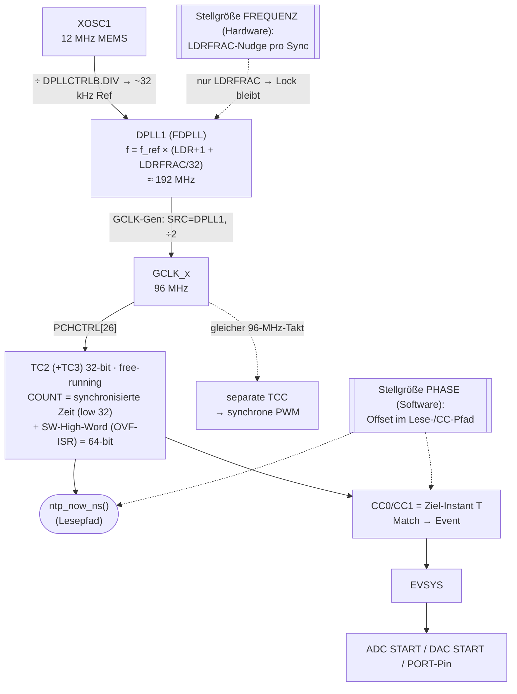
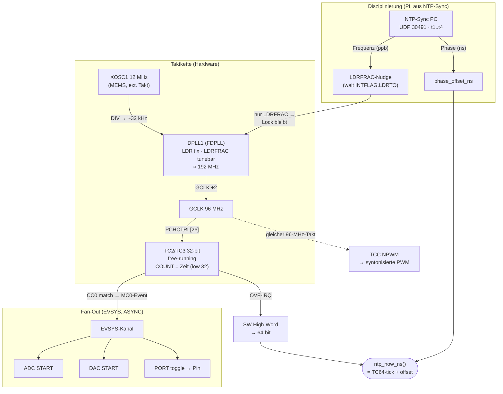
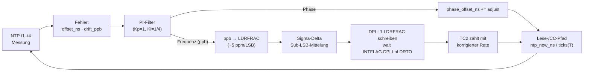
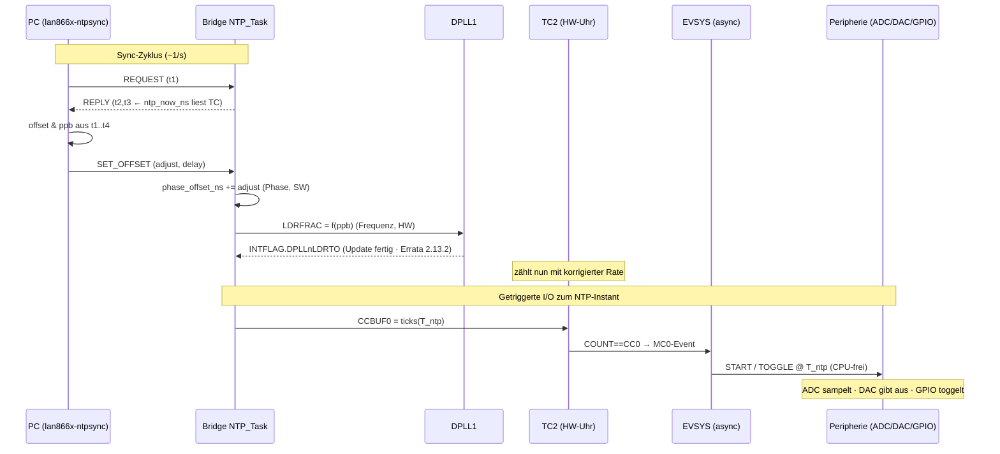
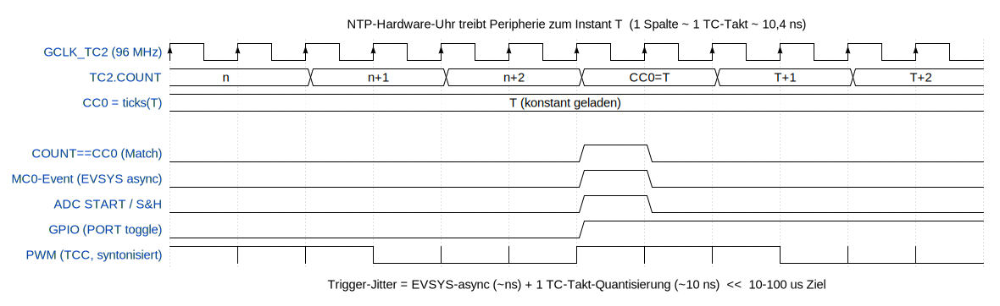

# NTP-tunebarer Hardware-Takt (Option B-b) + Peripherie-Trigger (Option C) — Implementierung

Konkrete Umsetzungsbeschreibung: wie aus **XOSC1 + DPLL1 + einem dedizierten TC** ein
**in Frequenz nachführbarer Hardware-Zeitzähler** entsteht, dessen Stand = die
synchronisierte NTP-Zeit ist, und wie damit über **EVSYS** ADC/DAC/GPIO/PWM exakt zu
NTP-Instanten getrieben werden.

> Voruntersuchung & Optionsvergleich: [HW_TIMEBASE_OPTIONS.md](HW_TIMEBASE_OPTIONS.md).
> Code: [`ntp_sync.c`](../firmware/src/ntp_sync.c),
> [`plib_clock.c`](../firmware/src/config/default/peripheral/clock/plib_clock.c).
> Datenblatt: SAM D5x/E5x, DS60001507K (Seitenangaben = gedruckte DS-Seiten).
> Register-Schreibweise = CMSIS-Stil wie im Projekt (`OSCCTRL_REGS->…`, `GCLK_REGS->…`).

**Projekt-Ressourcenlage (verifiziert):** `TC0` = SYS_TIME (einziges generiertes
TC-plib); **`TC2/TC3`, `TC4/TC5`, `TC6/TC7` frei**; **DPLL1 frei** (nur DPLL0 in Nutzung);
**EVSYS ungenutzt** (32 Kanäle frei). Diese Umsetzung verwendet **TC2 (+TC3) im
32-bit-Modus** als NTP-Hardware-Uhr und **DPLL1** als nachführbare Taktquelle.

---

## Realisierungsstand (Board getestet, Silizium Rev D) — Stand 2026-06

> **Diese Datei ist der ursprüngliche Implementierungsplan.** Der schrittweise Bring-up
> ist abgeschlossen und auf der MCU verifiziert — Protokoll mit PASS-Kriterien je Schritt:
> [HW_TIMEBASE_BRINGUP_STEPS.md](HW_TIMEBASE_BRINGUP_STEPS.md). Die folgenden Punkte fassen
> **Abweichungen zwischen Plan und realisiertem Code** zusammen; die betroffenen Abschnitte
> unten tragen einen Hinweis-Block.
>
> - ✅ **Schritte 0–9 PASS** (Rev D, `DID=0x61840300`, Regulator=LDO). Die ganze Kette
>   **XOSC1 → DPLL1 → TC2(64-bit) → NTP-Sync → EVSYS → GPIO/ADC/PPS** läuft hardwareseitig.
> - 📁 **Realisierter Code:** [`hwclk_cli.c`](../firmware/src/hwclk_cli.c) (Taktketten-Bring-up
>   + CLI-Testgruppe **`hwclk`**) und die Integration in [`ntp_sync.c`](../firmware/src/ntp_sync.c)
>   (`hwclock_now_ns()` als Lesepfad). Es gibt **kein** separates `hwclock.c/.h` (anders als §4.5
>   vorschlug).
> - 🔧 **DPLL1-Parameter anders:** realisiert **`DIV=182`, `LDR=5855`, `LDRFRAC=0`** → f_ref ≈
>   32,79 kHz, ×5856 = **exakt 192,000 MHz** (Plan war `DIV=186`/`LDR=5999`/`LDRFRAC=16` ≈ 192,5 MHz).
>   Gemessen **+31 ppm** (= XOSC1-Roh-Drift). Siehe §4.1(b).
> - ⛔ **Kernabweichung — HW-Frequenz-Disziplinierung (LDRFRAC) ist auf Rev D nicht machbar.**
>   Ein **On-the-fly-`DPLLRATIO`-Write stoppt den DPLL1-Ausgang dauerhaft** — trotz vollständiger
>   Errata-Workarounds (2.13.1 `WUF`+`LBYPASS`, 2.13.2 `INTFLAG.DPLLLDRTO`-Wait). **Konsequenz:
>   die Frequenz bleibt in Software** (der `s_rate_ppb`-PI in `ntp_sync.c`); §4.3 ist damit der
>   *nicht realisierte* Plan. Folge-Auflage: **bounded loops** in allen DPLL1-abhängigen Pfaden.
> - 🔧 **EVSYS-Fan-Out realisiert** mit konkreten IDs: EVGEN **`TC2_MC0=0x50`**, User
>   **`PORT_EV0` m=1**, **`ADC0_START` m=55**. Zwei nicht-offensichtliche Voraussetzungen
>   (je ein Fehlversuch): **`MCLK.APBBMASK.EVSYS` einschalten** und für den ADC die
>   **Bias-Kalibrierung aus den Fuses laden**. Siehe §4.4.
> - 🔧 **Bring-up-Phase:** der Takt-Hochlauf busy-waitet → er läuft **einmalig im ersten
>   `NTP_Task()` (RUNNING-Phase)**, **nicht** in `APP_Initialize` (sonst Boot-Hang). Siehe §4.5.

---

## Inhalt

- [1. Beschreibung / Architektur](#1-beschreibung--architektur)
  - [1.1 Die Kette](#11-die-kette)
  - [1.2 Das Zeitmodell — zwei Stellgrößen, sauber getrennt](#12-das-zeitmodell--zwei-stellgrößen-sauber-getrennt)
  - [1.3 Warum DPLL1 (nicht DPLL0)](#13-warum-dpll1-nicht-dpll0)
- [2. Vorgehensweise (Konzept)](#2-vorgehensweise-konzept)
- [3. Erreichbare Ziele](#3-erreichbare-ziele)
- [4. Implementierung](#4-implementierung)
  - [4.1 Taktkette aufsetzen (`hwclock_init()`)](#41-taktkette-aufsetzen-einmalig-z-b-neues-hwclock_init)
  - [4.2 Lesepfad — `ntp_now_ns()`](#42-lesepfad--ntp_now_ns-auf-die-hw-uhr-umstellen)
  - [4.3 Disziplinierungs-Schleife (`OP_SET_OFFSET`)](#43-disziplinierungs-schleife-im-op_set_offset-handler)
  - [4.4 EVSYS-Fan-Out — Peripherie treiben](#44-evsys-fan-out--peripherie-zum-ntp-instant-treiben)
  - [4.5 Code-Integration](#45-code-integration)
- [5. Risikoabschätzung (Risiko-Matrix)](#5-risikoabschätzung-risiko-matrix)
- [6. Umsetzungsreihenfolge (Milestones)](#6-umsetzungsreihenfolge-milestones)
- [7. Errata-Bewertung (SAM D5x/E5x, DS80000748)](#7-errata-bewertung-sam-d5xe5x-ds80000748)
- [8. Diagramme (Mermaid)](#8-diagramme-mermaid)
  - [8.1 Blockdiagramm — Architektur](#81-blockdiagramm--architektur-takt--regler--fan-out)
  - [8.2 Blockdiagramm — Regelschleife](#82-blockdiagramm--die-regelschleife-frequenzhw-phasesw)
  - [8.3 Sequenz-/Ablaufdiagramm](#83-sequenz-ablaufdiagramm-zeitlicher-verfahrensablauf)
  - [8.4 Timing-Diagramm (Signalebene, wavedrom)](#84-timing-diagramm-signalebene)

---

## 1. Beschreibung / Architektur

### 1.1 Die Kette
```
XOSC1 (12 MHz MEMS)                      Stellgröße FREQUENZ (Hardware)
   │  ÷ (DPLLCTRLB.DIV) → ~32 kHz Ref            │
   ▼                                             ▼
DPLL1  f = f_ref × (LDR+1 + LDRFRAC/32)  ──  LDRFRAC nudge pro Sync
   │  ≈ 192 MHz
   ▼  GCLK-Generator (SRC=DPLL1, ÷2)
GCLK_x = 96 MHz ──► PCHCTRL[26] ──► TC2(+TC3) 32-bit, free-running
                                          │  COUNT = synchronisierte Zeit (low 32)
                                          │  + SW-High-Word (OVF-ISR) = 64-bit
                                          │
                          ┌───────────────┴───────────────┐
                   ntp_now_ns()                      CC0/CC1 = Ziel-Instant T
                   (Lesepfad)                              │ Match → Event
                                                           ▼
                                       EVSYS ──► ADC START / DAC START / PORT-Pin
                                                 (+ separate TCC für synchrone PWM)
                          Stellgröße PHASE (Software-Offset im Lese-/CC-Pfad)
```

Dieselbe Kette als Mermaid:


### 1.2 Das Zeitmodell — zwei Stellgrößen, sauber getrennt
- **Frequenz (Syntonisierung) → Hardware:** der TC zählt mit der *korrigierten* Rate,
  weil **DPLL1.LDRFRAC** nachgeführt wird. Damit liegt die richtige Frequenz **physisch**
  im Zähler — Voraussetzung dafür, dass ein Compare-Ereignis (CC == COUNT) zum richtigen
  Zeitpunkt feuert.
- **Phase (Offset) → Software:** der TC läuft frei; die absolute NTP-Zeit =
  `TC64 · tick_ns + phase_offset_ns`. `phase_offset_ns` ist ein per-Sync gesetzter
  int64 (entspricht dem heutigen `s_offset_ns`). Phase wird **nicht** über die PLL
  gemacht (das würde die Frequenz stören).
- **64-bit-Erweiterung:** TC2 ist 32-bit, überläuft bei 96 MHz alle **≈ 44,7 s**. Ein
  Software-High-Word, im **TC2-Overflow-Interrupt** inkrementiert, ergibt die 64-bit-Zeit
  (gleiche Technik wie Harmonys SYS_TIME).

### 1.3 Warum DPLL1 (nicht DPLL0)
DPLL0 speist CPU/Bus/alle Peripherie (GCLK0=120 MHz, GCLK1=60 MHz). Würde man DPLL0
nudgen, wanderten **alle** Takte (UART-Baud, SysTick, Ethernet-Timing). **DPLL1 ist
unabhängig** und wird hier exklusiv für die NTP-Zeitbasis verwendet — CPU bleibt unberührt.

---

## 2. Vorgehensweise (Konzept)

1. **XOSC1 als Taktquelle in Betrieb nehmen** (einmalig). *Optionale Basismaßnahme aus
   Option B-a:* zusätzlich DPLL0-Referenz auf XOSC1 legen → senkt die Roh-Drift des
   **gesamten** Systems von ~1800 ppm auf ~30 ppm. Für B-b genügt zunächst, dass XOSC1
   läuft (es speist DPLL1).
2. **DPLL1 aufsetzen:** Referenz = XOSC1÷(→~32 kHz), Verhältnis auf ~192 MHz, **`LTIME=0`
   (Auto-Lock)**, Lock-Timer-Takt (`PCHCTRL[3]`) bereitstellen — Voraussetzung für
   störungsfreie On-the-fly-Updates.
3. **GCLK-Generator** mit `SRC=DPLL1`, `÷2` → 96 MHz, auf **`PCHCTRL[26]` (TC2/TC3)** routen.
4. **TC2 im 32-bit-Modus** frei laufen lassen, Overflow-Interrupt für die 64-bit-Erweiterung.
5. **Disziplinierungs-Schleife** (im bestehenden `SET_OFFSET`-Pfad von `ntp_sync.c`):
   - Frequenzfehler (ppb) aus dem t1..t4-Austausch → **nächstgelegener `LDRFRAC`-Wert**;
     **nur LDRFRAC schreiben → DPLL-Lock bleibt erhalten** (DS §28 S.708). Optional
     **Sigma-Delta-Dithering** zwischen zwei LDRFRAC-Werten → mittlere Rate exakt.
   - Phasenfehler → `phase_offset_ns` setzen (Software).
6. **EVSYS-Fan-Out:** Ziel-Instant T → `CC0`/`CCBUF0` von TC2; Match-Event → EVSYS-Kanal
   → ADC-START / DAC-START / PORT-Pin; synchrone **PWM** über eine separate, vom selben
   96-MHz-GCLK getaktete **TCC**.

---

## 3. Erreichbare Ziele

| Größe | Wert | Begründung |
|---|---|---|
| **TC-Auflösung (tick)** | **≈ 10,42 ns** | 1/96 MHz |
| **HW-Frequenzraster (LDRFRAC)** | **≈ 5 ppm/LSB** | f_ref/32/f_DPLL ≈ 32k/32/192e6 |
| **Holdover/Sync ohne Dither** | **≤ ~2,5 µs/s** | halbes LSB (≤2,5 ppm) × 1 s |
| **Holdover/Sync mit Sigma-Delta** | **< 1 µs/s** | mittlere Rate < 0,5 ppm |
| **Trigger-Jitter (EVSYS-Pfad)** | **~10–20 ns** | async ns + 1 TC-Takt Quantisierung |
| **Roh-Drift (XOSC1 statt DFLL)** | **~±30 ppm** statt ~1800 ppm | MEMS-Oszillator über Temperatur |
| **Unabhängige Trigger** | viele | TC2 CC0/CC1 + weitere TC/TCC, 32 EVSYS-Kanäle |

> 🔧 **Rev-D-Realität:** die Zeilen **HW-Frequenzraster (LDRFRAC)** und **Holdover mit/ohne
> Dither** beschreiben die *geplante* HW-Disziplinierung — die ist auf Rev D **nicht nutzbar**
> (§4.3). Realisiert: **Frequenz in Software** (`s_rate_ppb`-PI), Restdrift rastet auf ~+28 ppm
> ein, `mean`-Offset ~0 (±~10 µs NTP-Jitter). Roh-Drift (XOSC1) **+31 ppm gemessen** (statt
> ~1800 ppm DFLL); TC-Auflösung (~10,4 ns) und EVSYS-Trigger-Jitter (~10–20 ns) gelten unverändert.

**Ergebnis:** Das **10–100-µs-Ziel wird mit Reserve erreicht** — schon „nächstes LDRFRAC
pro Sync" hält ≤ ~2,5 µs/s, der EVSYS-Trigger feuert mit ~10-ns-HW-Jitter (CPU-frei). Die
**reale Obergrenze ist nicht der Takt, sondern die NTP-Transportgenauigkeit über die
T1S-Bridge** (~hunderte µs Software-Roundtrip). Für *lokale* getriggerte I/O (ADC/DAC/PWM/
GPIO relativ zur lokalen NTP-Zeit) ist die Zeitbasis selbst weit besser als das Ziel.

---

## 4. Implementierung

### 4.1 Taktkette aufsetzen (einmalig, z. B. neues `hwclock_init()`)

**(a) XOSC1 aktivieren** — **Schaltplan-bestätigt:** 12-MHz-**MEMS-Oszillator** `DSC6003C12A`
(aktiver CMOS-Takt, kein Quarz) speist **XIN1 / PB22 / Pin 97** ⇒ **External-Clock-Mode,
`XTALEN=0`** (R1 gelöst):
```c
/* XOSC1 = externer 12-MHz-Takt an XIN1 (PB22). KEIN Quarz → XTALEN=0,
 * kein IMULT/IPTAT/ENALC (das sind reine Quarz-Amplitudenparameter). */
OSCCTRL_REGS->XOSCCTRL[1] = OSCCTRL_XOSCCTRL_ENABLE_Msk
                          | OSCCTRL_XOSCCTRL_STARTUP(0U);   /* ext. Takt: minimaler Startup */
while ((OSCCTRL_REGS->OSCCTRL_STATUS & OSCCTRL_STATUS_XOSCRDY1_Msk) == 0U) {}
```
> Hinweis: `XOSCCTRL` ist ein **Array** — Index **`[1]`** = XOSC1. Der 32,768-kHz-Zweig
> (`Y400 DSC6083CE2A`) ist ebenfalls ein MEMS-Takt; als FREQM-Referenz ggf. XOSC32K
> (`XOSC32KCTRL`, `XTALEN=0`) statt der internen OSCULP32K nutzen.
>
> 🔧 **Realisiert/getestet (Board):** `RDY=1`, **XOSC1 = 12.000.155 Hz = +12 ppm** (FREQM gegen
> XOSC32K). XOSC32K-Enable braucht **`CGM(XT)` + RDY-Poll bis ~1 s** (`ctrl=0x200A`); ohne CGM
> bzw. zu kurzer Poll → Fallback auf OSCULP32K (nur Präsenz-Check, ~±%). `hwclk xosc` misst die
> Frequenz, `hwclk xosc ulp` erzwingt OSCULP32K als Referenz.

**(b) DPLL1 konfigurieren** (Ref ≈ 32 kHz aus XOSC1, ~192 MHz Ausgang, On-the-fly-fähig):

> 🔧 **Realisiert (Rev D, [`hwclk_cli.c`](../firmware/src/hwclk_cli.c)):** **`DIV=182`**
> (f_ref = 12e6/(2·183) ≈ **32,79 kHz**), **`LDR=5855`** ((5855+1)·32,79k = **exakt 192,000 MHz**),
> **`LDRFRAC=0`** (kein „Mittelstellungs"-Reserve­bereich — Runtime-LDRFRAC entfällt, s. §4.3).
> Rev D: `LBYPASS=1`+`WUF=1` gesetzt, auf **`CLKRDY`** (nicht `LOCK`) triggern, ~10 ms settlen.
> Gemessen: `CLKRDY=1 LOCK=1`, **192,006 MHz = +31 ppm** (= XOSC1-Roh-Drift). Der untenstehende
> Code (`DIV=186`/`LDR=5999`/`LDRFRAC=16`) ist der **ursprüngliche Plan** und überschätzt f_ref.

```c
/* Lock-Timer-Takt für DPLL1 (PCHCTRL[3] = GCLK_OSCCTRL_FDPLL1_32K) aus einem 32k-Gen */
GCLK_REGS->GCLK_PCHCTRL[3] = GCLK_PCHCTRL_GEN(0x?U) | GCLK_PCHCTRL_CHEN_Msk;  /* 32k-Generator */

OSCCTRL_REGS->DPLL[1].OSCCTRL_DPLLCTRLB =
        OSCCTRL_DPLLCTRLB_REFCLK(3U)        /* 3 = XOSC1 */
      | OSCCTRL_DPLLCTRLB_DIV(186U)         /* f_ref = 12e6 / (2*(186+1)) ≈ 32,09 kHz */
      | OSCCTRL_DPLLCTRLB_LTIME(0U)         /* Auto-Lock → Voraussetzung On-the-fly */
      | OSCCTRL_DPLLCTRLB_FILTER(0U);
OSCCTRL_REGS->DPLL[1].OSCCTRL_DPLLRATIO =
        OSCCTRL_DPLLRATIO_LDR(5999U)        /* (5999+1)=6000 × 32,09k ≈ 192,5 MHz */
      | OSCCTRL_DPLLRATIO_LDRFRAC(16U);     /* Mittelstellung, Stellbereich ±16 LSB */
while (OSCCTRL_REGS->DPLL[1].OSCCTRL_DPLLSYNCBUSY & OSCCTRL_DPLLSYNCBUSY_DPLLRATIO_Msk) {}
OSCCTRL_REGS->DPLL[1].OSCCTRL_DPLLCTRLA = OSCCTRL_DPLLCTRLA_ENABLE_Msk;
while ((OSCCTRL_REGS->DPLL[1].OSCCTRL_DPLLSTATUS &
        (OSCCTRL_DPLLSTATUS_LOCK_Msk | OSCCTRL_DPLLSTATUS_CLKRDY_Msk)) !=
       (OSCCTRL_DPLLSTATUS_LOCK_Msk | OSCCTRL_DPLLSTATUS_CLKRDY_Msk)) {}
```

**(c) GCLK-Generator (freier Index, z. B. 5) aus DPLL1, ÷2 → 96 MHz, an TC2/TC3:**

> 🔧 **Realisiert:** dedizierter **GCLK-Gen `HWCLK_GEN_TC2 = 5`** (SRC=DPLL1, ÷2 = 96 MHz),
> `PCHCTRL[TC2_GCLK_ID=26]`, `MCLK_APBBMASK.TC2` — exakt wie unten. Gemessene Rate ≈ 95,82 MHz
> *gegen SYS_TIME* ist nur die DFLL-Drift von SYS_TIME (~+1950 ppm), nicht TC2 (Cross-Check ✓).

```c
GCLK_REGS->GCLK_GENCTRL[5] = GCLK_GENCTRL_SRC(8U)   /* 8 = DPLL1 */
                           | GCLK_GENCTRL_DIV(2U)
                           | GCLK_GENCTRL_GENEN_Msk;
while (GCLK_REGS->GCLK_SYNCBUSY & GCLK_SYNCBUSY_GENCTRL5_Msk) {}
GCLK_REGS->GCLK_PCHCTRL[26] = GCLK_PCHCTRL_GEN(5U)  /* 26 = GCLK_TC2,TC3 */
                            | GCLK_PCHCTRL_CHEN_Msk;
while ((GCLK_REGS->GCLK_PCHCTRL[26] & GCLK_PCHCTRL_CHEN_Msk) == 0U) {}
MCLK_REGS->MCLK_APBBMASK |= MCLK_APBBMASK_TC2_Msk;  /* APB-Takt TC2 (Bus prüfen!) */
```

**(d) TC2 als 32-bit Free-Running + Overflow-Interrupt (64-bit-Basis):**

> 🔧 **Realisiert/getestet:** TC2 `MODE=COUNT32`, OVF-IRQ (`TC2_Handler`) inkrementiert das
> SW-High-Word; **glitch-freier 64-bit-Read per hi/lo/hi-Retry** (s. §4.2). `hwclk now` zeigt
> Ticks+ns, `hwclk wrap` belegt OVF→High-Word++ (hi 0→1). **`PRESCALER` liegt in `CTRLA`** (nicht
> CTRLB). Lesepfad `hwclock_now_ns() = tc2_read64() · 125/12 ns`.

```c
TC2_REGS->COUNT32.TC_CTRLA = TC_CTRLA_SWRST_Msk;
while (TC2_REGS->COUNT32.TC_SYNCBUSY & TC_SYNCBUSY_SWRST_Msk) {}
TC2_REGS->COUNT32.TC_CTRLA = TC_CTRLA_MODE_COUNT32 | TC_CTRLA_PRESCALER_DIV1
                           | TC_CTRLA_PRESCSYNC_PRESC;
TC2_REGS->COUNT32.TC_INTENSET = TC_INTENSET_OVF_Msk;   /* OVF → High-Word++ */
NVIC_EnableIRQ(TC2_IRQn);
TC2_REGS->COUNT32.TC_CTRLA |= TC_CTRLA_ENABLE_Msk;
while (TC2_REGS->COUNT32.TC_SYNCBUSY & TC_SYNCBUSY_ENABLE_Msk) {}
```
```c
static volatile uint32_t s_hw_hi = 0;          /* obere 32 bit der 64-bit-Zeit */
void TC2_Handler(void) {
    if (TC2_REGS->COUNT32.TC_INTFLAG & TC_INTFLAG_OVF_Msk) {
        s_hw_hi++;
        TC2_REGS->COUNT32.TC_INTFLAG = TC_INTFLAG_OVF_Msk;
    }
}
```

### 4.2 Lesepfad — `ntp_now_ns()` auf die HW-Uhr umstellen
```c
#define HW_TICK_HZ   96000000ULL
static int64_t s_phase_offset_ns = 0;          /* = bisheriges s_offset_ns */

static uint64_t hw_ticks64(void) {             /* atomar gegen OVF-Race */
    uint32_t hi1, lo, hi2;
    do { hi1 = s_hw_hi;
         TC2_REGS->COUNT32.TC_CTRLBSET = TC_CTRLBSET_CMD_READSYNC;
         while (TC2_REGS->COUNT32.TC_SYNCBUSY & TC_SYNCBUSY_COUNT_Msk) {}
         lo  = TC2_REGS->COUNT32.TC_COUNT;
         hi2 = s_hw_hi;
    } while (hi1 != hi2);                       /* OVF während Lesen → wiederholen */
    return ((uint64_t)hi1 << 32) | lo;
}
uint64_t ntp_now_ns(void) {                    /* ersetzt die SYS_TIME-Variante */
    uint64_t t = hw_ticks64();
    uint64_t sec = t / HW_TICK_HZ, frac = t % HW_TICK_HZ;
    int64_t  ns  = (int64_t)(sec * 1000000000ULL + (frac * 1000000000ULL) / HW_TICK_HZ);
    return (uint64_t)(ns + s_phase_offset_ns);
}
```

### 4.3 Disziplinierungs-Schleife (im `OP_SET_OFFSET`-Handler)

> ⛔ **NICHT realisiert auf Rev D — HW-LDRFRAC-Disziplinierung ist hier tot.** Ein
> **On-the-fly-`DPLLRATIO`-Write (auch nur `LDRFRAC`) stoppt den DPLL1-Ausgang dauerhaft**:
> TC2 friert ein („advanced 0 ticks") und erholt sich nicht — **trotz** der vollständigen
> Errata-Workarounds (2.13.1 `WUF=1`+`LBYPASS=1`, 2.13.2 `INTFLAG.DPLLLDRTO`-Wait). Die
> „on-the-fly ratio change"-Funktion ist auf diesem Rev D praktisch unbrauchbar.
> **Realisierung stattdessen:** die **Frequenz bleibt in Software** — der bestehende
> `s_rate_ppb`-PI in [`ntp_sync.c`](../firmware/src/ntp_sync.c) nullt die Restdrift im
> Lesepfad (Schritt 6 erreicht, in SW statt HW). Für getriggerte HW-Events (§4.4) werden
> Compare-Ziele über die **effektive** Tick-Rate gerechnet, nicht nominal 96 MHz, damit sie
> trotz des festen ~+28-ppm-HW-Offsets am richtigen Instant feuern. **Auflage:** alle
> DPLL1-abhängigen Spin-Loops (`tc2_read64`/`gclk_sync`/FREQM) müssen **bounded** sein —
> ein toter DPLL-Takt friert sonst den ganzen Superloop ein. `hwclk ldrfrac` ist nur noch
> **read-only-Diagnose** (LDRFRAC + gemessene DPLL-Frequenz). Der folgende Code dokumentiert
> den **ursprünglichen HW-Plan** zur Referenz.

```c
/* aus dem PC-Sync: 'adjust' (ns) = -gemessener Offset; interval = Zeit seit letztem Sync */
#define LDRFRAC_MID   16
#define PPM_PER_LSB   5.0                       /* aus der gewählten Taktkette */
static int  s_ldrfrac = LDRFRAC_MID;
static int  s_sd_acc  = 0;                      /* Sigma-Delta-Akkumulator */

/* PHASE: Software-Offset (wie bisher) */
s_phase_offset_ns += adjust;

/* FREQUENZ: ppb schätzen wie heute, dann auf LDRFRAC abbilden */
int64_t drift_ppb = (adjust * 1000000LL) / (interval_ns / 1000);   /* ns/Intervall → ppb */
s_freq_ppb_filt += drift_ppb / KI;                                 /* PI-Integral, wie heute */

double lsb_needed = (double)s_freq_ppb_filt / (PPM_PER_LSB * 1000.0);
int    lsb_int    = (int)lround(lsb_needed);
int    target     = LDRFRAC_MID - lsb_int;                          /* Vorzeichen je nach Richtung */
if (target < 0) target = 0; if (target > 31) target = 31;          /* 5-bit Sättigung → Anti-Windup */

/* optional Sigma-Delta: Sub-LSB-Rest über die Zeit mitteln */
s_sd_acc += (int)lround((lsb_needed - lsb_int) * 32);
int dither = s_sd_acc / 32; s_sd_acc -= dither * 32;
int ldrfrac = target + dither; if (ldrfrac<0) ldrfrac=0; if (ldrfrac>31) ldrfrac=31;

if (ldrfrac != s_ldrfrac) {                    /* NUR LDRFRAC schreiben → Lock bleibt */
    OSCCTRL_REGS->DPLL[1].OSCCTRL_DPLLINTFLAG = OSCCTRL_DPLLINTFLAG_DPLLLDRTO_Msk; /* Flag löschen */
    OSCCTRL_REGS->DPLL[1].OSCCTRL_DPLLRATIO =
        OSCCTRL_DPLLRATIO_LDR(5999U) | OSCCTRL_DPLLRATIO_LDRFRAC((uint32_t)ldrfrac);
    while (OSCCTRL_REGS->DPLL[1].OSCCTRL_DPLLSYNCBUSY & OSCCTRL_DPLLSYNCBUSY_DPLLRATIO_Msk) {}
    /* ERRATA 2.13.2: bei On-the-fly-Ratio-Update wird STATUS.DPLLnLDRTO NICHT gesetzt →
       stattdessen auf das INTFLAG.DPLLnLDRTO warten (Ratio-Update abgeschlossen). */
    while ((OSCCTRL_REGS->DPLL[1].OSCCTRL_DPLLINTFLAG & OSCCTRL_DPLLINTFLAG_DPLLLDRTO_Msk) == 0U) {}
    s_ldrfrac = ldrfrac;
}
```
> **Wichtig:** nie den Integer-`LDR` im Betrieb ändern (löscht den Lock); ausschließlich
> `LDRFRAC` nudgen. Frequenz **in Hardware**, Phase **in Software** — niemals vermischen.

### 4.4 EVSYS-Fan-Out — Peripherie zum NTP-Instant treiben

> 🔧 **Realisiert (Rev D, [`hwclk_cli.c`](../firmware/src/hwclk_cli.c)) — konkrete IDs & Gotchas:**
> - EVGEN **`TC2_MC0 = 0x50`**; User **`PORT_EV0` m=1** und **`ADC0_START` m=55** (jeweils
>   `EVSYS_USER[m] = EVSYS_USER_CHANNEL(ch+1)`, Kanal zuerst — vgl. unten).
> - **`MCLK.APBBMASK.EVSYS` muss an sein** (zusätzlich `PORT` für den GPIO-Pfad) — sonst
>   verpuffen alle EVSYS-Register-Writes (Kanal/User lesen 0 zurück). Kostete einen Fehlversuch.
> - **ADC:** die **Bias-Kalibrierung aus den Fuses laden** (`FUSES_SW0_WORD_0` @ `0x00800080`
>   → `ADC.CALIB` BIASCOMP[4:2]/BIASREFBUF[7:5]/BIASR2R[10:8]); ohne sie **wandelt die D5x-ADC
>   nicht**. Nebenbei: `PRESCALER` liegt in **`CTRLA`**, nicht CTRLB.
> - **GPIO-Pfad-Gotchas:** erst routen + ~2 ms settlen (Kanal-Konfig erzeugt eine Transient-Flanke),
>   dann Startzustand + CC0 armen; async-**SWEVT** toggelt den PORT **nicht** (nur der echte HW-Pfad).
> - Getestet: `hwclk evt` (GPIO-Toggle zur NTP-Sekunde), `hwclk adc N` (N Trigger → N Conversions),
>   `hwclk pps on` (Dauer-PPS via `CC0 += 96e6`-Reload im `TC2 MC0`-ISR).

**(a) TC2-Compare als Event-Generator scharf machen** (CC0 = Ziel-Tick, Double-Buffer):
```c
TC2_REGS->COUNT32.TC_EVCTRL = TC_EVCTRL_MCEO0_Msk;        /* Match-Event auf CC0 */
/* Ziel-Instant T_ntp → Tickwert; nur die low-32 in CC, im OVF-Fenster scharf: */
uint64_t target_ticks = ntp_ns_to_ticks(T_ntp);          /* inverse zu 4.2 */
TC2_REGS->COUNT32.TC_CCBUF[0] = (uint32_t)target_ticks;   /* gepuffert gegen Wrap-Race */
```

**(b) EVSYS verdrahten — Reihenfolge: User zuerst, dann Kanal** (DS §31.5.2.1 S.773):
```c
MCLK_REGS->MCLK_APBBMASK |= MCLK_APBBMASK_EVSYS_Msk;
/* Beispiel: ADC0-START am Kanal 0 */
EVSYS_REGS->EVSYS_USER[EVSYS_ID_USER_ADC0_START] = EVSYS_USER_CHANNEL(0U + 1U); /* n+1 */
EVSYS_REGS->EVSYS_CHANNEL[0] = EVSYS_CHANNEL_EVGEN(EVSYS_ID_GEN_TC2_MCX_0)
                             | EVSYS_CHANNEL_PATH_ASYNCHRONOUS               /* ADC nur async! */
                             | EVSYS_CHANNEL_EDGSEL_NO_EVT_OUTPUT;
```

**(c) Die einzelnen User freigeben:**
```c
/* ADC: Sampling startet exakt beim Event (S&H erst bei Conversion-Start) */
ADC0_REGS->ADC_EVCTRL = ADC_EVCTRL_STARTEI_Msk;          /* DS §45.6.6 S.1455 */

/* DAC: bei Event-Start DATABUFx schreiben (nicht DATAx) */
DAC_REGS->DAC_EVCTRL  = DAC_EVCTRL_STARTEI0_Msk;          /* DS §47.6.6 S.1523 */
/* … später pro Wert: DAC_REGS->DAC_DATABUF[0] = value; */

/* GPIO an exaktem Instant: TC2-Match-Event → PORT-EVx TOGGLE/SET/CLEAR (DS §32.2 S.801)
   USER = PORT_EV0..3; PORT_EVCTRL: PID=Pin, EVACT=TOGGLE, PORTEI=1. */
```

**(d) Synchrone PWM** über eine **separate TCC** am selben 96-MHz-GCLK:
- TCC im `NPWM`-Modus, `PER`/`CCx` = Periode/Duty → alle Flanken sind inhärent auf die
  disziplinierte Zeitbasis ausgerichtet (DS §49.6.2.5.5 S.1642).
- Phasenlage zur NTP-Sekunde: TCC per **Retrigger-Event** von TC2 an einem bekannten
  Instant starten/neu-triggern (EVSYS: TC2_MC1 → TCC_EV).

**(e) Periodische Trigger** (z. B. „ADC jede ms auf der NTP-Achse"): im `TC2 MC0`-ISR
`CCBUF[0] += period_ticks` nachladen (Single-Shot-Kette), oder eine eigene TCC mit
Auto-Reload nutzen.

### 4.5 Code-Integration

> 🔧 **Realisiert (abweichend vom Plan unten):** kein separates `hwclock.c/.h`, sondern
> **[`hwclk_cli.c`](../firmware/src/hwclk_cli.c)** — es enthält den Taktketten-Bring-up
> (`hwclk_timebase_start()` → `hwclk_tc2_init()`), den Lesepfad `hwclock_now_ns()`
> (`tc2_read64() · 125/12 ns`) **und** die CLI-Testgruppe **`hwclk`** (ein Unterkommando
> je Bring-up-Schritt). [`ntp_sync.c`](../firmware/src/ntp_sync.c): `ntp_raw_ns()` liest
> `hwclock_now_ns()` (Fallback SYS_TIME); Phase → `s_offset_ns`; **Frequenz bleibt im
> bestehenden `s_rate_ppb`-PI** (kein `hwclock_set_ldrfrac()` — s. §4.3).
> **Bring-up läuft einmalig im ersten `NTP_Task()` (RUNNING-Phase)**, nicht in
> `APP_Initialize` — der Hochlauf busy-waitet über `plat_sleep_ms()` und würde dort den
> Boot aufhängen (Board tot, kein Ping/Konsole). Vgl. Schritt 5 in
> [HW_TIMEBASE_BRINGUP_STEPS.md](HW_TIMEBASE_BRINGUP_STEPS.md).

Ursprünglicher Plan (zur Referenz):
- Neues Modul `hwclock.c/.h`: `hwclock_init()` (4.1), `hwclock_ticks64()`,
  `hwclock_set_ldrfrac()`, `ntp_ns_to_ticks()`/`hwclock_now_ns()`.
- `ntp_sync.c`: `ntp_raw_ns()`/`ntp_now_ns()` lesen die HW-Uhr; im `OP_SET_OFFSET`-Pfad
  die Aktuatoren ersetzen (Phase→`s_phase_offset_ns`, Frequenz→`hwclock_set_ldrfrac()`).
  Der bestehende PI bleibt; der `s_rate_ppb`-Term wandert in die LDRFRAC-Abbildung.
- **MCC:** DPLL1/GCLK/TC2/EVSYS lassen sich auch im MCC-Clock-/Peripheral-Manager
  konfigurieren (dann werden plibs generiert). Die **Regelschleife (4.3) bleibt
  Hand-Code**. Achtung: MCC-Regenerierung überschreibt `plib_clock.c` (R7).

---

## 5. Risikoabschätzung (Risiko-Matrix)

Wahrscheinlichkeit **W** und Auswirkung **A** je 1–5; **R = W×A**; Ampel:
🟢 1–6 niedrig · 🟡 8–12 mittel · 🔴 15–25 hoch.

| # | Risiko | W | A | R | Ampel | Gegenmaßnahme |
|---|---|--:|--:|--:|:--:|---|
| **R1** | ~~XOSC1 ist kein nutzbarer Takt~~ — **GELÖST** (Schaltplan geprüft) | 1 | 5 | 5 | 🟢 | **Geklärt:** 12-MHz-**MEMS-Oszillator** `DSC6003C12A` (aktiver CMOS-Takt) an **XIN1/PB22/Pin 97** ⇒ External-Clock-Mode **`XTALEN=0`**, `XOSCCTRL[1]`, `XOSCRDY1`. Quelle & Routing bestätigt; kein Quarz-Bring-up nötig. Fallback (XOSC32K) entfällt. |
| **R2** | **CPU-Takt-Kopplung** — versehentlich DPLL0/GCLK0 verändert | 2 | 5 | 10 | 🟡 | Strikt nur **DPLL1** + freier GCLK-Gen + freier PCHCTRL[26] anfassen; DPLL0/GCLK0/1/2 read-only behandeln; Code-Review der Clock-Init. |
| **R3** | **TC-Kollision** — gewählter TC doch anderweitig genutzt | 2 | 4 | 8 | 🟡 | TC0=SYS_TIME meiden; **TC2/TC3** gewählt (im Projekt 0 Referenzen); vor Merge `grep -r 'TC2_\|TC3_'` gegen die LAN865x-/PWM-Pfade. Alternativen TC4/5, TC6/7. |
| **R4** | **LDRFRAC-Raster zu grob** (~5 ppm/LSB) für engeres Ziel | 3 | 2 | 6 | 🟢 | Sigma-Delta-Dither (4.3) → mittlere Rate <0,5 ppm; ggf. f_ref kleiner (näher 32 kHz) / f_DPLL höher (näher 200 MHz). |
| **R5** | **DPLL-Lock/Output-Verlust** durch `DPLLRATIO`-Write im Betrieb | 4 | 4 | 16 | 🔴 | **Eingetreten (Rev D):** *jeder* On-the-fly-`DPLLRATIO`-Write (auch nur `LDRFRAC`) stoppt den DPLL1-Ausgang dauerhaft, trotz 2.13.1/2.13.2-Workarounds. **Mitigation:** im Betrieb DPLLRATIO **gar nicht** schreiben → Frequenz in SW (§4.3); LDR/DIV/LDRFRAC nur im einmaligen Bring-up; **bounded loops** in allen DPLL1-Pfaden. |
| **R6** | **Fractional-DPLL-Jitter** stört jitterkritische PWM/DAC | 2 | 3 | 6 | 🟢 | Für die TC-Zeitbasis unkritisch (mittelt sich); für PWM/DAC `DCOFILTER`/`FILTER` optimieren oder LDRFRAC nahe 0/voll halten + mehr Dither. |
| **R7** | **MCC-Regenerierung** überschreibt Clock-/TC-Init | 3 | 3 | 9 | 🟡 | Clock-Kette idealerweise **in MCC** konfigurieren (statt Hand-Patch in `plib_clock.c`); andernfalls Init in eigenes, MCC-fernes Modul + dokumentierter Re-Apply-Schritt (wie der bestehende `DRV_LAN865X`-Hook). |
| **R8** | **Compare-Wraparound-Race** — CC zu spät geschrieben → Event 1 Periode (≈44 s) zu spät | 3 | 4 | 12 | 🟡 | Immer `CCBUF` (Double-Buffer) + ausreichend Vorlauf (≫ Reload-/Sync-Latenz); im MC-ISR prüfen, ob Ziel schon passiert → überspringen/neu rechnen. |
| **R9** | **64-bit-OVF-Race** beim Lesen über den Überlauf | 2 | 3 | 6 | 🟢 | Hi/Lo/Hi-Doppellesung (4.2); OVF-ISR kurz halten; `READSYNC` vor COUNT-Lesen. |
| **R10** | **NTP-Transport bleibt der Engpass** (~hunderte µs) — HW-Uhr besser als die Sync-Quelle | 4 | 2 | 8 | 🟡 | Für *lokale* getriggerte I/O irrelevant (Zeitbasis ist lokal exakt). Für *Leitungs*-Sync <10 µs separat HW-Frame-Timestamping (Option A / PTP, `net_10base_t1s`) verfolgen. |
| **R11** | **Anti-Windup/Stabilität** der Regelschleife (5-bit-Sättigung) | 2 | 3 | 6 | 🟢 | LDRFRAC-Sättigung als Windup-Grenze behandeln; wenn dauerhaft am Anschlag → LDR-Arbeitspunkt (offline) nachziehen; Ki konservativ (wie heute 1/4). |
| **R12** | **XOSC1-Startup/Stabilität** (kalt, Temperatur) | 2 | 2 | 4 | 🟢 | `XOSCRDY1` abwarten; bei MEMS-Takt entfällt Quarz-Startup (kein `ENALC`/Amplitude-Loop); Drift-Holdover deckt kurze Aussetzer. MEMS-Frequenzstabilität typ. ±20–50 ppm über Temperatur. |

**Top-Risiken:** R1 ist **gelöst** (XOSC1-MEMS-Takt bestätigt). Verbleibend führend:
**R8** (Wrap-Race), **R7** (MCC-Regenerierung) und **R2** (CPU-Takt-Kopplung) — alle
mit Standard-Mitteln beherrschbar.

---

## 6. Umsetzungsreihenfolge (Milestones)

1. **M0 — XOSC1 verifizieren (R1, Schaltplan ✓).** Quelle bereits geklärt (MEMS an XIN1).
   Verbleibt der Bring-up-Test: XOSC1 an (`XTALEN=0`), mit **FREQM** gegen XOSC32K messen →
   bestätigt die laufende 12-MHz-Frequenz. *Gate für alles Weitere.*
2. **M1 — DPLL1 + GCLK + TC2 (4.1).** TC2-Frei­lauf + 64-bit-OVF; `ntp_now_ds`-Plausibilität
   gegen das alte SYS_TIME (sollten parallel laufen).
3. **M2 — Lesepfad umstellen (4.2).** `ntp_now_ns()` liest TC2; CLI `ntp` zeigt Frequenz/
   Auflösung der neuen Uhr.
4. **M3 — Disziplinierung (4.3).** LDRFRAC-Regler + Phase-Offset; `ntp watch` zeigt
   sinkende `drift`/`mean`; Holdover messen (Sync aussetzen lassen).
5. **M4 — EVSYS-Fan-Out (4.4).** Erst GPIO-Toggle zur NTP-Sekunde (Oszilloskop gegen PC-PPS),
   dann ADC-START, dann PWM-Phasenlage.
6. **M5 — Optional B-a:** DPLL0-Wurzel ebenfalls auf XOSC1 → senkt System-Roh-Drift global.

> Querverweis: die übergeordnete Optionsbewertung und der Vergleich mit Option A
> (GMAC-1588-TSU) stehen in [HW_TIMEBASE_OPTIONS.md](HW_TIMEBASE_OPTIONS.md).

---

## 7. Errata-Bewertung (SAM D5x/E5x, DS80000748)

**Gesamtbefund (Plan): KEIN Errata steht der Implementierung im Weg** — abgedeckt durch
(a) die **ASYNC-EVSYS-Architektur**, (b) den **`INTFLAG.DPLLnLDRTO`-Workaround** und (c) den
**LDO-Mode**. **Befund nach Bring-up (Rev D):** für die *getriggerte I/O* gilt das auch —
EVSYS/ADC/PPS laufen. **Ausnahme: die HW-Frequenz-Disziplinierung über LDRFRAC ist auf
diesem Rev D nicht realisierbar** — ein On-the-fly-`DPLLRATIO`-Write stoppt den DPLL-Ausgang
dauerhaft, **schlimmer als 2.13.1/2.13.2 vorhersagen** und durch deren Workarounds **nicht**
behebbar (s. §4.3). Frequenz daher in Software. Die **Silizium-Revision** ist geprüft:
**Rev D** (`DID=0x61840300`).

| Errata | Modul | Rev | Relevanz hier | Bewertung | Workaround / Status |
|---|---|---|---|---|---|
| **2.13.2** | FDPLL | A/D/F/G | **LDRFRAC-Nudge** (4.3) | ⛔ **Blocker auf Rev D** | Plan: `STATUS.DPLLnLDRTO` nicht gesetzt → auf `INTFLAG.DPLLnLDRTO` warten. **Befund:** der Workaround genügt **nicht** — der On-the-fly-Ratio-Write stoppt DPLL1 trotzdem dauerhaft (TC2 friert) → **HW-LDRFRAC verworfen, Frequenz in SW** (§4.3). |
| **2.13.1** | FDPLL | **nur A/D** (F/G fixed) | DPLL1-Lock-Warten (4.1b) | kein Blocker (Initial-Lock) | „FDPLL unlocks while output stable". Rev D bestätigt: Initial-Lock mit `LBYPASS=1`+`WUF=1`, auf `CLKRDY` triggern, ~10 ms — funktioniert (`CLKRDY=1 LOCK=1`). **Aber:** schützt nicht den On-the-fly-Ratio-Change (s. 2.13.2). |
| **2.19.1** | SUPC | alle | FDPLL braucht **LDO** | **Vorbedingung erfüllt** | „PLLs nicht im Buck-Mode". DPLL0/CPU läuft schon mit FDPLL → Board ist bereits LDO. Neue DPLL1 fügt kein Risiko hinzu. |
| **2.24.1 / 2.24.2 / 2.24.3** | EVSYS | alle | Fan-Out (4.4) | **vermieden** | Sync/Resync-Bugs (Spurious-Overrun, keine SW-Events, Spurious-Detection). → **ASYNC-Pfad** (ADC erzwingt async; ohnehin gewählt). Optional zusätzlich EVSYS via PAC `WRCTRL` schreibschützen. |
| **2.21.1** | TCC | nur A/D (F/G fixed) | TCC-PWM mit Event | kein Blocker | „TCC nicht kompatibel mit EVSYS SYNC/RESYNC" → **TCC-EVSYS in ASYNC**. |
| **2.20.2 / 2.21.6** | TC/TCC | alle | **nur** Retrigger-am-Compare-Match (PWM-Phasenlage) | Caveat | „Retrigger am MC[n] → Waveform-Out[n] korrupt". Kern-Zeitbasis (TC2 free-running, kein Retrigger) **nicht betroffen**. Für PWM-Phasenlage: Retrigger nicht auf den Match legen, oder 2-Kanal-Redundanz (n/n+1). |
| **2.20.1** | TC | alle | CCBUF-Reuse (4.4a) | Coding-Detail | Beim Löschen von `STATUS.CCBUFV` wird SYNCBUSY zu früh frei → **STATUS-Flag 2× clearen** vor erneutem CCBUF-Schreiben. |
| **2.20.4 / 2.21.11** | TC/TCC | alle | nur **Capture**-Mode | n/a | TC2 läuft im **Compare**-Mode → nicht betroffen. Falls später Input-Capture (PPS-Phasenmessung): MC-Flags per SW clearen. |
| **2.21.9** | TCC | alle | TCC-Coding | trivial | Keine 8/16-bit-Writes auf `STATUS` (32-bit nutzen). |
| **2.28.1 / 2.28.2 + 2.15.1** | FREQM/PAC | alle | **nur M0** (XOSC1-Messung) | kein Blocker | DONE-IRQ kann verloren gehen (Ref-Periode > 4 APB), kein Timeout (SW-Timeout beim `BUSY`-Pollen), `FREQM.CTRLB` nicht lesen (PAC-Error). |
| **2.27.1** | OSCCTRL | alle | nur falls CFD auf XOSC1 | n/a | Clock-Switch-Back-Limit. CFD ist optional; wird CFD nicht genutzt (`CFDEN=0`) → irrelevant. |

**Aktionspunkte aus den Errata (Stand nach Bring-up):**
1. **2.13.2 / On-the-fly-Ratio** → **HW-LDRFRAC verworfen** (stoppt DPLL1 auf Rev D trotz
   Workaround) → **Frequenz-Disziplinierung in Software** (`s_rate_ppb`, §4.3).
2. **2.13.1** → Silizium = **Rev D** (`DID=0x61840300`). Initial-Lock mit `LBYPASS/WUF/CLKRDY`
   ✅ erprobt; reicht aber nicht für den Ratio-Change (s. 1.).
3. **2.19.1** → Main-Regler im **LDO**-Mode (bestätigt, da DPLL0/CPU FDPLL nutzt).
4. **EVSYS/TCC** → strikt **ASYNC** (realisiert).
5. **Neu (Rev D):** **bounded loops** in allen DPLL1-abhängigen Pfaden — ein durch einen
   versehentlichen Ratio-Write toter DPLL-Takt friert sonst den Superloop ein.

> Auswirkung auf die **Risiko-Matrix (§5):** R5 (DPLL-Lock) ist real eingetreten — der
> On-the-fly-Ratio-Change ist auf Rev D **nicht nutzbar** (über 2.13.2 hinaus); Mitigation =
> Frequenz in SW + bounded loops. **R13 = „Silizium-Rev A/D wegen 2.13.1"** ist damit von
> einem 🟢-Restrisiko zu einem **realisierten Befund** geworden (W5×A3, gelöst durch SW-Disziplin).

---

## 8. Diagramme (Mermaid)

### 8.1 Blockdiagramm — Architektur (Takt + Regler + Fan-Out)


### 8.2 Blockdiagramm — die Regelschleife (Frequenz=HW, Phase=SW)


### 8.3 Sequenz-/Ablaufdiagramm (zeitlicher Verfahrensablauf)


### 8.4 Timing-Diagramm (Signalebene)

Erzeugt mit dem Python-Modul **wavedrom** aus [`img/render_timing.py`](img/render_timing.py)
→ [`img/hw-timebase-timing.svg`](img/hw-timebase-timing.svg):



<details><summary>WaveJSON-Quelle (für Regeneration)</summary>

```wavedrom
{ "signal": [
  { "name": "GCLK_TC2 (96 MHz)",       "wave": "P..........." },
  { "name": "TC2.COUNT",               "wave": "=.=.=.=.=.=.", "data": ["n", "n+1", "n+2", "CC0=T", "T+1", "T+2"] },
  { "name": "CC0 = ticks(T)",          "wave": "=...........", "data": ["T (konstant geladen)"] },
  {},
  { "name": "COUNT==CC0 (Match)",      "wave": "0.....10...." },
  { "name": "MC0-Event (EVSYS async)", "wave": "0.....10...." },
  { "name": "ADC START / S&H",         "wave": "0.....10...." },
  { "name": "GPIO (PORT toggle)",      "wave": "0.....1....." },
  { "name": "PWM (TCC, syntonisiert)", "wave": "hhhlllhhhlll" }
],
  "config": { "hscale": 2 },
  "head": { "text": "NTP-Hardware-Uhr treibt Peripherie zum Instant T" },
  "foot": { "text": "Trigger-Jitter = EVSYS-async (~ns) + 1 TC-Takt (~10 ns) << 10-100 us Ziel" }
}
```
Regeneration: `pip install wavedrom && python img/render_timing.py`  (1 Spalte ≈ 1 TC-Takt ≈ 10,4 ns).
</details>

Der **Trigger-Jitter** ist der EVSYS-Async-Pfad (~ns) + die Match-Quantisierung (1
TC-Takt ≈ 10,4 ns) — weit unter dem 10–100-µs-Ziel. Die **Genauigkeit von `T` selbst**
kommt aus der Disziplinierung (8.2) und ist nach oben durch die NTP-Transportmessung
begrenzt (siehe §3 / [HW_TIMEBASE_OPTIONS.md](HW_TIMEBASE_OPTIONS.md) §6.4).
