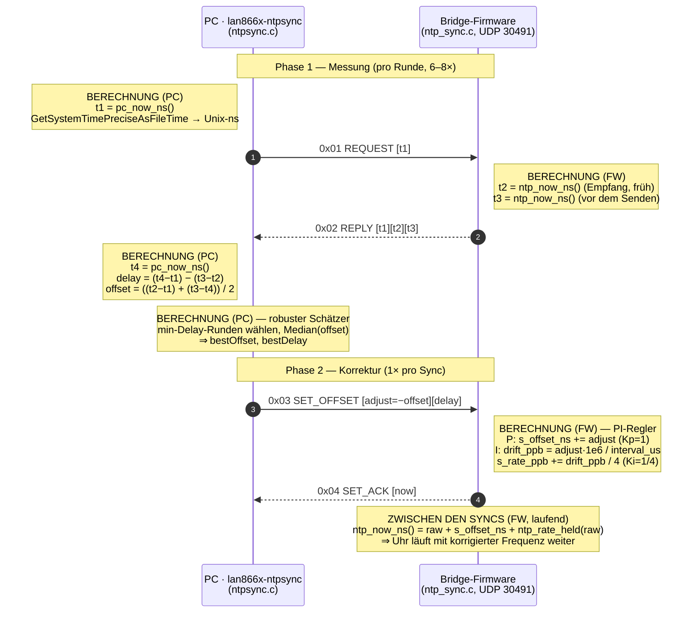

# NTP-Zeitsynchronisation der Bridge — aktuelle Funktionsweise

Dieses Dokument beschreibt, **wie die Zeit-Synchronisation zwischen der Bridge-Firmware
und dem PC aktuell tatsächlich funktioniert** — Wire-Protokoll, t1/t2/t3/t4-Rechnung,
PI-Frequenz-Disziplinierung und die ehrlichen Grenzen. Es bezieht sich direkt auf den
Quellcode in [../firmware/t1s_100baset_bridge/firmware/src/ntp_sync.c](../firmware/t1s_100baset_bridge/firmware/src/ntp_sync.c)
(Firmware) und [../ntpsync.c](../ntpsync.c) (PC-Tool `lan866x-ntpsync`).

Vertiefende Analyse und Diagramme: [NTP_SYNC.md](NTP_SYNC.md), [NTP_TIMING.md](NTP_TIMING.md),
[NTP_TWO_NODE_CONVERGENCE.md](NTP_TWO_NODE_CONVERGENCE.md). Die geplante Erweiterung auf
**mehrere Knoten** (Discovery, Konfiguration, 1:N-Sync, Pin-Toggle-Verifikation) ist als
Konzept in [NTP_MULTINODE_SZENARIO.md](NTP_MULTINODE_SZENARIO.md) beschrieben.

---

## Grundidee

Es ist **kein echtes NTP** (kein Stratum, keine RFC-5905-Pakete) — es ist ein
**eigenes, schlankes NTP-artiges Protokoll** über UDP **Port 30491**, big-endian,
signed 64-bit-Nanosekunden. Die Firmware ist der *Server/Follower*, der PC ist der
*Master*.

Die Firmware führt einen **frei laufenden, hochauflösenden Zähler**
([ntp_sync.c:101](../firmware/t1s_100baset_bridge/firmware/src/ntp_sync.c#L101)):

```
ntp_now_ns() = raw  +  s_offset_ns  +  ntp_rate_held(raw)
               │        │              └─ Frequenz-Korrektur (I-Anteil), zwischen Syncs aufakkumuliert
               │        └─ Phasen-Offset (vom PC gesetzt)
               └─ SYS_TIME-Hardwarezähler in ns (60 MHz, ~16 ns/Tick), monoton seit Boot
```

`raw` kommt aus `SYS_TIME_Counter64Get()`, overflow-sicher in ns umgerechnet
([ntp_sync.c:87](../firmware/t1s_100baset_bridge/firmware/src/ntp_sync.c#L87)).

---

## Das Wire-Protokoll (4 Opcodes)

| Op | Richtung | Inhalt | Zweck |
|---|---|---|---|
| `0x01 REQUEST` | PC→FW | `[op][t1]` | PC fragt: „wie spät ist es?" |
| `0x02 REPLY` | FW→PC | `[op][t1][t2][t3]` | FW antwortet mit Empfangs-/Sendestempel |
| `0x03 SET_OFFSET` | PC→FW | `[op][adjust][delay]` | PC zieht FW-Uhr auf PC-Zeit |
| `0x04 SET_ACK` | FW→PC | `[op][now]` | Quittung mit neuer FW-Zeit |

Dazu noch `0x05/0x06 TAP` für das eth0-Timestamp-Tap — eine separate Messfunktion,
**nicht** Teil der Synchronisation.

---

## Ablaufdiagramm

Das Sequenzdiagramm zeigt einen vollständigen Sync-Zyklus. Die `Note`-Blöcke markieren,
**wo welche Berechnung stattfindet** — blau auf der PC-Seite (`ntpsync.c`), grün auf der
Firmware-Seite (`ntp_sync.c`).



Kurz gefasst: **Der PC misst und entscheidet** (Offset, Delay, robuster Schätzer),
**die Firmware stempelt und reguliert** (t2/t3-Stempel, PI-Disziplinierung, freilaufende
Hochrechnung zwischen den Syncs).

---

## Der Ablauf — ein Sync-Zyklus

### 1. Messung (t1/t2/t3/t4-Austausch)

Wie bei NTP, in [ntpsync.c:74](../ntpsync.c#L74):

```
t1 = PC sendet REQUEST       ─────────►  t2 = FW empfängt   (Stempel so früh wie möglich, ntp_sync.c:305)
                                         t3 = FW sendet REPLY (ntp_sync.c:316)
t4 = PC empfängt REPLY       ◄─────────
```

Daraus rechnet der PC:

```
delay  = (t4 - t1) - (t3 - t2)     ← Round-Trip ohne FW-Bearbeitungszeit
offset = ((t2 - t1) + (t3 - t4))/2 ← FW-Uhr minus PC-Uhr, Annahme: Hin-/Rückweg symmetrisch
```

### 2. Robuster Schätzer

[ntpsync.c:93](../ntpsync.c#L93): Der PC macht **mehrere Runden** (8 bei `--once`,
6 kontinuierlich), nimmt nur die mit dem **kleinsten Delay** (= am wenigsten
gestört/symmetrisch) und davon den **Median-Offset**. Das mittelt Jitter raus, ohne
Ausreißern zu trauen — der Schlüssel gegen die Windows-Reply-Drops (Gotcha #4).

### 3. Korrektur (SET_OFFSET)

Der PC sendet `adjust = -offset`, damit `FW_now == PC_now` wird, plus das gemessene
`delay`.

---

## Der entscheidende Teil: PI-Frequenz-Disziplinierung (Maßnahme #1)

Ohne das hätte man nur einen **Sägezahn**: Die Phase springt bei jedem Sync auf 0,
driftet dann mit ~1850 ppm (offener DFLL) wieder weg.

Die Firmware verarbeitet `SET_OFFSET` deshalb als **PI-Regler**
([ntp_sync.c:319-342](../firmware/t1s_100baset_bridge/firmware/src/ntp_sync.c#L319)):

- **P-Anteil (Kp = 1):** `adjust` wird sofort voll auf `s_offset_ns` angewendet →
  Phase stimmt sofort.
- **I-Anteil (Ki = 1/4):** der Residual-`adjust` wird durch das Sync-Intervall geteilt →
  ergibt eine **Drift in ppb**, die in `s_rate_ppb` integriert wird:

  ```c
  drift_ppb   = (adjust * 1e6) / interval_us;   // ns/Intervall → ppb
  s_rate_ppb += drift_ppb / 4;                  // Ki = 1/4
  ```

- Zwischen den Syncs akkumuliert `ntp_rate_held()` diese gelernte Rate kontinuierlich
  ([ntp_sync.c:68](../firmware/t1s_100baset_bridge/firmware/src/ntp_sync.c#L68)) → die
  FW-Uhr **läuft mit der korrigierten Frequenz weiter**, statt zu driften.

Der riesige erste `adjust` (Phasensprung auf die PC-Epoche, > 100 ms) wird vom
Frequenz-Loop **ausgeschlossen** (`if (s_synced && ...)`), damit nur die kleinen
Residuen die Frequenz lernen. Deshalb braucht der Lock **≥ 2 Syncs**.

Effekt laut Analyse: Holdover von ~9,6 ms/s Drift → **~58 µs über 6 s**.

---

## Was man am Board / PC sieht

- **PC:** `lan866x-ntpsync --ip 192.168.0.181` (kontinuierlich, alle 250 ms) oder
  `--once` für einen einzelnen Sync.
- **Board-CLI:**
  - `ntp` — Snapshot: Quelle, Offset, Drift in ppm, synced-Zähler.
  - `ntp watch` — eine Zeile pro Sync mit `offset` / `mean` / `drift` / `delay`. Der
    `mean` der letzten 16 Werte konvergiert sichtbar gegen ~0, sobald der Loop lockt.

---

## Grenzen (ehrlich)

- **Genauigkeit ≈ Round-Trip-Jitter / 2**, hier ~hunderte µs — **nicht** die
  16-ns-Tick-Auflösung. Die `offset`-Formel setzt symmetrische Wege voraus;
  asymmetrischer Jitter geht 1:1 in den Fehler.
- Die Zeitstempel t2/t3 liegen im UDP-Task, nicht in der ISR/PHY → Software-Granularität.
- Sub-µs / echtes PTP (Hardware-Timestamping) lebt im Schwesterprojekt
  `net_10base_t1s`, **nicht** hier.
