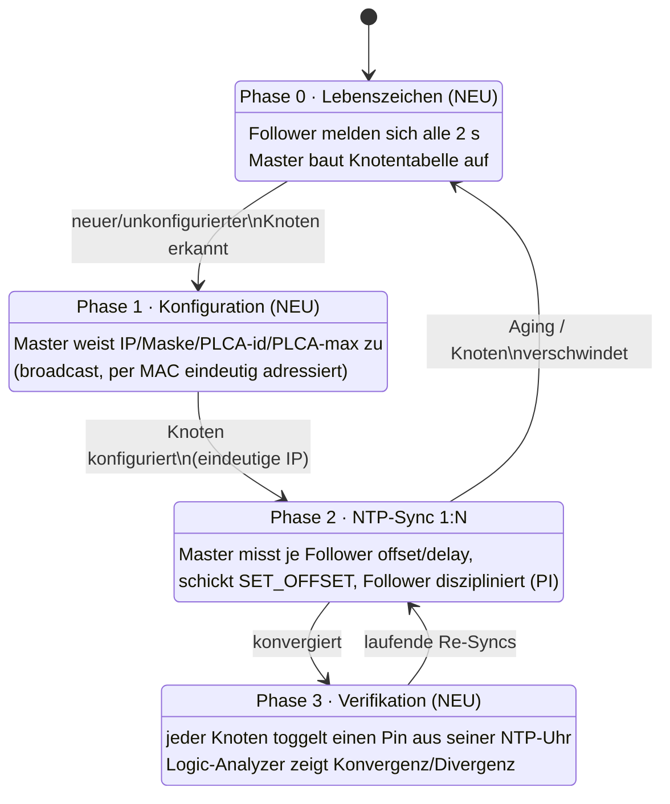
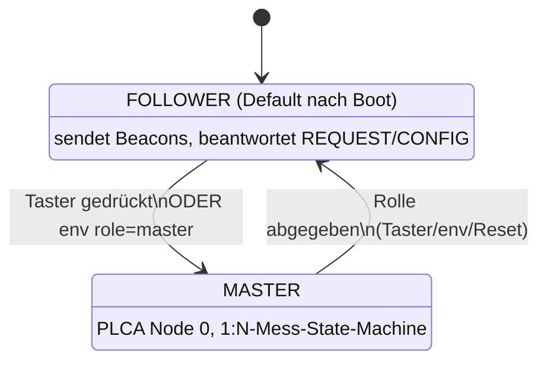
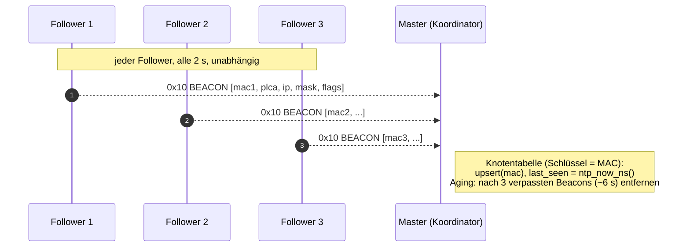
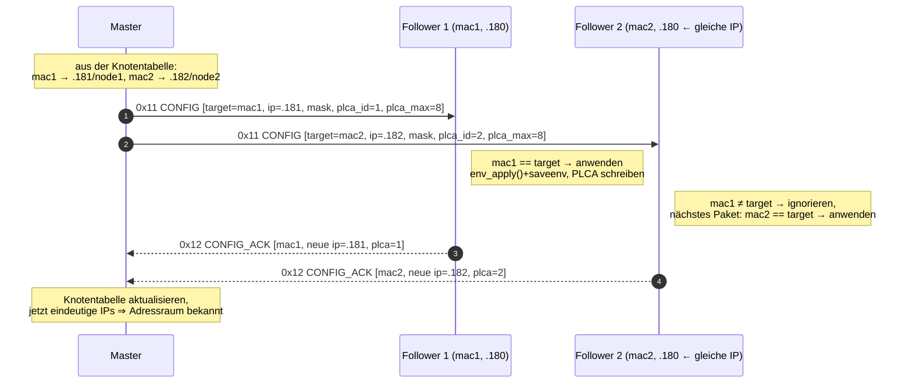
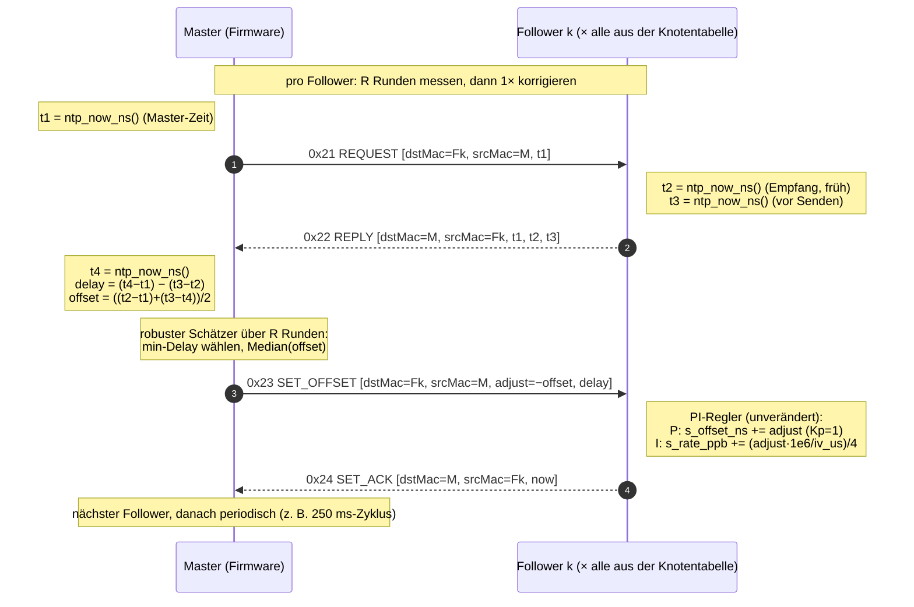

# Multi-Node-Zeitsync auf dem T1S-Bus — Szenario & Konzept

> **Status: Konzept / Design — noch nicht implementiert.** Dieses Dokument
> beschreibt das *geplante* Verfahren, mit dem ein **Koordinator (NTP-Master)** und
> mehrere **Follower** auf demselben 10BASE-T1S-Bus erst sich gegenseitig finden,
> dann konfiguriert werden und schließlich ihre Uhren synchronisieren — verifizierbar
> mit einem Logic-Analyzer. Es ist die Vorlage für die anschließende Implementierung.
> Abschnitte, die **neue** Bausteine beschreiben, sind mit **(NEU)** markiert;
> Abschnitte, die bestehenden Code wiederverwenden, verlinken auf die Quelle.

Es baut direkt auf der heutigen 1:1-Zeitsync auf — Wire-Protokoll, t1/t2/t3/t4-Rechnung
und PI-Frequenz-Disziplinierung sind in
[NTP_FUNKTIONSWEISE.md](NTP_FUNKTIONSWEISE.md) beschrieben und werden hier **nur
erweitert, nicht ersetzt**. Quellbezug:
[ntp_sync.c](../firmware/t1s_100baset_bridge/firmware/src/ntp_sync.c) (Firmware),
[ntpsync.c](../ntpsync.c) (heutiges PC-Tool),
[dncpdisc.c](../dncpdisc.c) (das Beacon/Registry-Vorbild) und
[env.h](../firmware/t1s_100baset_bridge/firmware/src/env.h) (die persistente Config).

---

## 1. Das Szenario

Auf **einem** T1S-Bus liegen mehrere **gleichartige** ATSAME54-Boards mit
**identischer Firmware** (dieselbe Familie wie die Bridge). Die Software ist
**symmetrisch**: jedes Board kann Master *oder* Follower sein — siehe
[§2 Symmetrisches Rollenmodell](#2-symmetrisches-rollenmodell--begriffe). Genau
**ein** Board ist zur Laufzeit der **Koordinator** — PLCA Node 0 *und* NTP-Master
(im aktuellen Aufbau die Bridge, mit dem Bus an `eth0`); alle übrigen sind
**Follower** (NTP-Follower, PLCA Nodes 1…N).

Die folgende Skizze zeigt **drei** Follower als Beispiel (an dem auch getestet
wird). In der Praxis sind so viele Follower möglich wie **Bus-Teilnehmer − 1**,
d. h. bis zu **PLCA-Node-Count − 1**.

```
                         PC / Labornetz (optional, 100BASE-T an eth1)
                                        │
                          ┌─────────────┴──────────────┐
                          │  Koordinator = NTP-Master   │  PLCA node 0
                          │  (Bridge, ATSAME54)         │  eth0  ◄── T1S
                          └─────────────┬──────────────┘
                                        │  10BASE-T1S (ein 2-Draht-Segment, PLCA)
        ┌───────────────────────────────┼───────────────────────────────┐
        │                               │                               │
 ┌──────┴───────┐               ┌───────┴──────┐               ┌────────┴─────┐
 │  Follower 1  │               │  Follower 2  │               │  Follower 3  │
 │  PLCA node 1 │               │  PLCA node 2 │               │  PLCA node 3 │
 │  NTP-Follower│               │  NTP-Follower│               │  NTP-Follower│
 └──────────────┘               └──────────────┘               └──────────────┘
        │                               │                               │
      [PIN]                           [PIN]                           [PIN]   ◄── Logic-Analyzer
```

> Die Boards sind **eigene Knoten mit dieser Firmware** (NTP-Uhr mit PI-Disziplin +
> Pin-Toggle), **nicht** die LAN866x-RCP-Endpoints — die sprechen SOME/IP und können
> keinen eigenen disziplinierten Zähler betreiben.

Der gesamte Ablauf zerfällt in vier Phasen, die der Master der Reihe nach (und
danach periodisch) durchläuft:



Kurz: **Der Master kennt seine Busteilnehmer, konfiguriert sie, hält ihre Uhren
nach** — und der Pin-Toggle macht den Sync-Zustand am Oszilloskop sichtbar.

---

## 2. Symmetrisches Rollenmodell & Begriffe

**Alle Boards tragen dieselbe Firmware.** Es gibt keinen „Master-Build" und keinen
„Follower-Build" — die Rolle wird **zur Laufzeit** bestimmt:

- **Start: alle sind Follower.** Nach dem Boot sendet jeder Knoten nur Beacons
  ([Phase 0](#3-phase-0--lebenszeichen--discovery-neu)) und beantwortet Sync-Pakete
  — niemand misst aktiv.
- **Master-Wahl per Trigger.** Genau ein Knoten wird zum Master, ausgelöst durch
  **(a)** einen **Taster** am Board (manueller Trigger) oder **(b)** die
  **`env`-Konfiguration** (ein gespeichertes „role = master"-Flag, das beim Boot
  greift). Der gewählte Knoten übernimmt PLCA Node 0 und beginnt die aktive
  1:N-Messung.
- **Symmetrie als Vorteil:** jedes Board kann im Feld die Master-Rolle übernehmen
  (Ausfall-/Umbau-Flexibilität); im Code ist es ein einziger Zustandsautomat mit
  einem `role`-Schalter, nicht zwei getrennte Programme.



> **Genau ein Master.** Das Verfahren setzt voraus, dass nicht zwei Knoten
> gleichzeitig Master werden. Absicherung über die Beacons: ein Knoten, der vor der
> eigenen Master-Übernahme bereits einen anderen Master in der
> [Knotentabelle](#3-phase-0--lebenszeichen--discovery-neu) sieht, tritt zurück
> (Details → [§12 Offene Punkte](#12-offene-punkte--zu-bestätigen)).

| Begriff | Bedeutung |
|---|---|
| **Koordinator** | PLCA Node 0, gibt den Bus-Takt vor (PLCA). Der zur Laufzeit gewählte Master. |
| **NTP-Master** | aktiver Teil: misst Offset/Delay je Follower und korrigiert sie. Dieselbe Logik wie heute im PC-Tool ([ntpsync.c](../ntpsync.c)), aber **in der Firmware** **(NEU)**. |
| **Follower** | passiver Teil (Default-Rolle): beantwortet REQUEST, wendet SET_OFFSET an, führt die PI-Disziplin ([ntp_sync.c](../firmware/t1s_100baset_bridge/firmware/src/ntp_sync.c)) und toggelt seinen Pin. |
| **Beacon** | periodisches Lebenszeichen eines Knotens (Identität + Rolle) **(NEU)**. |
| **Knotentabelle** | die Liste, die der Master aus den Beacons aufbaut (MAC → IP/Maske/PLCA-id, Rolle, last-seen) **(NEU)**. |

> **Zeitbasis.** Der Master definiert die gemeinsame Zeit und läuft **frei als
> Referenz** — die Follower richten sich nach *seiner* Uhr. **Sobald ein PC den
> Master adressiert** (`lan866x-ntpsync` über den bestehenden 1:1-Pfad gegen den
> Master), wird der **Master selbst auf PC-Unix-Zeit diszipliniert** — und gibt diese
> Zeit über Phase 2 an alle Follower weiter. Beides gleichzeitig: ohne PC ist der
> Master die autonome Referenz, mit PC zieht die ganze Buszeit auf die PC-Wallclock.

---

## 3. Phase 0 — Lebenszeichen / Discovery **(NEU)**

Jeder Follower sendet **alle 2 Sekunden** einen UDP-**Broadcast** auf den Bus mit
seiner vollständigen Identität. Das erfüllt zwei Zwecke gleichzeitig: es ist ein
**Lebenszeichen** (Aging) *und* es macht jeden Teilnehmer **eindeutig
identifizierbar** — Schlüssel ist die **MAC** (immer eindeutig), nicht die IP.

Das Vorbild ist der **DNCP-Announce** ([dncpdisc.c](../dncpdisc.c)), aber bewusst
schlanker und in dieses Protokoll integriert (gleicher UDP-Port wie der Sync, per
Opcode gemultiplext — wie heute schon TAP und SET_OFFSET über einen Socket laufen,
[ntp_sync.c:301](../firmware/t1s_100baset_bridge/firmware/src/ntp_sync.c#L301)).

**Beacon-Inhalt** (`0x10 BEACON`, Follower → Broadcast):

| Feld | Bytes | Zweck |
|---|---|---|
| `op` | 1 | `0x10` |
| `mac` | 6 | **eindeutiger Schlüssel** des Knotens |
| `plca_id` | 1 | aktuelle PLCA Node-ID |
| `ipv4` | 4 | aktuelle IP |
| `mask` | 4 | aktuelle Netzmaske |
| `flags` | 1 | Bit0 = konfiguriert, Bit1 = NTP-synced, **Bit2 = Master-Rolle** |
| `fw_id` | 2 | Firmware-Kennung (optional) |

Das **Master-Bit** macht die [Master-Wahl](#2-symmetrisches-rollenmodell--begriffe)
beobachtbar: sieht ein Knoten in einem fremden Beacon bereits ein gesetztes
Master-Bit, übernimmt er die Rolle **nicht** (Schutz gegen zwei Master).



Im Master entsteht so eine **Knotentabelle**, gekippt über die MAC:

```
mac                 plca  ipv4            mask            flags   last_seen
8C:71:..:01           1   192.168.0.180   255.255.255.0   cfg     +1.998 s
8C:71:..:02           2   192.168.0.180   255.255.255.0   ―       +0.122 s   ← gleiche IP wie oben!
8C:71:..:03           3   192.168.0.190   255.255.255.0   cfg,syn +0.640 s
```

> Die Tabelle zeigt schon den Kernpunkt: **zwei Follower dürfen dieselbe IP haben**
> (z. B. beide noch auf dem Default `192.168.0.180`) — über die MAC sind sie
> trotzdem eindeutig. Genau das löst Phase 1 auf.

---

## 4. Phase 1 — Konfiguration **(NEU)**

Der Master kann jetzt jeden Knoten **gezielt** konfigurieren. Das Paket geht als
**Broadcast** auf den Bus, trägt aber einen **Ziel-Selektor = MAC des Followers**.
Nur der Knoten, dessen MAC passt, wendet die Config an; alle anderen verwerfen sie.

**Warum Broadcast + MAC statt Unicast-an-IP?** Vor der Konfiguration können mehrere
Follower **dieselbe** Default-IP haben — ein Unicast an diese IP wäre mehrdeutig
(ARP würde mehrere Antworten sehen). Der Broadcast erreicht alle, der
MAC-Selektor adressiert **genau einen**. Das ist exakt der Vorteil, den auch DNCP
nutzt (Registry an `FF:FF:FF:FF:FF:FF`, [dncpdisc.c:159](../dncpdisc.c#L159)).

**Config-Inhalt** (`0x11 CONFIG`, Master → Broadcast, MAC-selektiert):

| Feld | Bytes | Zweck |
|---|---|---|
| `op` | 1 | `0x11` |
| `target_mac` | 6 | **Selektor**: nur dieser Knoten reagiert |
| `set_ipv4` | 4 | zugewiesene IP |
| `set_mask` | 4 | zugewiesene Netzmaske |
| `set_plca_id` | 1 | zugewiesene PLCA Node-ID |
| `set_plca_max` | 1 | zugewiesene PLCA Node-Count (Maximum) |
| `set_gw` | 4 | Gateway (optional, für „über die Bridge nach außen") |

Der Follower übernimmt die Werte in den TCP/IP-Stack und die LAN865x-PLCA — über
genau die **`env`-Wege, die gerade entstehen** ([env.h](../firmware/t1s_100baset_bridge/firmware/src/env.h):
`env_apply()`, `saveenv`) — und quittiert mit seiner **neuen** Identität. Eine vom
Master vergebene Config wird **automatisch in der Emulated EEPROM gespeichert**
(`saveenv` direkt im `0x11 CONFIG`-Handler), sodass der Knoten nach einem Reset/
Power-Cycle **mit der zugewiesenen Identität wieder hochkommt** — keine erneute
Konfiguration nötig.



**Adressraum-Entscheidung.** Sobald alle IPs eindeutig sind, **kennt der Master den
kompletten Adressraum** des Busses. Er kann entscheiden, welche Knoten *intern*
bleiben und welche über die Bridge nach außen (eth1 / PC-Netz) erreichbar sein
sollen — z. B. indem er Gateway/Maske passend vergibt oder den Knoten in einem
separaten Subnetz hält. (Die L2-Bridge selbst macht eth0/eth1 zu einem Segment;
die Steuerung erfolgt über die vergebenen IP/Maske/GW.)

---

## 5. Phase 2 — NTP-Sync 1:N

Jetzt die eigentliche Zeitsync — **dasselbe Verfahren wie heute**, nur dass der
**Master (Firmware) die aktive Rolle** übernimmt, die heute der PC spielt, und das
**für jeden Follower nacheinander**. Die t1/t2/t3/t4-Rechnung und die
PI-Disziplinierung sind **unverändert** (siehe
[NTP_FUNKTIONSWEISE.md](NTP_FUNKTIONSWEISE.md)).

Der Master schickt **REQUEST** an einen Follower, der Follower antwortet mit
**REPLY** (mit seinen Empfangs-/Sendestempeln t2/t3), der Master berechnet
**offset** und **delay** und schickt **SET_OFFSET** zurück; der Follower wendet die
PI-Korrektur an und quittiert mit **SET_ACK**.



**Master als nicht-blockierende Zustandsmaschine.** Der Master darf den
Single-Thread-Superloop nicht anhalten (sonst stoppt die Bridge). Statt R Runden ×
N Follower blockierend abzuarbeiten, läuft die Messung als kleine State-Machine,
die aus `APP_Tasks` getaktet wird:

```
für den aktuellen Follower:
  IDLE → SEND_REQ → WAIT_REPLY (Timeout) → akkumuliere (off,del)
       → nach R Runden: rechne robusten Offset, SEND_SET → WAIT_ACK
       → nächster Follower (round-robin)
```

So bleibt jeder Durchlauf kurz; `plat_sleep_ms()` pumpt ohnehin Stack + Konsole
([ntp_sync.c:267](../firmware/t1s_100baset_bridge/firmware/src/ntp_sync.c#L267)).
Der **robuste Schätzer** (Median des Offsets über die Runden mit kleinstem Delay)
wird 1:1 aus [ntpsync.c:93](../ntpsync.c#L93) in die Firmware übernommen.

---

## 6. MAC-Erweiterung der Pakete

Damit die Adressierung auf dem **geteilten Bus** vollständig und eindeutig ist,
bekommt **jedes** Sync-Paket einen kleinen Kopf mit **Ziel- und Quell-MAC**:

```
 ┌────┬─────────────┬─────────────┬───────────── payload ──────────────┐
 │ op │ dstMac (6)  │ srcMac (6)  │ … (t1 / t1t2t3 / adjust,delay / now)│
 └────┴─────────────┴─────────────┴────────────────────────────────────┘
   1B       6B            6B
```

- **`dstMac`** = der angesprochene Knoten. Bei Broadcast verwirft jeder andere
  Knoten das Paket sofort. Damit funktioniert die Sync **auch dann eindeutig, wenn
  zwei Knoten (noch) dieselbe IP haben**.
- **`srcMac`** = der Absender. Der Master ordnet eine REPLY so dem **richtigen
  Follower** zu, selbst bei IP-Kollision, und kann pro MAC einen eigenen
  offset/delay/PI-Zustand führen.

Konsolidierte **Opcode-Übersicht** (Bestand + NEU):

| Op | Richtung | Inhalt | Phase |
|---|---|---|---|
| `0x01 REQUEST` *(legacy)* | PC→FW | `[t1]` | bestehender PC-Pfad, ohne MAC |
| `0x02 REPLY` *(legacy)* | FW→PC | `[t1][t2][t3]` | bestehender PC-Pfad |
| `0x03 SET_OFFSET` *(legacy)* | PC→FW | `[adjust][delay]` | bestehender PC-Pfad |
| `0x04 SET_ACK` *(legacy)* | FW→PC | `[now]` | bestehender PC-Pfad |
| `0x05/0x06 TAP` | PC↔FW | eth0-Timestamp-Tap | bestehend, separat |
| `0x10 BEACON` **(NEU)** | Follower→bcast | `[mac][plca][ip][mask][flags]` | 0 |
| `0x11 CONFIG` **(NEU)** | Master→bcast | `[target_mac][ip][mask][plca_id][plca_max][gw]` | 1 |
| `0x12 CONFIG_ACK` **(NEU)** | Follower→Master | `[mac][ip][plca]` | 1 |
| `0x21 REQUEST` **(NEU, MAC)** | Master→Follower | `[dstMac][srcMac][t1]` | 2 |
| `0x22 REPLY` **(NEU, MAC)** | Follower→Master | `[dstMac][srcMac][t1][t2][t3]` | 2 |
| `0x23 SET_OFFSET` **(NEU, MAC)** | Master→Follower | `[dstMac][srcMac][adjust][delay]` | 2 |
| `0x24 SET_ACK` **(NEU, MAC)** | Follower→Master | `[dstMac][srcMac][now]` | 2 |

> **Designentscheidung (offen):** Die MAC-Varianten als **neue Opcodes** (`0x21…`)
> zu führen, lässt die heutigen `0x01…04` für den PC-Pfad **unverändert** — der
> bestehende `lan866x-ntpsync` läuft weiter. Alternative: ein Flag-Bit + gemeinsamer
> Header für alle. Siehe [§12 Offene Punkte](#12-offene-punkte--zu-bestätigen).

Alles bleibt **big-endian, signed 64-bit-ns** wie heute
([ntp_sync.c:107](../firmware/t1s_100baset_bridge/firmware/src/ntp_sync.c#L107)).

---

## 7. Phase 3 — Verifikation per Pin-Toggle **(NEU)**

Jeder Knoten besitzt seinen **eigenen Hardware-Timer** — die lokale NTP-Uhr
(`SYS_TIME`-basiert, [ntp_sync.c](../firmware/t1s_100baset_bridge/firmware/src/ntp_sync.c)).
Aus **genau dieser Uhr** leitet jeder Knoten seinen Toggler ab — **kein separater
Software-/SysTick-Timer**. Default: **ein Toggle alle 100 ms** → der Pegel wechselt
alle 100 ms, also ein **200-ms-Rechteck** (50 % Tastverhältnis); das Intervall ist
**konfigurierbar**.

**Der Kern der Idee:** Nach dem Boot **läuft die NTP-Uhr auf jedem Board frei**. Die
daraus abgeleiteten Toggler haben deshalb zunächst **unterschiedliche Phase** (jedes
Board bootet zu einem anderen Zeitpunkt) und — wegen Oszillatortoleranz — leicht
**unterschiedliche Frequenz**: die Kanten liegen **nicht** übereinander. Die
[Phase-2-Sync](#5-phase-2--ntp-sync-1n) diszipliniert **genau diese Uhr** (Phasen-
Offset + PI-Frequenz, wie in `ntp_now_ns()`). Weil der Toggler **aus der Uhr
abgeleitet** ist, **synchronisieren sich die Toggler von selbst mit**, sobald die
Uhren gleich gehen — man synchronisiert die **Uhr**, nicht den Toggler; der Toggler
folgt.

```c
/* Pseudocode, in jedem Knoten aus dem Superloop aufgerufen.
 * ntp_now_ns() = die lokale Hardware-Uhr (frei laufend, durch den Sync diszipliniert). */
uint64_t slot = ntp_now_ns() / TOGGLE_PERIOD_NS;   /* TOGGLE_PERIOD_NS z. B. 100e6 */
if (slot != last_slot) { last_slot = slot; pin_toggle(); }
```

Weil die Toggler aus der nun **gleichgehenden** Uhr abgeleitet sind, fallen die
Kanten **zusammen, sobald synchronisiert** — und **driften wieder auseinander**,
sobald der Sync ausbleibt (die Uhren laufen dann erneut frei). Genau das macht der
Logic-Analyzer sichtbar:

```
synchronisiert (Kanten übereinander):
 M  ┐_______┌───────┐_______┌───────┐_______
 F1 ┐_______┌───────┐_______┌───────┐_______
 F2 ┐_______┌───────┐_______┌───────┐_______
 F3 ┐_______┌───────┐_______┌───────┐_______
    └ alle Flanken bei t = k·100 ms (NTP)

Sync fehlt → Divergenz (freilaufende Oszillatoren, ~1850 ppm):
 M  ┐_______┌───────┐_______┌───────┐____
 F1 ┐_______┌───────┐______┌────────┐___      ← läuft vor
 F2 ┐_______┌────────┐_______┌───────┐__       ← läuft nach
 F3 ┐________┌───────┐_______┌──────┐___
    └ Flanken laufen mit der Zeit auseinander
```

**Größenordnung.** Der undisziplinierte DFLL driftet hier ~**1850 ppm** (≈
1,85 ms pro Sekunde, siehe Memory-Notiz zum SAME54-Timebase). Ohne Sync wandert die
Flanke also ~1,85 ms/s — am Logic-Analyzer (µs-Auflösung) sofort sichtbar.
**Mit** PI-Frequenz-Disziplin bleibt der Holdover dagegen klein: nach 6 s ohne Sync
nur ~**58 µs** statt ~11 ms (verifizierte Größenordnung,
[NTP_FUNKTIONSWEISE.md](NTP_FUNKTIONSWEISE.md#der-entscheidende-teil-pi-frequenz-disziplinierung-maßnahme-1)).
Der Logic-Analyzer zeigt damit zweierlei:

1. **Konvergenz** — nach Sync-Start wandern die Flanken zusammen.
2. **Holdover/Divergenz** — schaltet man den Master-Sync ab, sieht man, wie langsam
   (mit Frequenzlock) bzw. schnell (ohne) die Flanken wieder auseinanderlaufen.

**Konfigurierbarkeit.** Über die CLI (Vorschlag): `synctoggle <pin> <period_ms> [on|off]`
— Periode, Pin und An/Aus pro Board. Default 100 ms.

---

## 8. Was man sieht / Steuerung (Vorschlag)

| Wo | Kommando | Zeigt |
|---|---|---|
| jedes Board | `role [master\|follower]` *(oder Taster)* | Rolle zur Laufzeit setzen; ohne Arg = aktuelle Rolle. Master-Wahl auch per `env` beim Boot. |
| Master-CLI | `nodes` | Knotentabelle (MAC, PLCA, IP/Maske, Rolle, flags, last-seen) |
| Master-CLI | `nodecfg <mac> <ip> <mask> <plca_id> <plca_max>` | sendet `0x11 CONFIG` an einen Knoten (auto-`saveenv` dort) |
| Master-CLI | `syncmaster [on\|off] [interval_ms]` | startet/stoppt die 1:N-Sync-State-Machine |
| jedes Board | `ntp` / `ntp watch` | bestehender Status/Live-Trace ([ntp_sync.c:273](../firmware/t1s_100baset_bridge/firmware/src/ntp_sync.c#L273)) |
| jedes Board | `synctoggle <pin> <period_ms> [on\|off]` | Pin-Toggle aus der NTP-Uhr (Phase 3) |
| PC (optional) | `lan866x-ntpsync` gegen eth1 | diszipliniert den **Master** auf PC-Zeit (Betriebsart a) |

---

## 9. Besser synchronisieren — die Hebel

Dieser Aufbau ist **genau der Bestfall**, den die Theorie-Notiz beschreibt
([NTP_TWO_NODE_CONVERGENCE.md §9](NTP_TWO_NODE_CONVERGENCE.md#9-bester-fall-nur-embedded-knoten-masterslave-auf-einem-strang)):
**gleichartige Embedded-Knoten auf einem Strang, ein Master, beide Enden stempeln
leitungsnah**. Deshalb ist hier deutlich mehr drin als im PC↔Bridge-Fall —
realistisch **~10 µs**, mit Broadcast-One-Way **einstellige µs** zueinander. Die volle
Herleitung steht in der Theorie-Notiz; hier die Hebel, **auf dieses N-Knoten-Szenario
angewandt** (Reihenfolge = Wirkung):

**1. Frequenz-Disziplinierung (PI) — größter Hebel, schon vorhanden.** Jeder Follower
fährt den PI-Regler bereits ([ntp_sync.c](../firmware/t1s_100baset_bridge/firmware/src/ntp_sync.c)).
Ohne ihn erzeugt die ~1850-ppm-DFLL-Drift den Sägezahn (die Divergenz in §7); mit ihm
liegt der Holdover bei ~58 µs über 6 s. Wird **unverändert** übernommen — der Toggler
(§7) profitiert direkt.

**2. Min-Delay-Filter + robuster Schätzer (im Master).** Der Master misst je Follower
**R Runden** und nimmt den **Median-Offset der δ-kleinsten** Runden (Portierung aus
[ntpsync.c:93](../ntpsync.c#L93)). Auf PLCA ist die δ-kleinste Runde die mit der
geringsten Contention → am symmetrischsten. Filtert PLCA-/SPI-Ausreißer.

**3. Der Bias hebt sich slave↔slave auf — genau das, was der Pin-Toggle braucht.**
Jeder Follower trägt **denselben** Master-Pfad-Asymmetrie-Bias `b`. Slave↔Master ist
`b + Rauschen` (~10–50 µs) — **aber slave↔slave** (zwei Follower *zueinander*) ist die
Differenz, `b` **fällt heraus**, übrig bleibt nur der mittelbare Zufalls-Rest. Weil der
Pin-Toggle „alle Knoten flanken **gleichzeitig**" ist (eine slave↔slave-Relation),
**liegen die Flanken enger zusammen** als die slave↔master-Zahl vermuten lässt →
einstellige µs.

**4. Broadcast-One-Way — Skalierung *und* Genauigkeits-Sprung.** Statt N einzelner
Round-Trips ([§5](#5-phase-2--ntp-sync-1n)) sendet der Master — als **PLCA Node 0
direkt am Beacon** — **einen** Broadcast-Sync, stempelt seinen TX, und ein Follow-up
trägt diesen TX-Stempel; jeder Follower stempelt seinen RX und rechnet
`Offset = (Master_TX + t_Kabel) − Slave_RX`. `t_Kabel` ist auf wenigen Metern T1S ~ns
und für alle gleich → die **Asymmetrie ist praktisch raus**, der Master-Verkehr ist
**O(1) unabhängig von der Follower-Zahl** (skaliert bis PLCA-max − 1), slave↔slave
**potenziell < 10 µs**. Der Round-Trip aus §5 ist der einfache erste Schritt;
Broadcast-One-Way ist die Optimierung (hängt an der Broadcast-/Port-Entscheidung,
[§12](#12-offene-punkte--zu-bestätigen)).

**5. Taktquelle — der Hardware-Hebel.** `SYS_TIME` hängt am internen **DFLL48M im
Open-Loop** (~1850 ppm). Ein **Quarz/TCXO/MEMS** senkt zwar nicht den µs-Boden (den
setzt der SPI-Stempel-Jitter), verbessert aber **Holdover & Vorhersagbarkeit** massiv
→ man kann **seltener** syncen und die Flanken halten länger ohne Sync (Theorie §3.2).

**6. Λ-Gütemaß pro Knoten.** Jeder Knoten kann seine eigene Sync-Güte berechnen und
melden (Erweiterung von `ntp`):

```
Λ ≈ δ_min/2  +  σ_θ/√N  +  |Δf|·t_seit_sync
    └ Transit  └ Zufall   └ Holdover-Drift
```

So weiß das System zur Laufzeit, **wie sehr** es der gemeinsamen Zeit trauen darf; bei
wachsendem δ-Spread weitet ein Knoten die Schranke oder geht in **Holdover**.

> **PLCA-Caveat (kein TDMA).** PLCA-Transmit-Opportunities sind **variabel** → die
> Asymmetrie ist nicht konstant. Min-Delay-Filter und Broadcast-One-Way fangen das
> weitgehend ab; die *saubere* Lösung wäre, **am Beacon / Wire-TX zu stempeln**
> (PTP-over-PLCA, Hardware) — jenseits von reinem Software-Stempeln. Den Sync-Strang
> gering belastet halten. Details:
> [NTP_TWO_NODE_CONVERGENCE.md §5.1](NTP_TWO_NODE_CONVERGENCE.md#51-plca-ist-kein-tdma--variable-transmit-opportunities).

---

## 10. Was damit möglich ist

Mit der erreichten Zeitbasis über alle N Knoten (σ_t ~ **10 µs** solide Software,
~**1 µs** mit Broadcast-One-Way) wird mehr als nur der Sichtbarkeits-Beweis (§7)
möglich. Die nutzbare Grenze hängt direkt an σ_t (Phasenfehler `Δφ = 2π·f·σ_t`,
Ortsauflösung `Δd = v·σ_t`):

| σ_t | Phase @ 50 Hz | f für ~1° Phase | TDOA Schall (343 m/s) | typische Nutzung |
|---|---|---|---|---|
| **10 µs** (Software) | 0,18° | ~280 Hz | 3,4 mm | Netz-/Leistungsanalyse, Vibration/Modal bis ~1–2 kHz, Akustik-Ortung |
| **1 µs** (Broadcast-One-Way) | 0,018° | ~2,8 kHz | 0,34 mm | volle Oberschwingungsanalyse, Vib./Audio bis ~10–20 kHz |
| **100 ns** (HW/PTP, Vergleich) | 0,0018° | ~28 kHz | 0,034 mm | HF-phasenkohärent, Beamforming |

**Möglich (im µs- bis 10er-µs-Regime):**
- **Koordinierte Aktionen / synchrone Trigger** mehrerer Knoten — der Pin-Toggle (§7)
  ist der einfachste Fall; ebenso gemeinsam getriggerte GPIO-/Sensor-Sampling-Zeitpunkte.
- **Verteilte kohärente ADC-Abtastung:** verteilte Leistungs-/Netzanalyse
  (Wirk-/Blindleistung, Oberschwingungen, synchrophasor-artig am Fundamental),
  phasenkohärente Vibrations-/Modalanalyse, akustisches Beamforming, Seismik-Arrays.
- **Laufzeit-Ortung (TDOA)** in *langsamen* Medien: Schall/Körperschall → **mm-Klasse**.
- **Ereignis-Korrelation** über Knoten hinweg auf einer gemeinsamen Zeitachse
  (Logs/Captures verschmelzen, kausale Reihenfolge) + **selbst-attestierte Güte** (Λ).

**Nicht möglich (ohne Hardware-Zeitstempelung):** harte **sub-µs**-Trigger;
**EM-Laufzeit-Ortung** (Kabelfehler, braucht ns); **HF-phasenkohärent** (> ~20 kHz);
**UTC-/absolut-rückführbare** Zeit ohne externe Referenz. Dafür → PTP/802.1AS im
Schwesterprojekt `net_10base_t1s`. Volle Betrachtung (Grenzfrequenzen, TDOA-Medien,
Anwendungsliste): [NTP_TWO_NODE_CONVERGENCE.md §10](NTP_TWO_NODE_CONVERGENCE.md#10-anwendung-verteilte-synchrone-abtastung--welche-grenzfrequenz).

---

## 11. Grenzen (ehrlich)

- **Genauigkeit ≈ Round-Trip-Jitter / 2** — wie heute (~hunderte µs), **nicht** die
  16-ns-Tickauflösung. Die Offset-Formel setzt symmetrische Hin-/Rückwege voraus;
  asymmetrischer Jitter geht 1:1 in den Fehler. Der T1S-Bus (PLCA, ~2 ms RTT) ist
  zwar gleichmäßiger als die 100BASE-T-Strecke, aber die Stempel t2/t3 liegen
  weiterhin im **UDP-Task, nicht in der ISR/PHY** → Software-Granularität.
- **Sub-µs / echtes PTP** (Hardware-Timestamping) lebt im Schwesterprojekt
  `net_10base_t1s`, **nicht** hier. Der Pin-Toggle macht die Software-Sync sichtbar,
  ersetzt aber kein PTP.
- **Broadcast-Last auf dem Bus:** Beacons (alle 2 s × N) und MAC-adressierte
  Broadcasts kosten PLCA-Slots. Bei vielen Knoten Beacon-Intervall/Adressierung
  überdenken (Unicast nach erfolgter Config).
- **Single-Thread-Superloop:** Master-State-Machine und Beacon/Config müssen kurz
  bleiben und dürfen `rcp_*`/Stack nicht re-entrant aufrufen (Repo-Gotcha #3).
- **PLCA-Selbstkonfiguration:** Vergibt der Master PLCA-Node-IDs per Config, muss er
  Kollisionen vermeiden (zwei Knoten mit derselben ID stören den Bus). Die
  Knotentabelle ist die Quelle der Wahrheit dafür.

---

## 12. Offene Punkte / zu bestätigen

**Bereits festgelegt** (in dieses Dokument eingearbeitet): eigene Boards mit
identischer, **symmetrischer** Firmware; alle starten als Follower, Master-Wahl per
**Taster oder `env`**; bis zu **(PLCA-Node-Count − 1)** Follower; Master **frei
laufend als Referenz**, *und* per PC diszipliniert, **sobald** ein PC ihn adressiert;
vom Master vergebene Config wird **automatisch** per `saveenv` persistiert; Pin-Toggle
**alle 100 ms** (200-ms-Rechteck); Aging nach **3 verpassten Beacons** (~6 s).

**Noch zu entscheiden:**

1. **Opcode-Schema:** neue MAC-Opcodes `0x21…` (PC-Pfad bleibt unverändert) vs.
   gemeinsamer Header mit Flag-Bit ([§6](#6-mac-erweiterung-der-pakete)).
   *Empfehlung:* neue Opcodes — hält den bestehenden `lan866x-ntpsync` unangetastet.
2. **UDP-Port:** alles über den bestehenden **30491** multiplexen (*empfohlen*, der
   Socket demuxt heute schon per Opcode) oder ein separater Bus-Discovery-Port
   (wie DNCP 65526/65527)?
3. **Master-Wahl — Tie-Break:** Was, wenn *zwei* Knoten quasi gleichzeitig den Taster
   drücken (beide sehen noch kein fremdes Master-Bit)? *Vorschlag:* niedrigste MAC
   gewinnt — der unterlegene tritt zurück, sobald er das fremde Master-Beacon sieht.
   Zu bestätigen.
4. **Master-Übergabe:** soll ein Rollenwechsel im Betrieb (Taster am Follower)
   unterstützt werden, und wie reagieren die anderen (alten Master automatisch
   degradieren)? Oder Master nur per Reset/`env` festlegen?
5. **Default-Toggle-Pin** je Board (ein freier, am Logic-Analyzer gut erreichbarer
   GPIO) — konkret festlegen.

> Sobald diese Punkte entschieden sind, ist dieses Dokument die
> Implementierungsvorlage: Phase 0/1 als neuer Discovery/Config-Block (Vorbild
> `dncpdisc.c` + `env`), Phase 2 als Master-State-Machine über das bestehende
> NTP-Protokoll, Phase 3 als kleiner NTP-getakteter GPIO-Toggle — alles in **einer**
> symmetrischen Firmware mit Laufzeit-Rollenschalter.
