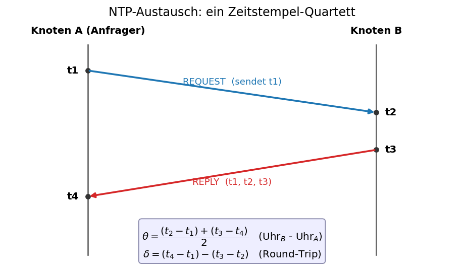
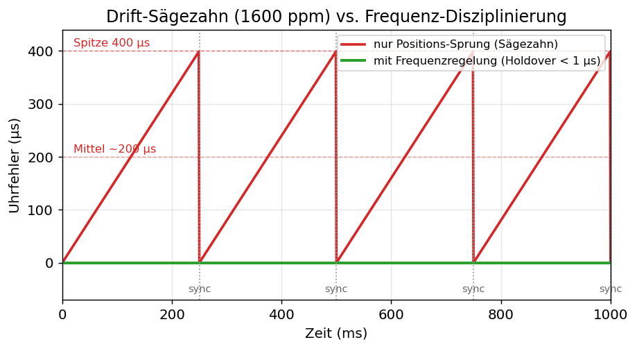
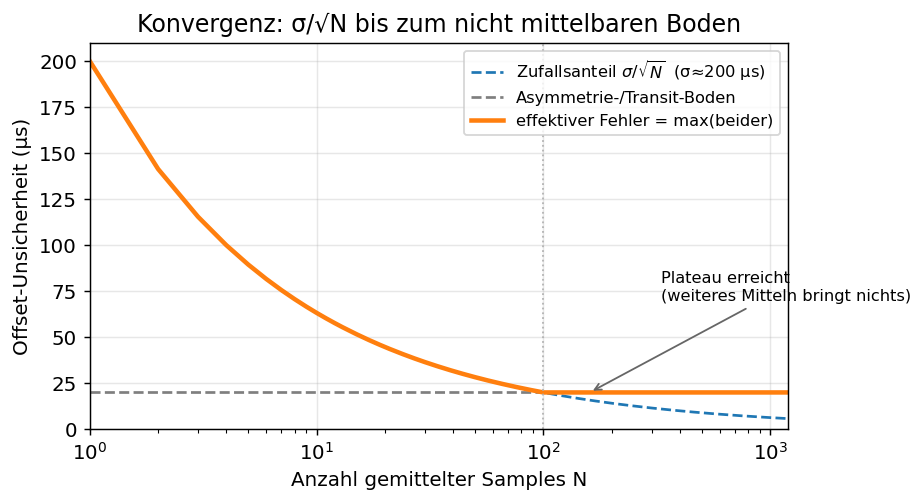
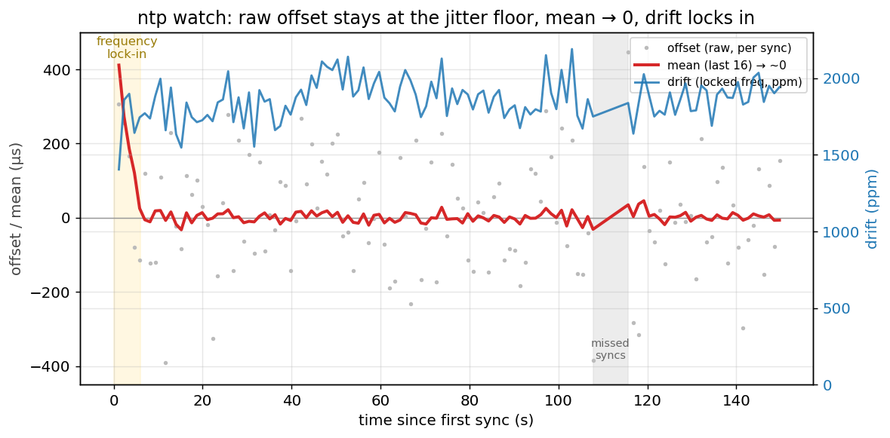
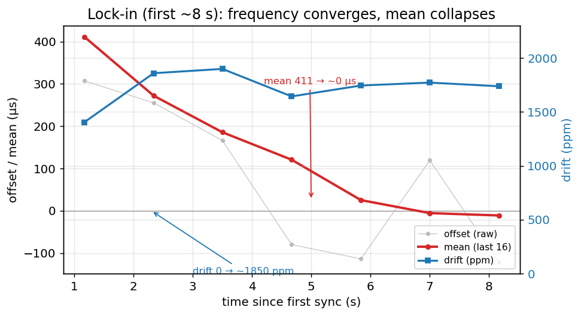
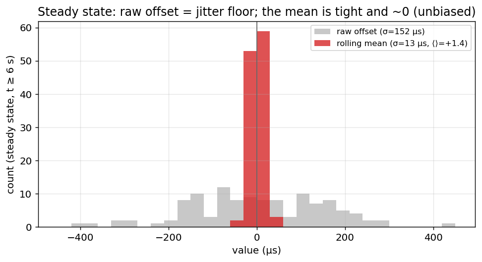

# Software NTP time sync on the T1S bridge — implementation, operation & convergence

This document is the practical reference for the **software NTP time
synchronisation** between the PC and the bridge firmware: **what is implemented, how
it works, and how the convergence is achieved** — illustrated with a **real
`ntp watch` run**.

It pulls the conceptual model and diagrams from the theory note
[NTP_TWO_NODE_CONVERGENCE.md](NTP_TWO_NODE_CONVERGENCE.md) and complements the
usage/bridge-delay write-up in [NTP_TIMING.md](NTP_TIMING.md).

- Firmware (follower): `firmware/t1s_100baset_bridge/firmware/src/ntp_sync.c`
- PC (master): `ntpsync.c` → `lan866x-ntpsync`

## Contents

- [1. What is implemented](#1-what-is-implemented)
- [2. How it works](#2-how-it-works)
  - [2.1 The free-running counter](#21-the-free-running-counter)
  - [2.2 The exchange (t1/t2/t3/t4)](#22-the-exchange-t1t2t3t4)
  - [2.3 The offset is only as good as the path symmetry](#23-the-offset-is-only-as-good-as-the-path-symmetry)
  - [2.4 Why a one-shot sync drifts away](#24-why-a-one-shot-sync-drifts-away)
- [3. How convergence is done — the PI discipline](#3-how-convergence-is-done--the-pi-discipline)
- [4. Convergence in practice — a real `ntp watch` run](#4-convergence-in-practice--a-real-ntp-watch-run)
  - [4.1 The three columns](#41-the-three-columns)
  - [4.2 The whole run](#42-the-whole-run)
  - [4.3 The lock-in (first ~8 s)](#43-the-lock-in-first-8-s)
  - [4.4 Steady state: jitter floor vs the mean](#44-steady-state-jitter-floor-vs-the-mean)
  - [4.5 Why `drift` wanders — and the Ki trade-off](#45-why-drift-wanders--and-the-ki-trade-off)
  - [4.6 Holdover: missed syncs stay sub-millisecond](#46-holdover-missed-syncs-stay-sub-millisecond)
- [5. Accuracy, limits & what's next](#5-accuracy-limits--whats-next)

---

## 1. What is implemented

**Firmware follower** (`ntp_sync.c`):
- A free-running high-resolution **NTP counter** (`SYS_TIME` ns + signed offset).
- A **UDP service on port 30491** (not pinned to an interface) speaking a 4-timestamp
  exchange + a `SET_OFFSET` discipline message; big-endian signed-64-bit ns.
- A **PI frequency discipline** that turns the stream of corrections into a phase
  *and* a frequency term, cancelling the oscillator drift (the core of this doc).
- The on-board CLI: **`ntp`** (status snapshot) and **`ntp watch`** (live per-sync
  output with convergence columns).
- An eth0 timestamp **tap** used by the bridge-delay measurement (see
  [NTP_TIMING.md](NTP_TIMING.md)).

**PC master** (`lan866x-ntpsync`):
- Runs the t1/t2/t3/t4 rounds, takes the **median offset of the lowest-delay rounds**
  (robust min-delay filter), raises the Windows timer resolution to **1 ms**, and
  sends `SET_OFFSET`. Continuous (every 250 ms) by default; `--once` for a single sync.

**Headline results** (measured on the SAME54 bridge):

| Quantity | Value |
|---|---|
| Counter resolution | ~16 ns (SYS_TIME @ 60 MHz) |
| Free-running oscillator drift | ~**1850 ppm** (frequency-locked & tracked) |
| Per-sync offset jitter (steady state) | σ ≈ **150 µs** (the floor) |
| Rolling-mean offset (steady state) | **+1.4 µs**, σ ≈ **13 µs** (converged & unbiased) |
| **Holdover** after 6 s without sync | **~58 µs** (vs ~9.6 ms un-disciplined) |

---

## 2. How it works

### 2.1 The free-running counter

The follower keeps a 64-bit counter in nanoseconds:

```
ntp_now_ns() = raw + offset + rate·(raw − last_sync)
raw          = SYS_TIME counter → ns (overflow-safe: sec·1e9 + frac·1e9/freq)
```

`raw` starts at 0 at boot. `offset` (phase) and `rate` (frequency correction,
`s_rate_ppb`) are what the discipline sets — see §3.

### 2.2 The exchange (t1/t2/t3/t4)



```
offset  θ = ((t2 − t1) + (t3 − t4)) / 2      # follower clock − PC clock
delay   δ = (t4 − t1) − (t3 − t2)            # round-trip transit
```

The PC keeps the lowest-`δ` rounds, then sends `SET_OFFSET` with `adjust = −θ` so the
follower moves toward PC time, plus the measured `δ`.

### 2.3 The offset is only as good as the path symmetry

θ is exact **only if the forward and reverse paths are equal**. Otherwise
`θ_measured = θ_true + (d→ − d←)/2`. The error splits into three classes — and only
one averages away:

| Error class | Cause | Under averaging of N samples |
|---|---|---|
| **Random** (white phase noise) | software timestamp jitter, scheduling | falls as **1/√N** |
| **Drift** (frequency) | oscillator runs fast/slow, temperature | does **not** average — must be *modelled* (§3) |
| **Systematic** (asymmetry bias) | constant unequal fwd/rev processing | does **not** average — stays as a floor |

### 2.4 Why a one-shot sync drifts away

The oscillator drifts ~1850 ppm → in one 250 ms sync interval the clock slips
`1850 ppm × 250 ms ≈ 460 µs`. Correcting only the **phase** each sync leaves a
**sawtooth**; averaging cannot remove it because the clock keeps drifting *between*
samples.



The fix is to also learn and apply a **frequency** correction — then the line between
syncs is flat instead of a ramp.

---

## 3. How convergence is done — the PI discipline

The follower does **not** just step the phase. On every `SET_OFFSET` it runs a small
**PI loop** on the correction stream (`adjust = −measured offset`):

```c
// consolidate the rate accrued since the last sync into the phase (stay continuous)
s_offset_ns += rate_held(raw);
s_lastInterval = raw - s_lastSyncRaw;  s_lastSyncRaw = raw;

// I term: integrate the residual (as ppb) into the frequency correction
if (synced && interval > 0) {
    int64_t drift_ppb = (adjust * 1e6) / (interval_us);   // ns/interval → ppb
    s_rate_ppb += drift_ppb / NTP_KI_DEN;                 // Ki = 1/4
}
// P term: correct the phase now (full step)
s_offset_ns += adjust;
```

and `ntp_now_ns()` accrues `rate·(raw − last_sync)` between syncs. Key points:

- **Phase (P)** aligns the clock immediately each sync (as before).
- **Frequency (I)** learns the oscillator drift from the *stream* of corrections and
  keeps compensating it between syncs. The huge first-sync correction is skipped (the
  loop only starts integrating once `synced`), so only the small per-interval residual
  feeds the frequency term.
- The **wire protocol is unchanged** — the PC still only sends `adjust`. All the
  "compute the frequency compensation and apply it" happens in the firmware, fed by the
  PC's sync packets.
- It is **adaptive**, not a one-time calibration: it follows a slowly changing drift
  (e.g. temperature) as long as syncs keep arriving.

The **random** part of the residual still falls as `σ/√N`, but only down to the
asymmetry/transit floor — the convergence plateaus there (theory:
[NTP_TWO_NODE_CONVERGENCE.md](NTP_TWO_NODE_CONVERGENCE.md)):



---

## 4. Convergence in practice — a real `ntp watch` run

The following is a real, ~2.5-minute `ntp watch` capture taken **from a fresh boot**
while `lan866x-ntpsync` ran continuously. (Diagrams generated from the raw trace by
[`ntp_trace_plot.py`](ntp_trace_plot.py).)

### 4.1 The three columns

`ntp watch` prints three quantities per line, chosen so the convergence is visible
even though the raw measurement never gets quieter:

- **`offset`** — this sync's raw measured offset. This is the single-shot measurement
  **jitter** (bounded by ~`δ/2`); it does **not** shrink.
- **`mean`** — rolling mean of the last 16 offsets. **Converges to ~0** as the loop
  locks. The huge initial phase-lock offset is excluded so it can't poison the mean.
- **`drift`** — the **frequency-locked** oscillator drift (`s_rate_ppb` in ppm).
  Ramps up from 0 and then **settles**.

### 4.2 The whole run



Three things to read off it:
1. **`offset`** (grey dots) stays a wide ±~200 µs cloud the whole time — the jitter
   floor, untouched by the discipline.
2. **`mean`** (red) drops out of the lock-in band in the first ~5 s and then **hugs 0**
   for the rest of the run.
3. **`drift`** (blue, right axis) climbs to ~1850 ppm in the first few syncs and then
   **wanders around that level** (it is being continuously re-estimated and also tracks
   the oscillator warming).

### 4.3 The lock-in (first ~8 s)



From the trace: `mean` goes `411 → 272 → 185 → 120 → 25 → ~0 µs` and `drift` goes
`+1404 → +1858 → +1898 → … → ~1850 ppm` over the first 5–6 syncs (~1.5 s of real
time; printed ~1/s). **That ramp is the convergence** — it lives in `mean` and
`drift`, not in the per-sync `offset`.

### 4.4 Steady state: jitter floor vs the mean



Steady-state statistics (t ≥ 6 s, from the trace):

| Quantity | mean | σ | range |
|---|---|---|---|
| raw `offset` | +4.0 µs | **151.6 µs** | −392 … +446 µs |
| rolling `mean` | **+1.4 µs** | **13.3 µs** | — |
| `drift` | 1864 ppm | 126 ppm | — |

The raw offset is a wide, zero-centred cloud (the measurement jitter floor). The
rolling mean is **~10× tighter and centred on ~0**. That the mean sits at **+1.4 µs**
— not at a constant +150 µs — is the empirical proof that there is **no significant
path asymmetry** here: a one-time asymmetry calibration would buy essentially nothing.
(If the mean parked at a clear non-zero value over many lines, *that* would indicate a
calibratable bias.)

### 4.5 Why `drift` wanders — and the Ki trade-off

The integral is nudged by `(adjust/interval)/Ki` each sync, and `adjust` carries the
per-sync offset noise: ±200 µs over 250 ms is **±800 ppm instantaneous**, so with
`Ki = 1/4` each step moves the rate by up to ~±200 ppm. Hence the ±126 ppm wander.

This is **cosmetic**: timekeeping quality shows up in `mean ≈ 0` and in the holdover
(§4.6), not in how steady the `drift` column looks. For a *quieter* drift estimate
(slightly better holdover, slower thermal tracking) increase `NTP_KI_DEN` (smaller Ki
= more smoothing); for faster tracking, decrease it. It is the one tuning knob.

### 4.6 Holdover: missed syncs stay sub-millisecond

Two places in the run show the frequency lock holding when syncs stop:

- **The ~8 s gap** at 18:39:20 → 18:39:28 (marked "missed syncs" in §4.2): the next
  offset is only **+446 µs**, not `8 s × 1850 ppm ≈ 14.7 ms`. The learned rate kept
  compensating.
- **The final `ntp` status**, taken after `watch` stopped and the PC sync was ended:

```text
  synced     : YES (490 sync msg)
  last sync  : 7.119 s ago
  osc. drift : +1835 ppm  (frequency-locked, applied)
  residual   : ~82.522 us offset at last sync (freq lock keeps holdover slow)
  local time : 18:40:09.999 (GMT+2)
```

7 s after the last sync the clock is still good — the holdover is governed by the
*residual* drift the loop hasn't captured (a few ppm), not the full ~1850 ppm. The
dedicated holdover test elsewhere measured **~58 µs after 6 s**.

---

## 5. Accuracy, limits & what's next

- **Per-sync jitter floor (~150 µs σ):** set by *software* timestamping (superloop +
  stack + SPI MAC-PHY) and the round-trip — **not** by the 16 ns counter, and **not**
  reducible by the frequency discipline. Only **hook-level / hardware timestamping
  (PTP)** lowers it; that is the sister project `net_10base_t1s`.
- **Asymmetry:** empirically ~0 here (mean ≈ +1.4 µs), so no calibration needed; if it
  ever showed, a one-time calibration would remove it.
- **Frequency discipline (this doc):** removes the drift/sawtooth — the big lever. It
  is why the holdover is ~58 µs instead of ~9.6 ms over 6 s, and why the live mean is
  unbiased.
- **Oscillator / where the timer comes from:** the ~1850 ppm is not arbitrary — it is
  exactly what the clock tree predicts. `SYS_TIME` is **TC0** (16-bit, prescaler
  DIV1), and its 60 MHz derives — verified in
  `config/default/peripheral/clock/plib_clock.c` — from the **internal DFLL48M running
  open-loop** (both `OSCCTRL_Initialize()` and `DFLL_Initialize()` are empty stubs, so
  **no external crystal** (XOSC0/XOSC1) is enabled and the DFLL stays in its
  free-running reset default):

```
internal DFLL48M  (open-loop, RC-based, factory-trimmed only → temperature-dependent)
   │  GCLK_GENCTRL[2] = SRC(6)=DFLL ÷48
 1 MHz ──► FDPLL0 reference (DPLLCTRLB.REFCLK=GCLK, PCHCTRL[1]=GEN2); DPLLRATIO LDR=119 → ×120
   ▼
120 MHz (FDPLL0)
   ├─ GCLK_GENCTRL[0] SRC(7)=DPLL0 ÷1 → 120 MHz  (CPU / main clock)
   └─ GCLK_GENCTRL[1] SRC(7)=DPLL0 ÷2 →  60 MHz  (GCLK1) ─ PCHCTRL[9] → TC0 (DIV1)
                                                          → 60 MHz SYS_TIME tick (~16 ns)
```

  So the *entire* timebase (CPU and the NTP counter) is rooted in the internal,
  open-loop DFLL48M — an RC-class source specified to ~±0.4–1 % and temperature-
  dependent, which is precisely why the measured drift is ~1800–2000 ppm and rises as
  the board warms. The *absolute* error is irrelevant to the follower (the PI loop
  learns it), but clocking the DFLL/PLL reference — or `SYS_TIME` itself — from an
  **external crystal / TCXO / MEMS** would shrink the drift to tens of ppm (crystal)
  or ~1 ppm (TCXO/MEMS), improving the drift-wander and holdover (the per-sync jitter
  floor is unaffected). See the oscillator comparison in
  [NTP_TWO_NODE_CONVERGENCE.md §3.2](NTP_TWO_NODE_CONVERGENCE.md).
- **Earlier timestamping (`#2`)** via a UDP RX signal handler was evaluated and
  **rejected**: on this cooperative-superloop + SPI-stack architecture it stamps at the
  same point `NTP_Task` already does, so it does not move the floor.

> **See also:** [NTP_TIMING.md](NTP_TIMING.md) (usage, the bridge one-way delay
> measurement) and [NTP_TWO_NODE_CONVERGENCE.md](NTP_TWO_NODE_CONVERGENCE.md) (the
> theory: convergence maths, master/slave, distributed sampling bandwidth).
