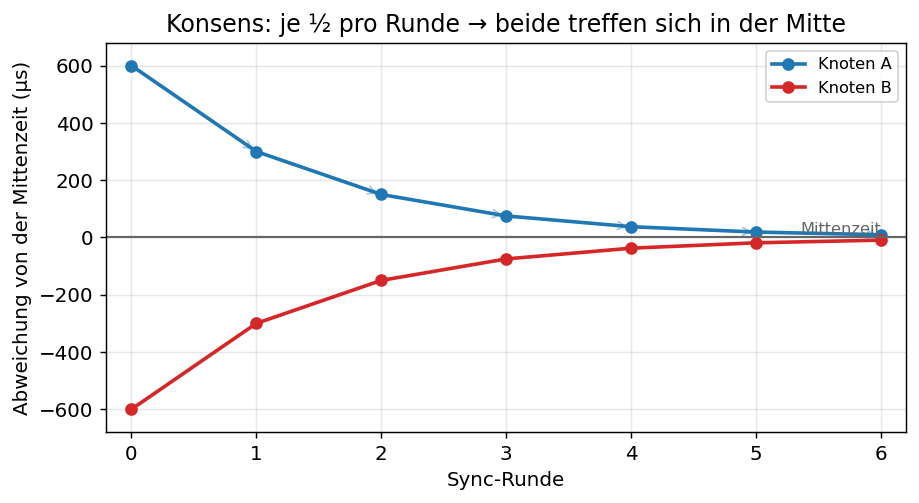
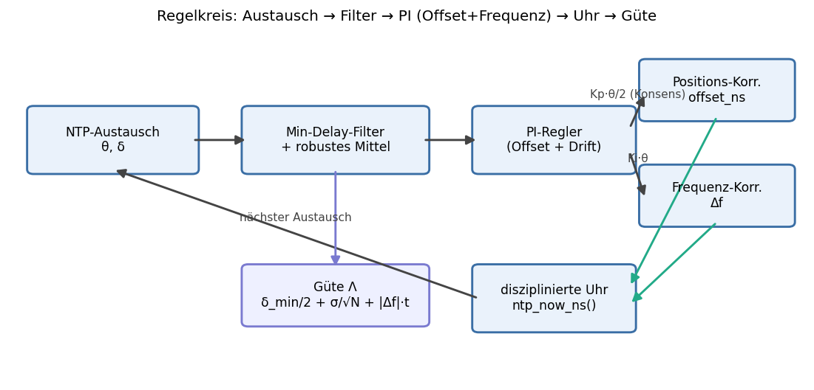

# Theoretische Betrachtung: konvergierende Zwei-Knoten-Software-NTP über einen T1S-Strang

Diese Notiz untersucht **theoretisch**, ob sich zwei T1S-Knoten mit demselben
Software-NTP-Mechanismus dieses Projekts (`ntp_sync.c` / `lan866x-ntpsync`,
t1/t2/t3/t4-Austausch alle 250 ms) **konvergierend** synchronisieren lassen: beide
Boards tauschen ständig Zeitstempel aus, mitteln die Ergebnisse und nähern sich
zeitlich immer weiter an. Es geht um die Frage: **Wie genau und wie zuverlässig kann
das werden — und wo ist die physikalische Grenze?**

Grundlage sind die in diesem Repo **real gemessenen** Werte (siehe
[NTP_TIMING.md](NTP_TIMING.md)):

| Größe | gemessen | Quelle |
|---|---|---|
| Zähler-Auflösung | **16 ns** (SYS_TIME @ 60 MHz) | `ntp`-Status |
| Oszillator-Drift, frei laufend | **~1600 ppm** (≈ 1,6 ms/s) | `ntp` est. drift / bridge_delay |
| Sync-Residuum (1 Austausch) | **~150–360 µs** | ntpsync residual |
| Round-Trip-Delay PC↔Bridge | **~0,5–1,0 ms** | ntpsync delay |
| Pfad-Asymmetrie (eth0 egress vs. ingress) | **~0,3–0,5 ms** | bridge_delay |

> Kurzfazit vorweg: Ja, Konvergenz ist möglich und sinnvoll — aber **nicht durch
> reines Mitteln**. Der Gewinn durch Mittelung trifft auf zwei harte Böden: die
> **Oszillator-Drift** (erfordert Frequenz-Disziplinierung, nicht nur Positions-
> Mittelung) und die **systematische Pfad-Asymmetrie** (lässt sich *nicht*
> wegmitteln). Realistisch erreichbar auf dieser Hardware: **~10er-µs Präzision**,
> und mit einmaliger Asymmetrie-Kalibrierung auch **~10er-µs Richtigkeit**. **Sub-µs
> ist ohne Hardware-Zeitstempelung (PTP) nicht erreichbar.**

---

## 1. Das Messmodell — was ein NTP-Austausch liefert

Pro Austausch (Knoten A fragt, Knoten B antwortet):

```
offset  θ = ((t2 − t1) + (t3 − t4)) / 2      # Uhr_B − Uhr_A
delay   δ = (t4 − t1) − (t3 − t2)            # Round-Trip-Transit
```


Der **fundamentale NTP-Trick**: θ ist exakt richtig, **wenn Hin- und Rückweg gleich
lang sind**. Ist der Hinweg `d→` und der Rückweg `d←`, dann gilt:

```
θ_gemessen = θ_wahr + (d→ − d←) / 2
```

Der Term `(d→ − d←)/2` ist die **halbe Pfad-Asymmetrie**. Das ist der Kern der
ganzen Betrachtung:

- **Zufälliger Anteil** von δ (Jitter, Contention, Scheduling) ist mittelwertfrei →
  **mittelt sich weg**.
- **Systematischer Anteil** (konstante Asymmetrie der Verarbeitung) ist **kein**
  Rauschen → **mittelt sich NICHT weg**. Er ist ein Bias, der als Boden stehen bleibt.

NTP gibt deshalb auch eine ehrliche Fehlerschranke an: weil die wahre Asymmetrie
zwischen 0 und δ liegen kann, ist der Offset-Fehler **garantiert ≤ δ/2** beschränkt.
Bei δ_min ≈ 0,5 ms ist das eine Worst-Case-Schranke von **±250 µs** — selbst wenn der
Zufallsanteil schon perfekt wegmittelt ist.

---

## 2. Zwei Fehlerklassen — und nur eine ist mittelbar

| Fehlerklasse | Ursache | Verhalten bei Mittelung über N Samples |
|---|---|---|
| **Zufällig** (white phase noise) | Zeitstempel-Jitter, PLCA-Contention, Scheduling | sinkt mit **1/√N** |
| **Drift** (frequency/random walk) | Oszillator läuft schnell/langsam, T-abhängig | mittelt **nicht** weg — muss *modelliert* (Frequenz) werden |
| **Systematisch** (Asymmetrie-Bias) | konstant ungleiche Hin-/Rückverarbeitung | mittelt **nicht** weg — bleibt als Boden |

Reines Mitteln des Offsets adressiert **nur die erste Zeile**. Die anderen beiden
sind der Grund, warum „immer genauer im Laufe der Zeit" eine Grenze hat.

---

## 3. Der Drift-Killer: warum Mitteln allein nicht reicht

Die MCU-Oszillatoren hier driften **~1600 ppm**. Zwischen zwei Syncs (250 ms) läuft
die Uhr also um

```
1600 ppm × 250 ms = 400 µs
```

weg. Wer nur **die Position** korrigiert (Offset-Sprung alle 250 ms) und dazwischen
„mittelt", erzeugt einen **Sägezahn** mit ~400 µs Spitze / ~200 µs Mittel. Dieser
Sägezahn ist *deterministisch* — Mittelung über viele Samples senkt ihn **nicht**,
weil zwischen den Samples die Uhr ja weiterdriftet.


*(obere Linie: nur Positions-Korrektur — der Drift-Sägezahn, den Mitteln nicht
beseitigt; untere Linie: mit Frequenzregelung bleibt der Fehler praktisch bei 0.)*

**Lösung: Frequenz-Disziplinierung.** Man schätzt nicht nur den Offset, sondern auch
die **Frequenzabweichung** und korrigiert die Tick-Rate (bzw. addiert eine laufende
Rate auf `s_offset_ns`). Das ist ein **Zwei-Zustands-Schätzer** (Offset *und* Drift)
— ein PI-Regler / eine PLL / ein kleiner Kalman-Filter. Sobald die Frequenz auf z. B.
**±1 ppm** eingeregelt ist, beträgt der Holdover-Fehler über 250 ms nur noch

```
1 ppm × 250 ms = 0,25 µs   → vernachlässigbar.
```

Erst **mit** Frequenzregelung wird der verbleibende Positionsfehler so klein, dass
das Mitteln des Zufallsanteils überhaupt sichtbar wird. Genau das macht „echtes" NTP
(und PTP) — die `est. drift`-Anzeige des `ntp`-Kommandos liefert dafür bereits den
Rohwert (`drift ≈ −adjust / interval`).

---

## 4. Konvergenz-Mathematik

### 4.1 Zufallsanteil: 1/√N — bis zum Plateau

Mit Frequenzregelung bleibt ein mittelwertfreier Jitter σ_θ pro Sample. Der gemittelte
Schätzer hat den Standardfehler

```
SE(N) = σ_θ / √N
```

Bei 250 ms Kadenz sind das **240 Samples/Minute**. Über 1 min → √240 ≈ **15×**, über
10 min → ≈ **49×** Reduktion des Zufallsanteils. **Aber:** das läuft gegen den
**Asymmetrie-Boden** (Abschnitt 1). Sobald `σ_θ/√N` unter `(d→−d←)/2` fällt, bringt
weiteres Mitteln nichts mehr — die Kurve **plateaut**. Praktisch ist dieses Plateau
nach **Sekunden bis wenigen Minuten** erreicht; „beliebig genau mit der Zeit" gibt es
nicht.


*(fallende Linie: σ/√N (hier σ ≈ 200 µs); flache Linie: der nicht mittelbare Boden
aus Asymmetrie/Transit. Der effektive Fehler folgt dem Maximum beider → die
Konvergenz **plateaut**, sobald σ/√N den Boden erreicht.)*

### 4.2 Optimale Mittelungsdauer (Allan-Deviation)

Es gibt ein **Optimum** für die Mittelungs-/Sync-Dauer τ:

- **τ zu kurz** → Zeitstempel-Jitter (white phase noise) dominiert → Mitteln hilft.
- **τ zu lang** → Oszillator-Random-Walk/Drift dominiert → Mitteln **schadet**.

Das Minimum der **Allan-Deviation** σ_y(τ) der MCU-Uhr markiert das τ, bei dem beide
sich die Waage halten. Für einen einfachen MCU-Quarz liegt es typisch im Bereich
**~1–10 s**. 250 ms liegt sicher im white-noise-Bereich → es ist richtig, mehrere
Samples zu kombinieren, um in die Allan-Senke zu kommen.

### 4.3 Symmetrische Variante: Konsens statt Master/Slave

Mit dem PC war es Master/Slave (FW folgt PC). Zwischen zwei **gleichberechtigten**
Knoten ist die **Konsens-Mittelung** eleganter und „konvergierend" im Wortsinn:
jeder Knoten korrigiert nur die **Hälfte** des gemessenen Offsets in Richtung des
anderen.

```
A: offset_A += +θ/2          B: offset_B += −θ/2
```

Beide laufen auf eine gemeinsame **virtuelle Mittenzeit** zu — bei zwei Knoten
konvergiert das geometrisch (Faktor ½ pro Runde, d. h. nach wenigen Runden praktisch
zusammen). Das mittelt die **unabhängigen** Uhrfehler beider Seiten heraus (Vorteil
gegenüber „einer folgt einem"). Der gemeinsame Bias durch Asymmetrie bleibt natürlich.



*(Knoten A und B korrigieren je die Hälfte des gemessenen Offsets → der Abstand
halbiert sich pro Runde und beide treffen sich in der Mitte. Auf eine externe
Referenz folgt das nicht — es ist gegenseitige, relative Synchronisation.)*

**Bonus — Asymmetrie wird sichtbar:** misst A den Offset und B unabhängig auch (jeder
als Anfrager), müssten beide betragsgleich/vorzeichenverkehrt sein. Die **Differenz**
der beiden unabhängigen Schätzungen ist ein direktes Maß der Verarbeitungs-Asymmetrie
— womit man sie sogar **kalibrieren** und den Bias herausrechnen kann (analog zur
Capture-Clock-Kalibrierung in [NTP_TIMING.md](NTP_TIMING.md) §5).

---

## 5. Ausreißer-Filterung auf dem T1S-Strang

Auf einem **eigenen, ruhigen** T1S-Strang ist δ weitgehend konstant — genau wie der
Nutzer vermutet. Variationen kommen v. a. von:

- **PLCA-Sendeslot:** ein Knoten muss auf seine Transmit-Opportunity im Beacon-Zyklus
  warten → **quantisierter** Zusatz-Delay bis zur Zykluszeit. Das ist die größte
  Jitter- *und* Asymmetrie-Quelle.
- **SPI-Anbindung der MAC-PHY (LAN8651):** RX-Indication über SPI aus dem Superloop →
  Latenz und Asymmetrie zwischen TX- und RX-Stempelpunkt.

Bewährte Gegenmittel (klassisches NTP macht genau das):

1. **Minimum-Delay-Filter:** im Fenster nur das Sample mit dem **kleinsten δ**
   verwenden (das hat am wenigsten Contention erlitten und ist am symmetrischsten).
   Der Host-Tool tut das bereits.
2. **Robuste Schätzer** statt arithmetischem Mittel: Median / getrimmtes Mittel /
   Huber über die Offsets der δ-kleinsten Samples.
3. **Schwellwert-Verwurf:** Samples mit δ > δ_min + Schwelle fallen lassen.

Auf einem dedizierten Strang ist δ_min damit sehr stabil → konstante Asymmetrie →
**kalibrierbar** (Abschnitt 4.3).

---

## 6. Qualitätsmaß, das jeder Knoten lokal berechnen kann

Jeder Knoten kann seine **Synchronisations-Güte** aus der eigenen Statistik schätzen
— ohne externe Referenz. Sinnvolle Größen (alle aus den vorhandenen t1..t4 + dem
laufenden Schätzer ableitbar):

| Metrik | Berechnung | Aussage |
|---|---|---|
| `δ_min` | Minimum über Fenster | beste erreichte Schranke (Fehler ≤ δ_min/2) |
| δ-Spread | `δ_p90 − δ_p10` | Contention/Last; klein = vertrauenswürdig |
| `σ_θ` | Streuung der Offsets im Fenster | Zufallsanteil pro Sample |
| `SE = σ_θ/√N` | Standardfehler des Mittels | wie weit das Mitteln noch trägt |
| Frequenz-Stabilität | Streuung aufeinanderfolgender Drift-Schätzungen (≈ Allan-Dev) | Holdover-Güte zwischen Syncs |

Daraus lässt sich eine **NTP-artige „synchronization distance"** Λ bilden — die
ehrliche obere Fehlerschranke, die der Knoten selbst meldet:

```
Λ  ≈  δ_min/2                # irreduzible Transit-Unsicherheit (Asymmetrie unbekannt)
    +  σ_θ/√N                # verbleibender Zufallsanteil
    +  |Δf| · t_seit_sync    # Holdover-Drift seit dem letzten Sync
```

Der dritte Term ist genau das, was das erweiterte `ntp`-Kommando heute schon anzeigt
(`est. dev.`). Ein Knoten kann damit zur Laufzeit sagen: *„Ich bin auf ±Λ genau" —*
und Λ schrumpft sichtbar, während die Konvergenz läuft, bis sie auf δ_min/2 (dem
Asymmetrie-/Transit-Boden) aufsetzt.

---

## 7. Was ist erreichbar — Genauigkeit & Zuverlässigkeit

| Ausbaustufe | erwartetes Niveau (diese HW) | begrenzt durch |
|---|---|---|
| nur Positions-Sprung + Mitteln | **±200–400 µs** | Drift-Sägezahn (Abschnitt 3) |
| + Frequenz-Disziplinierung (PI/PLL) | **~10–50 µs** (Präzision) | Software-Zeitstempel-Jitter, SPI-RX-Latenz |
| + Minimum-Delay-Filter, ruhiger Strang | **~10 µs** (Wiederholbarkeit) | PLCA-Quantisierung, Superloop-Kadenz |
| + einmalige Asymmetrie-Kalibrierung | **~10er µs** auch in der *Richtigkeit* | Reststreuung der Kalibrierung |
| Hardware-Zeitstempelung (PTP/802.1AS) | **sub-µs … ns** | — (anderes Verfahren) |

**Präzision (Wiederholbarkeit):** beide Knoten *zueinander* stabil im **10er-µs**-
Bereich — gut machbar, sobald die Frequenz geregelt ist.

**Richtigkeit (Trueness):** durch die Asymmetrie zunächst auf **δ_min/2 ≈ 100er µs**
beschränkt; mit Kalibrierung (Abschnitt 4.3) ebenfalls in den **10er-µs**-Bereich.

**Harte Decke:** Die Stempel entstehen in Software (Superloop/Hook), die MAC-PHY
hängt am SPI. Der **16-ns-Tick ist NICHT die Grenze** — die Stempel-Latenz und ihr
Jitter sind es. Für **sub-µs** braucht es Zeitstempelung in der MAC/PHY-Hardware
(PTP / IEEE 802.1AS), was genau das Schwesterprojekt `net_10base_t1s` macht.

**Zuverlässigkeit:** Auf einem dedizierten, gering belasteten Strang ist das Verfahren
robust — δ ist stabil, Ausreißer sind selten und filterbar, und jeder Knoten kennt
über Λ seine eigene Güte (kann bei wachsendem δ-Spread die Schranke aufweiten oder in
**Holdover** auf der disziplinierten Frequenz gehen). Es ist allerdings **relative**
Synchronisation (die beiden stimmen *miteinander* überein), **nicht** UTC-rückführbar
— ohne externe Referenz gibt es keine absolute Zeit.

---

## 8. Was damit möglich wäre — und was nicht

**Möglich (im ~10er-µs-Regime):**
- **Koordinierte Aktionen** zwischen zwei T1S-Knoten: gemeinsam getriggerte GPIO-/
  Sensor-Sampling-Zeitpunkte, abgestimmte Mess-Fenster.
- **Ereignis-Korrelation** über Knoten hinweg auf einer gemeinsamen Zeitachse
  (Logs/Captures beider Boards verschmelzen, kausale Reihenfolge sicher bestimmen).
- **Selbst-attestierte Güte:** jeder Knoten meldet sein Λ → das System weiß, *wie sehr*
  es der gemeinsamen Zeit gerade trauen darf.

**Nicht möglich (ohne Hardware-Zeitstempelung):**
- Harte, deterministische Trigger im **sub-µs**-Bereich.
- UTC-/absolut-rückführbare Zeit ohne externe Referenzuhr.
- „Beliebig genau, je länger es läuft" — die Konvergenz **plateaut** am Asymmetrie-/
  Transit-Boden; jenseits davon hilft nur Kalibrierung oder ein anderes Verfahren.

---

## 9. Fazit & ein konkreter Algorithmus-Vorschlag

Konvergierende Zwei-Knoten-Synchronisation per Software-NTP auf einem T1S-Strang ist
**machbar und sinnvoll** — wenn man drei Dinge kombiniert:

1. **Frequenz-Disziplinierung** (PI/PLL über Offset *und* Drift) — beseitigt den
   dominierenden Drift-Sägezahn. **Wichtigster Hebel.**
2. **Minimum-Delay-Filter + robuster Offset-Schätzer** — macht δ und damit die
   Asymmetrie konstant und filtert PLCA-/SPI-Ausreißer.
3. **Konsens-Korrektur (je ½ zur Mitte)** + **Λ-Gütemaß pro Knoten** — echte
   gegenseitige Konvergenz mit Selbstbewertung; die Differenz der wechselseitigen
   Offset-Schätzungen kalibriert die Restasymmetrie.



Skizze einer Iteration (alle 250 ms, beide Knoten symmetrisch):

```
1. NTP-Austausch -> (θ_i, δ_i)
2. Fenster der letzten K Samples: nimm die mit δ nahe δ_min, verwirf Ausreißer
3. θ* = robustes Mittel dieser Offsets
4. PI-Regler: Frequenzkorrektur f += Ki·θ*,  Positionskorrektur += Kp·θ*·(1/2)
   (Faktor ½ = Konsens zur Mitte; der Partner macht die andere Hälfte)
5. aktualisiere Λ = δ_min/2 + σ_θ/√N + |Δf|·t_seit_sync   -> melde Güte
```

Damit landet man realistisch bei **~10er µs** zueinander, stabil und mit
mitlaufender, ehrlicher Fehlerschranke. Für alles darunter (sub-µs, ns) führt der Weg
über **Hardware-Zeitstempelung / PTP** — siehe `net_10base_t1s`.

> **Abgrenzung:** Dieses Dokument ist eine *theoretische* Betrachtung. Implementiert
> ist heute der Master/Slave-Sync gegen den PC ([NTP_TIMING.md](NTP_TIMING.md)); der
> hier skizzierte Zwei-Knoten-Konsens-Regler ist ein möglicher Ausbau, kein
> vorhandenes Feature.

---

*Die Diagramme (`img/ntp_*.png`) werden mit matplotlib aus
[`ntp_convergence_diagrams.py`](ntp_convergence_diagrams.py) erzeugt
(`pip install matplotlib && python ntp_convergence_diagrams.py`); die Zahlen sind
illustrativ und entsprechen den im Text genannten Werten.*
